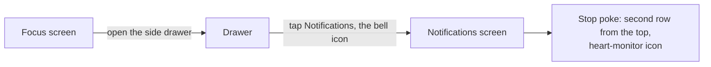

# Phone check: the "Stop poke" switch

**Row**: `ee68d5e7-8948-4f2c-9cc3-bdc0eeb6843f` · **Manager**: Tiffany · **Asked for by**: Rick, 2026-10-09
**Time needed**: about two minutes · **Build**: any APK from `13882d9` or later

## What the switch does

The server sends every manager seat a "Do not stop yet" poke when the seat tries to stop with work still owed.
The "Stop poke" switch turns that poke on or off for the whole fleet.
Only an admin account may change it; every account may read it.

## Where it is

The row sits directly under the server push pause row and above the big "Notifications" master switch.
Its subtitle shows the current state: `On`, or `Muted by <who> at <time>`.

## The check

| Step | Do | Expect |
|---|---|---|
| 1 | Open the drawer, tap **Notifications** | The "Stop poke" row shows `Checking…`, then `On` |
| 2 | Flip the switch **off** | Subtitle changes to `Muted by <your account> at <time>`; no red error line |
| 3 | Tell Tiffany "muted" | She confirms from her seat that the pokes stopped arriving |
| 4 | Flip the switch back **on** | Subtitle returns to `On` |
| 5 | Leave the app and come back | The row re-reads the server and still shows `On` |

Leave the switch **on** when you finish. While it is off, no manager seat is poked.

## What a failure looks like

| You see | It means |
|---|---|
| "Admin only — this account cannot change the stop poke." | The phone is signed in with a non-admin account; the switch stays grey until you reopen the screen |
| A red line under the row | The server refused or was unreachable; the text is the server's own message |
| No "Stop poke" row at all | The app did not register the stop poke client; tell Tiffany, that is a bug |
| Subtitle stuck on `Unknown` | The first read failed; a red line should say why |

## Source

- Switch: `lib/features/settings/presentation/heartbeat_poke_section.dart`
- Screen: `lib/features/settings/presentation/notification_management_screen.dart`
- Drawer entry: `lib/features/focus_mode/presentation/focus_mode_screen.dart`
- The same toggle from the server shell: `src/scripts/heartbeat-poke-toggle.sh` in the lupin repo
