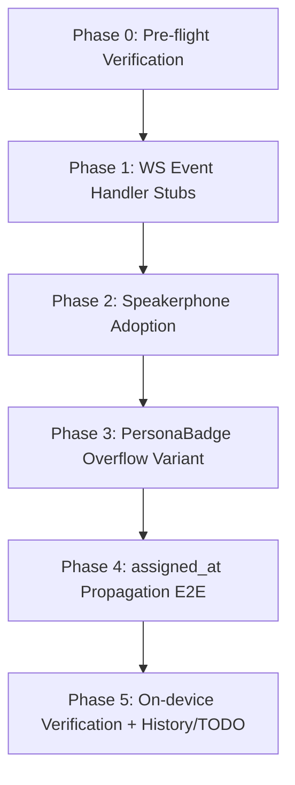

# [LUPIN-MOBILE] Notification-Client Sync — May 6 → May 21 Deltas

**Date**: 2026-05-21
**Author**: Tiffany 💍 (CC session `1b3f8c46`, lupin-mobile)
**Status**: Plan — cascade-review-target. Q1-Q4 resolved (see §8.0); reshaped for `/plan-review-cascaded` submission. Awaiting Rick to launch the cascade.
**Anchor**: mobile commit `fd8fc18` (2026-05-06 Phase 0 dispatch audit)
**Source inventory**: locked notification-UI change audit (delivered to Rick verbally/inline 2026-05-21 — not a serialized doc; see §0.5 provenance note) + DM exchange with Mr. Radio 🦉 (session `679e8f04`)
**Cascade-review intake**: this document is shaped as a parent input plan for `/plan-review-cascaded` per `planning-is-prompting/workflow/plan-review-cascaded.md` + `plan-review-cascaded-common.md`. §0 below is the cascade-readiness conformance block.

---

## 0. Cascade-Review Readiness (Step 0 Input-Shape Conformance)

This section exists so the review-cascade Manager can run Step 0 (intake + decomposition + light-review gate) without reverse-engineering the plan's shape. Per `plan-review-cascaded.md` §0-§2, the input plan must decompose cleanly into ≥2 independently-reviewable sections and pass a 6-criterion light-review gate.

### 0.1 Proposed Section Decomposition (4 sections)

The Manager owns final decomposition (Step 2), but the plan is authored to decompose as follows. Phases 0 and 5 are **process bookends** (pre-flight + on-device wrap), not review sections — they fold into each section's local pre/post obligations.

| Section | Maps to | Scope | Reviewable in isolation? |
|---|---|---|---|
| **Section A — WS Event Handler Stubs** | Phase 1 | 3 documented no-op cases in `_onExternalUpdate` for `commons_broadcast_ack`, `commons_question_received`, `commons_activity` | ✅ Yes — pure dispatch-switch additions; no shared-state mutation |
| **Section B — Speakerphone Adoption** | Phase 2 | `speakerphone_changed` event handling; `_speakerphoneBySender` map; state-class plumbing; new-name-only + smoke-test guard | ✅ Yes — self-contained event + state surface |
| **Section C — PersonaBadge Overflow Variant** | Phase 3 | dotted-border + ✱ variant on `PersonaBadge`; dotted painter; new TestKey | ✅ Yes — isolated widget + painter |
| **Section D — `assigned_at` Propagation E2E** | Phase 4 | fixture round-trip tests; senders-endpoint + WS-event `assigned_at` verification; Mr. Radio coordination DM | ✅ Yes — test-only section; no production-code mutation |

Sections are roughly comparable in scope (B is the largest; A the smallest — acceptable per `section_sizing_heuristic = independence_criterion`, "roughly comparable" not "equal").

### 0.2 Cross-Section Dependency Map (both directions)

| Section | Depends ON (upstream) | Depended-on BY (downstream) | Shared files |
|---|---|---|---|
| **A** | Phase 0 pre-flight only | B (B adds a case to the same `_onExternalUpdate` switch A extends) | `notification_bloc.dart` (shared with B) |
| **B** | A (same switch surface — merge-order coupling, not logic coupling) | — | `notification_bloc.dart` (shared with A), `notification_event.dart`, `notification_state.dart`, `notification_models.dart` |
| **C** | none | — | `persona_badge.dart`, `dashed_border_painter.dart`, `test_keys.dart` — **disjoint from A/B/D** |
| **D** | none (runs parallel to Mr. Radio's parent-side Part B) | — | test files only — **disjoint from A/B/C production code** |

**Independence verdict**: C and D are fully independent. A and B share `notification_bloc.dart` — the coupling is **merge-order only** (both edit the same `switch`), NOT logic coupling; either can be reviewed in isolation. No cycles. No out-of-order dependencies.

### 0.3 Pre-Cascade Recon Checklist (author-onboarding)

Standing doctrine the cascade cast must hold before authoring/reviewing any section:

**Standing feedback memories that gate this cascade's implementation** (lupin-mobile auto-memory):
- `feedback_dev_server_laptop_split` — the dev server has no Android SDK/adb; **Phase 5 APK build + on-device VPs run laptop-side** via rsync + adb. Reviewers must not flag "build the APK here" as missing.
- `feedback_automate_over_manual_tests` — widget-test BLoC-driven flows (whenListen + MockBloc) **before** recommending on-device manual testing. Sections A-D all carry automated tests; device VPs (Phase 5) are reserved for hardware-only checks.
- `feedback_no_auto_checkpoint` — Rick drives commit cadence; no phase-boundary auto-commit. Implementer must not propose checkpoints between sections.
- `feedback_legacy_test_quarantine` — if any existing test drifts under these changes, quarantine-first (don't delete); the 44-test quarantine baseline is known and stable.
- `feedback_plan_approval_means_go` — once Rick greenlights post-cascade, that approval IS the go; no second mid-implementation gate. Mid-implementation blocking questions use cosa-voice MCP, never terminal text.
- `feedback_user_stated_contract_is_authoritative` — when Rick names a URL/signature/contract, it is authoritative even if a local `:7999` probe shows an older form (relevant to Section D's `assigned_at` contract).

**Persona conventions**: lupin-mobile CC sessions are allocated a cosa-voice persona at SessionStart. This plan's author is Tiffany 💍 (session `1b3f8c46`). Parent-Lupin coordination counterpart is Mr. Radio 🦉 (session `679e8f04`). Signing convention: history/commit entries stamp `(persona display_name)`.

**Standing project-specific rules**:
- Prefix: `[LUPIN-MOBILE]` on all TODO items, commits, notifications
- R&D docs: `src/rnd/` with `YYYY.MM.DD-` date prefix
- Code style: 4-space indent, double quotes, spaces inside `( )` and `[ ]`, Design-by-Contract docstrings (Dart-adapted)
- Test venue: `flutter test` (unit/widget/service_integration); device verification is laptop+emulator/device only
- Mobile is a **standalone repo** — git operations are mobile-repo-only; never touch parent Lupin or CoSA git state
- Post-edit verification: `flutter analyze` clean is the floor, not the ceiling — per-section tests must pass

### 0.4 Self-Assessment Against the Step 0 Light-Review Rubric (6 criteria)

Per `plan-review-cascaded-common.md` §Step 0 light-review gate:

| # | Criterion | Self-assessment |
|---|---|---|
| 1 | **Slice independence** — cross-slice deps explicit both directions | ✅ §0.2 maps upstream + downstream + shared files per section; independence verdict stated |
| 2 | **Q-decision completeness** — every Q has PROPOSED stance + alternatives + recommendation | ✅ §8 — all 4 Qs carry pros/cons + recommendation; §8.0 records Rick's resolutions (RESOLVED, stronger than PROPOSED) |
| 3 | **Recon item resolvability** — every Recon item names where verification happens | ✅ Phase 0 = pre-flight grep; Phase 4 = fixture + live-`:7999` probe; each phase's AC names its verification tier |
| 4 | **Source citation** — every requirement traces to a design doc or R&D doc | ✅ §0.5 provenance table below |
| 5 | **Sequencing soundness** — recommended order respects cross-slice deps | ✅ §7 sequence is A→B→C→D→wrap; respects the only real dep (A before B for merge-order on the shared switch) |
| 6 | **Author-onboarding completeness** — standing doctrine memories listed | ✅ §0.3 pre-cascade Recon checklist |

**Readiness verdict**: all 6 criteria self-assessed PASS. The plan is submitted as cascade-input-ready; the Manager's Step 0 light-reviewer makes the binding call.

### 0.5 Requirement Provenance (Source Citation)

| Requirement | Source |
|---|---|
| WS handler stubs for 3 new event types | Audit §C (cosa commits `799f4ce`, `d18cdf9`, `15599db`/`6136a88`/`fe352b8`) + §D event-surface table |
| `speakerphone_changed` adoption + rename | Audit §C (cosa commit `e420ec0`, 2026-05-12 speakerphone refactor) + §D |
| `PersonaBadge` overflow variant | Audit §A (parent commit `a1ccdcf`, Sam-as-overflow) + parent R&D `2026.05.16-voice-persona-stale-bridge-and-sam-overflow.md` |
| `assigned_at` propagation | Mr. Radio 🦉 DM (`679e8f04`) + his design doc `2026.05.21-recent-activity-filter-and-focus-bar-chronological-lock.md` Part B |
| Out-of-scope park-all-6 decision | Q3 resolution, 2026-05-21 walk-through (§8.0) |

**Provenance note on the change audit**: the "notification-UI change audit" cited above (and referenced as "Audit §A / §C / §D") was delivered to Rick **verbally/inline on 2026-05-21** — it is **not a separately-serialized document**, so it has no file path. The commit hashes enumerated in this table (`799f4ce`, `d18cdf9`, `15599db`, `6136a88`, `fe352b8`, `e420ec0`, `a1ccdcf`) are the checkable provenance — each is independently verifiable via `git log` in the cosa submodule or the parent Lupin repo.

---

## 1. Context & Goal

Between 2026-05-06 and 2026-05-21 the parent Lupin notification-client surface moved heavily (~30 commits on the deprecated `notifications.js`, 23 new TypeScript files in the multiplexer subtree, 13 server-side commits in the cosa submodule). This plan brings the mobile app's notification client up to functional parity **on the WebSocket event contract** — which Mr. Radio explicitly recommended as the right stable surface to track, ahead of the legacy JS internals or the multiplexer TS scaffolding.

**Out of scope for this sync** — all 6 items below are **PARKED in TODO.md** per Q3 resolution (2026-05-21 walk-through). None are hard-dropped; each becomes a one-line parking-lot entry:
- Recent-Activity filter strip UI (Mr. Radio's Part A) — web-only UX, no mobile surface; greenfield-feature framing
- Focus-bar chronological lock UI (Mr. Radio's Part B) — web-only UX, no mobile strip; greenfield-feature framing
- Doc viewer link emission — mobile renders zero `/app/docs` links today (verified via grep); greenfield-feature framing
- Commons DM panel — relevant IF mobile becomes a CC peer; conditional if-then entry
- Recent Activity stream (`commons_activity` WS) — relevant IF mobile grows a peer-traffic surface; conditional if-then entry
- TTS preview-and-pause `tts_preview_*` config fields — relevant IF preview-and-pause UX is wanted on mobile; conditional if-then entry

`preferred_persona_name` allocate query param remains genuinely N/A — mobile does not allocate personas — and is not even parked.

---

## 2. Verified Current Mobile State

| Surface | State today | Notes |
|---|---|---|
| `VoicePersona` model (`voice_persona.dart`) | `name`, `voiceId`, `icon`, `color`, `borrowed`, **`overflow`**, **`assignedAt`**, **`displayName`** — all parsed | Mobile data layer is **already at parity** with the server's expanded persona dict |
| `NotificationBloc._onExternalUpdate` | Dispatches on inner `notification.type`: `task`/`progress`/`alert`/`custom`/`user_initiated_message`/`session_topic` → audio + TTS; `voice_persona_assigned`/`voice_persona_released` → persona-map mutation; default → `print` log (silent-drop guard) | Future cases noted in source comment: "conversation_mode_changed, focus_changed, etc." |
| `PersonaBadge` widget | Renders `borrowed` via `DashedBorderPainter`. **No `overflow` rendering.** | Mobile data model has the field; UI does not yet branch on it |
| WS subscription | `subscribed_events: []` (receive ALL events) per `websocket_service.dart:173` | No subscription gating; new server event types arrive automatically; only mobile-side dispatch needs updating |
| `assigned_at` parse | `VoicePersona.fromJson` parses `json["assigned_at"]` via `DateTime.tryParse` | Parser is liberal; tolerates absence (null) and malformed (null) |
| Yes/No/Neither | Shipped 2026-05-11 (`1da39d4`) | At parity with cosa-voice MCP v0.3.0 |
| `/api/claude-code/submit` cutover | Shipped 2026-04-? (`ee6f081`) | Dispatch retirement synced |
| Doc viewer link emission | Zero refs in `lib/` | No work needed for path-prefix routing change |

**Net mobile gap is narrow** — concentrated in three places: WS event-handler additions, `overflow` UI rendering, and an `assigned_at` propagation verification that's coupled with Mr. Radio's backend plumbing-check during his Part B.

---

## 3. Phases

Each phase below specifies: **goal**, **files touched**, **acceptance criteria**, **test strategy**, **doc updates**.

---

### Phase 0 — Pre-flight Verification

**Goal**: Confirm no in-tree drift since the audit; confirm Mr. Radio's design-confirm is still LOCKED; confirm `assigned_at` plumbing item still open.

**Steps**:
1. Re-grep the mobile tree for the audit's target identifiers: `conversation_mode`, `speakerphone`, `commons_broadcast_ack`, `commons_question_received`, `commons_activity`. Confirm no partial-port has snuck in.
2. Confirm Mr. Radio's design doc (`2026.05.21-recent-activity-filter-and-focus-bar-chronological-lock.md`) still says "LOCKED" and Phase 1 of Part A is the active implementation track.
3. Read the current `lib/features/notifications/data/notification_models.dart` to confirm `NotificationItem` schema can carry the existing voice_persona dict — no new top-level field changes needed for any of the planned Phase 1-3 work.

**Files touched**: NONE.
**Acceptance**: report verdict in plan execution log; greenlight Phase 1 ONLY if no drift.

---

### Phase 1 — WS Event Handler Stubs

**Goal**: Eliminate "Unknown notification.type" log noise for the four new server event types. Each handler is a documented no-op stub with clear extension comments — actual semantic behavior is added in Phase 2 (for speakerphone) and deferred for the others.

**Files touched**:
- `lib/features/notifications/domain/notification_bloc.dart` (`_onExternalUpdate` switch)

**New cases** (all documented as intentional no-ops at this phase):

| `notification.type` | Handler this phase | Why no-op |
|---|---|---|
| `commons_broadcast_ack` | `break` with comment | Inter-session ack feedback; no mobile UI surface yet |
| `commons_question_received` | `break` with comment | DM push for CC peer sessions; mobile is not a CC peer |
| `commons_activity` | `break` with comment | Recent Activity stream; no mobile panel to populate |
| `speakerphone_changed` | **handled in Phase 2** — not in this phase | (See Phase 2) |
| `conversation_mode_changed` | **NOT added** — kept as default-branch log | Server emits forward-compat bridge; mobile canonicalizes on new name |

**Acceptance criteria**:
- `print("[NotificationBloc] Unknown notification.type ...")` no longer fires for the three Phase-1 cases when matching events arrive on the wire
- Default branch still fires for any truly-unknown future type
- No state change emitted from any new case (verified via blocTest `expect: []` per Phase 2 test 2.4.4 pattern already in use)

**Test strategy**: unit/widget — blocTest `whenListen` injecting each new event type; assert state stream is empty (no emit) and the `_personasBySender` map is unchanged.

---

### Phase 2 — Speakerphone Adoption

**Goal**: Adopt the renamed `speakerphone_changed` event with payload `{session_id, on, displaced?, displaced_by?}`. Store the per-session speakerphone state in a new bloc field so future UI surfaces can read it; emit a state snapshot so any subscribed widget can react.

**Files touched**:
- `lib/features/notifications/data/notification_models.dart` — optional new `SpeakerphonePayload` value object if the existing `NotificationItem` doesn't surface `session_id` / `on` accessibly
- `lib/features/notifications/domain/notification_bloc.dart` — new case in `_onExternalUpdate`; new `Map<String, bool> _speakerphoneBySession` field; new private helper `_emitWithSpeakerphone(emit)`
- `lib/features/notifications/domain/notification_event.dart` — optional new `NotificationsSpeakerphoneChanged(senderId, on)` dedicated event for test injection (mirrors `NotificationsVoicePersonaAssigned`)
- `lib/features/notifications/domain/notification_state.dart` — extend `NotificationsInboxLoaded` / `ConversationLoaded` / `SenderDatesLoaded` / `ConversationByDateLoaded` to carry an unmodifiable `Map<String, bool> speakerphoneBySession` snapshot (mirrors `personasBySender` plumbing)

**Behavioral semantics**:
- `on: true` → mobile records "session X is in speakerphone mode" — no UI side effect yet, just durable state
- `on: false` → mobile records "session X is NOT in speakerphone mode"
- `displaced/displaced_by` fields are stored verbatim for diagnostic / future use; not acted on
- **No change to TTS routing or audio dispatch in this phase** — speakerphone state is informational only

**Acceptance criteria**:
- Mobile case `"speakerphone_changed"` lands in `_onExternalUpdate` ahead of the `default` branch
- Payload extracted: `sessionId = n.senderId` (server stamps); `on = n.payload?["on"] == true` or via a typed accessor on `NotificationItem`
- `_speakerphoneBySession[ sessionId ] = on` (idempotent)
- A state re-emit fires through `_emitCurrentSnapshot`-equivalent pathway carrying the updated map
- `conversation_mode_changed` (the LEGACY name) does NOT land — confirmed dropping it via default branch is acceptable, because server already emits the new name preferentially and the Path III bridge handles the old name server-side for non-mobile clients

**Test strategy**:
- Unit/blocTest: inject `speakerphone_changed` with `on: true` → assert state map updated, emit fires
- Unit/blocTest: idempotent — same payload twice → state map unchanged on second hit (verified via equality)
- Unit/blocTest: `on: false` after `on: true` → state map shows `false`
- Widget test: spec'd later when first UI surface consumes the state — not in this phase

**Doc updates**: source comment in `_onExternalUpdate` switch updated to remove `conversation_mode_changed` from the "future cases" comment list.

---

### Phase 3 — PersonaBadge `overflow` Variant

**Goal**: Mirror the web UI's dotted-border `.persona-badge.overflow` variant so mobile distinguishes Sam-as-overflow allocation from legacy hash-borrow. Data model already carries `overflow: bool`; only the UI branch is missing.

**Files touched**:
- `lib/features/notifications/presentation/persona_badge.dart` — add `if ( p.overflow )` branch alongside the existing `if ( p.borrowed )` branch
- `lib/shared/painters/` — possibly new `DottedBorderPainter` (or extend `DashedBorderPainter` with a `style: BorderStyle.dotted` parameter — REUSE pre-pass to decide)
- `lib/core/testing/test_keys.dart` — new `personaBadgeDottedPrefix` test key (mirrors `personaBadgeDashedPrefix`)

**Behavioral semantics**:
- `overflow=true` && `borrowed=false` → dotted border + ✱ glyph (mirrors web `.persona-badge.overflow`)
- `overflow=true` && `borrowed=true` → **overflow takes precedence** (mirrors web `notifications.js` composition rule per audit line: "composes the state class with overflow-precedence-over-borrowed")
- `overflow=false` && `borrowed=true` → dashed border (existing behavior, unchanged)
- `overflow=false` && `borrowed=false` → plain badge (existing behavior, unchanged)

**Acceptance criteria**:
- 3 widget tests cover the four state combinations (overflow only / borrowed only / both / neither)
- ✱ glyph appears only on overflow variants
- Dotted border is visually distinct from dashed border (manual visual review during on-device verification gate)
- TestKeys: `personaBadgeDottedPrefix` keyed badges discoverable in tests

**Doc updates**: extend docstring in `persona_badge.dart` to cover the overflow variant alongside the borrowed variant.

---

### Phase 4 — `assigned_at` Propagation E2E

**Goal**: Confirm `voice_persona.assigned_at` flows reliably from the server through the WS event path AND through the senders endpoint REST path to the mobile bloc. **Coupled with Mr. Radio's Part B plumbing-check** — if his sweep uncovers a backend gap on the senders router or WS new-session event, that landing on the parent side is the prerequisite for mobile-side verification.

**Files touched**:
- `test/features/notifications/data/voice_persona_test.dart` (or new file) — assertion that `assigned_at` parses through every fixture
- `test/features/notifications/data/notification_repository_test.dart` — fixture-backed integration verifying senders endpoint payload carries `assigned_at` for every `active_session` entry
- `test/features/notifications/domain/notification_bloc_test.dart` — blocTest injecting `voice_persona_assigned` with `assigned_at` populated, asserting downstream `personasBySender` state has the parsed `DateTime`

**Acceptance criteria**:
- Round-trip test: `VoicePersona.fromJson( {..., "assigned_at": "2026-05-21T15:00:00Z"} ).assignedAt` is non-null and equals expected `DateTime`
- Round-trip test: `VoicePersona.fromJson( {...} )` (no `assigned_at` key) → `assignedAt == null` (no exception)
- Round-trip test: `VoicePersona.fromJson( {..., "assigned_at": "garbage"} )` → `assignedAt == null` (graceful degradation per existing contract)
- Live-server probe (optional, against `:7999`): allocate a fresh persona via `POST /api/cosa-voice/voice-persona/{sid}/allocate`, observe the resulting WS event payload, assert `assigned_at` field present and parseable

**Plumbing-check coordination**: send a courtesy DM to Mr. Radio at the start of this phase reading: "starting `assigned_at` propagation E2E on the mobile side — let me know if your Part B plumbing-check uncovered a backend gap on the senders router or new-session WS event."

---

### Phase 5 — On-device Verification + History + TODO

**Goal**: Build, install, exercise on a real device, archive plan completion.

**Steps**:
1. `flutter analyze` clean + `flutter test` 100% pass
2. APK build via existing laptop-side rsync + adb pipeline (per `feedback_dev_server_laptop_split` — dev server does NOT have Android SDK; the laptop owns build + deploy)
3. On-device exercises:
   - **VP1**: Inbox screen with mixed-persona threads — visually confirm badges for borrowed vs overflow vs neither render correctly in both light + dark mode
   - **VP2**: Trigger a `speakerphone_changed` event on the parent server (via `POST /api/cosa-voice/voice-persona/{sid}/conversation-mode` or equivalent), observe mobile receives and silently records (no UI yet, but no log noise)
   - **VP3**: Trigger a `commons_broadcast_ack` event, observe mobile silently ignores (no "Unknown notification.type" log line)
4. Update `history.md` with session-end entry
5. Update `TODO.md` to close the "May 6 → May 21 notif-client sync" line item; seed all **6** parked deferred items (per Q3 resolution, §8.0) as separate parking-lot entries: commons DM panel, Recent Activity stream, `tts_preview_*` config, filter strip UI, chronological lock UI, doc-viewer link emission

**Acceptance criteria**:
- All three on-device VPs pass
- `flutter test` shows N new tests added across Phases 1-4 (target +18-25 new test cases)
- No regression in existing test baseline
- `history.md` + `TODO.md` updated

---

## 4. Files Summary

| File | Phase | Change |
|---|---|---|
| `lib/features/notifications/domain/notification_bloc.dart` | 1, 2 | New cases in `_onExternalUpdate`; new `_speakerphoneBySession` map; helper plumbing |
| `lib/features/notifications/domain/notification_event.dart` | 2 | New `NotificationsSpeakerphoneChanged` event class |
| `lib/features/notifications/domain/notification_state.dart` | 2 | Extend loaded states with `speakerphoneBySession` snapshot |
| `lib/features/notifications/data/notification_models.dart` | 2 | Optional `SpeakerphonePayload` value object IF the existing item shape can't surface `on` |
| `lib/features/notifications/presentation/persona_badge.dart` | 3 | New `overflow` branch with dotted border + ✱ glyph |
| `lib/shared/painters/dashed_border_painter.dart` (or new `dotted_border_painter.dart`) | 3 | Dotted-style variant — REUSE-pre-pass decision |
| `lib/core/testing/test_keys.dart` | 3 | New `personaBadgeDottedPrefix` key |
| `test/features/notifications/**` | 1-4 | New blocTests + widget tests + fixture tests (target +18-25 cases) |
| `history.md` | 5 | Session-end entry |
| `TODO.md` | 5 | Close sync line item + seed all 6 parked deferred items (per §8.0) |
| `src/rnd/2026.05.21-notif-client-sync-may-06-deltas.md` | **THIS FILE** | Plan-of-record + execution log |

---

## 5. Risk & Mitigation

| Risk | Likelihood | Mitigation |
|---|---|---|
| Mr. Radio's Part B plumbing-check uncovers a backend gap → Phase 4 blocked on parent-side fix | medium | Phase 4 sequenced AFTER Phases 1-3, so if blocked we can ship 1-3 standalone and resume 4 once Mr. Radio's fix lands |
| New server event types emerge mid-sync (Phase 7a telemetry, new commons event) → log noise returns | low | Default branch still fires for unknowns; Phase 1's stub pattern is straightforward to extend |
| Adding `_speakerphoneBySession` to every loaded state forces large state-class diff and breaks downstream widget tests | low-medium | Mirror the `_personasSnapshot()` pattern already in use; defensive snapshot at every emit site; existing test fixtures need a single new optional param with sensible default `{}` |
| Dotted painter visually indistinguishable from dashed on small badge diameter (40px / 24px) | medium | On-device VP1 catches; iterate dot-spacing or fall back to ✱ overlay as primary disambiguator if border style insufficient |
| Test count grows but coverage on `notification_bloc.dart` slips relative to its current level | low | Track per-file coverage via `flutter test --coverage` (lcov output) in Phase 5 — note `c8` is the multiplexer-TypeScript tool and does not apply to this Dart/Flutter repo; the new code paths are well-isolated and each adds at least one direct test |

---

## 6. Doc Touchpoints (per CLAUDE.md table)

| Code area changed | Doc to update |
|---|---|
| `notification_bloc.dart` `_onExternalUpdate` switch | This file (§3 phase notes) |
| `voice_persona.dart` (no schema change, just confirming `assigned_at` consumed) | No change needed — comment already references parent design doc |
| `persona_badge.dart` (new overflow variant) | This file (§3.3 phase notes); parent-Lupin `src/rnd/v0.1.7/2026.05.16-voice-persona-stale-bridge-and-sam-overflow.md` cross-link |
| New `Speakerphone*` event/state classes | This file (§3.2); supersedes `src/rnd/v0.1.7/2026.05.06-mobile-port-plans/02-conversation-mode-port-plan.md` which is now obsolete due to the rename |

**Note**: `02-conversation-mode-port-plan.md` (2026-05-06) was the original mobile-port plan for `conversation_mode_changed`. Per the speakerphone refactor (parent 2026-05-12 `e420ec0`), the wire name changed. This document supersedes it and the legacy port-plan should be marked `OBSOLETE — superseded by 2026.05.21-notif-client-sync-may-06-deltas.md` at the top.

---

## 7. Implementation Sequence (Once Rick Greenlights)

1. **Phase 0 verification** — pre-flight grep + LOCKED-status check (5 min)
2. **Phase 1 stubs** — `_onExternalUpdate` extension + 3 blocTests (~30 min)
3. **Phase 2 speakerphone** — state plumbing + event + 4-6 blocTests (~60-90 min)
4. **Phase 3 overflow badge** — painter + branch + 3 widget tests + visual review prep (~45 min)
5. **Phase 4 `assigned_at` E2E** — fixture tests + DM Mr. Radio if needed (~30 min, plus any wait time on backend if Mr. Radio uncovers a gap)
6. **Phase 5 on-device + wrap** — APK build + 3 VPs + history.md + TODO.md (~30 min mostly serial on laptop)

**Estimated total**: 3-4 hours of Claude time + 1 device-tester window for VP1-VP3.

---

## 8. Open Questions for Rick (with pros/cons + Tiffany's recommendation)

### 8.0 RESOLVED — Walk-through 2026-05-21

| Q | Rick's decision | Notes |
|---|---|---|
| **Q1 Speakerphone UI** | **Option A — Record-only, no UI** | Per recommendation. State recorded in bloc map; no UI surface this sync. |
| **Q2 Legacy event name** | **New-name-only** (per recommendation) | Rick added: `conversation_mode` term will be **fully retired from the vocabulary** in a future cleanup pass — it is superseded + deprecated, not needed. Mobile smoke-test guard aligns with that direction. |
| **Q3 Deferred items** | **PARK ALL SIX** (deviation from recommendation) | Rick parked every item, including the 3 Tiffany recommended dropping. Nothing is hard-dropped — all 6 become TODO.md parking-lot entries. |
| **Q4 `assigned_at` coupling** | **Option A — Parallel + tests-as-spec** | Per recommendation. Phase 4 runs alongside Mr. Radio's Part B; mobile fixture tests assert the desired contract; courtesy DM at Phase 4 start. |

**Impact of resolutions on the plan**:
- Phase 2 stays record-only (no Phase 2.5 UI). New-name-only dispatch + first-sprint smoke-test guard asserting the legacy name never appears on the wire.
- Phase 4 proceeds in parallel — not gated on Mr. Radio's Part B close.
- Phase 5 TODO.md step now seeds **6** parking-lot entries (not 3): commons DM panel, Recent Activity stream, `tts_preview_*` config, filter strip UI, chronological lock UI, doc-viewer link emission. The latter 3 are framed as "greenfield feature — revisit only on dedicated request."
- New TODO.md cross-reference entry: future `conversation_mode` vocabulary retirement (parent-Lupin-led; mobile smoke-test guard is the mobile-side tripwire until then).

---

### Q1. Speakerphone payload semantics on mobile (Phase 2)

**The question**: Plan records `_speakerphoneBySession` map but no UI surface consumes it. Is that the right shape, or do you want a Phase 2.5 indicator (small chip / icon) in the inbox or conversation header?

**Option A — Record-only (silent state, no UI)**
- ✅ Smallest change footprint; least UI-regression risk
- ✅ Decouples wire compatibility from UI design decisions; future surface designed deliberately, not reactively
- ✅ Mobile speaker is already always-on by default — the web meaning ("this session is in speakerphone mode for TTS routing") doesn't map cleanly to mobile
- ❌ State sits dormant — no immediate user-visible value from the work
- ❌ Future UI work revisits Phase 2 plumbing anyway; partial double-touch

**Option B — Record + Phase 2.5 visible indicator**
- ✅ Immediate user-visible value; tighter parity loop closure
- ✅ State without UI consumer is harder to QA; indicator catches integration bugs earlier
- ❌ UI design decisions land mid-implementation (icon placement, light/dark, animation)
- ❌ Adds VP4 on-device visual review to Phase 5 scope
- ❌ Mobile semantics of "speakerphone" are ambiguous — guessing-game design risk

**Tiffany's recommendation: Option A (record-only)**.
Rationale: web semantics don't map to mobile (phone speaker is the default output); there's no parity gap to close visually. Record the state so the bloc map is populated; defer UI to a deliberate Phase 2.5 plan once you decide what speakerphone means in the mobile UX context. Avoids design-by-imitation.

---

### Q2. `conversation_mode_changed` legacy-name forward-compat (Phase 2)

**The question**: Plan adopts only the new name `speakerphone_changed` on mobile, trusting the server's Path III bridge to emit the new name preferentially. Do you want a dual-handler that ALSO accepts `conversation_mode_changed` (the legacy name)?

**Option A — New-name-only on mobile**
- ✅ Simpler dispatch; one case, one set of tests
- ✅ Server's Path III bridge is the canonical compat layer; mobile shouldn't duplicate that responsibility
- ✅ Cleaner code; no legacy crust to remove later
- ✅ Audit confirms server emits the new name preferentially
- ❌ If some server path emits ONLY the old name (a stale handler the bridge missed), mobile silently drops → diagnostic gap

**Option B — Dual-handler (both names route to same case body)**
- ✅ Belt-and-suspenders robustness against server-side handler drift
- ❌ Code carries a deprecation hint indefinitely; "remove when X" comments tend to rot
- ❌ Sends a posture signal that mobile doesn't trust the server's canonicalization
- ❌ Duplicate maintenance if the case body grows

**Tiffany's recommendation: Option A (new-name-only) + a smoke test that asserts the legacy name does NOT appear on the wire for the first sprint**.
Rationale: trust the server contract; if it breaks, fix the server. The smoke-test guard catches drift cheaply without baking in permanent dual handlers.

---

### Q3. Out-of-scope items — Park vs Drop, per item

**The question**: For each deferred item, decide TODO.md parking-lot entry (may return to it) vs hard drop (acknowledge it doesn't apply).

| Item | Tiffany's recommendation | Why |
|---|---|---|
| **Filter strip UI parity** (Mr. Radio's Part A on mobile) | **DROP** | Mobile inbox has no Recent Activity panel today; building one is a separate feature, not a sync |
| **Chronological lock UI** (Mr. Radio's Part B on mobile) | **DROP** | Mobile has no focus-bar / strip-of-icons surface; lock semantics don't apply |
| **Commons DM panel** (mobile receives DMs from CC peers) | **PARK** | If mobile becomes a CC peer (user voice-asks; sessions DM in reply), `commons_question_received` becomes load-bearing — worth a one-line TODO.md "if-then" entry |
| **Recent Activity stream surface** (consume `commons_activity` WS) | **PARK** | Same conditional as above — if mobile grows a peer-traffic surface, this is the wire feed |
| **Doc-viewer link emission** (rendering `/app/docs?path=…` markdown anchors) | **DROP** | Mobile renders zero `/app/docs` refs today (verified via grep); not a sync, would be a new feature |
| **`tts_preview_*` config consumption** (preview-and-pause UX) | **PARK** | Mobile DOES have a TTS service; if preview-and-pause UX is ever desired on mobile, the config fields are canonical — low cost to track |

**Net**: drop 3, park 3. The three parked items become single-line TODO.md entries with conditional triggers.

---

### Q4. `assigned_at` E2E coupling with Mr. Radio's Part B (Phase 4)

**The question**: Run mobile Phase 4 fixture-tests in parallel with Mr. Radio's Part B implementation, or wait until his Part B closes so we verify against a clean post-condition?

**Option A — Parallel**
- ✅ Shorter total wall-clock; both tracks land sooner
- ✅ Mobile fixture tests are contract tests on the wire shape, not server-state dependent — they can ship even if a backend gap is found
- ✅ Mobile's failing fixture would serve as empirical evidence for Mr. Radio's check ("mobile parser says `assigned_at` was null on event X")
- ❌ Slight risk: if Mr. Radio's check uncovers a gap requiring a contract amendment, mobile tests might temporarily assert against the wrong shape

**Option B — Wait for Mr. Radio's Part B to close**
- ✅ Mobile verifies against a known-good post-condition
- ✅ No risk of asserting against a half-implemented contract
- ✅ Simpler scheduling
- ❌ Mobile Phase 4 blocks on parent timeline; if Mr. Radio's Part B grows in scope, mobile sync slips
- ❌ Asymmetric: Phase 4 is small (a few fixture tests); waiting for a multi-hour backend track is heavyweight

**Tiffany's recommendation: Option A (parallel) with two mitigations**:
1. Mobile Phase 4 fixture tests assert on **the desired contract** (every persona-bearing event MUST carry `assigned_at`); if Mr. Radio uncovers a backend gap, the failing test IS the spec for what he needs to patch.
2. Courtesy DM to Mr. Radio at Phase 4 start so any contract amendment surfaces immediately.

Rationale: tests-as-spec works here. The contract is small and well-defined; parallel execution turns the mobile test into a forcing function for backend correctness without blocking either track.

---

### Net Recommendation Summary

| Q | Tiffany's call |
|---|---|
| Q1 Speakerphone UI | Record-only (Option A) |
| Q2 Legacy-name handler | New-name-only + smoke test guard (Option A) |
| Q3 Deferred items | Drop 3 / Park 3 (filter UI + chrono UI + doc-viewer → drop; DM panel + activity stream + tts_preview → park) |
| Q4 `assigned_at` coupling | Parallel + tests-as-spec + courtesy DM (Option A) |

If all four go as recommended, the implementation footprint stays at ~3-4 hours of Claude time and the only cross-team coordination is a single courtesy DM in Phase 4.

---

## 9. Status After This Doc

**Cascade-review-target.** Q1-Q4 resolved (§8.0). Document reshaped to parent-input-plan shape for `/plan-review-cascaded` — §0 carries the Step-0 conformance block (decomposition, dependency map, Recon checklist, 6-criterion self-assessment, provenance).

**Next step**: Rick launches the review-cascade (designates a Manager session + provides this doc as the input plan). The cascade's Step 0 light-reviewer makes the binding cascade-readiness call; Steps 1-8 walk Sections A-D through the review stages; Step 9 produces the revision-handoff synthesis. Implementation begins only after the cascade closes and Rick greenlights the ratified revision package.

Mr. Radio 🦉 is aware via the 2026-05-21 DM exchange that mobile parity work is in planning; he coordinates Section D (`assigned_at`) backend-plumbing only if his Part B uncovers a gap.

— Tiffany 💍
