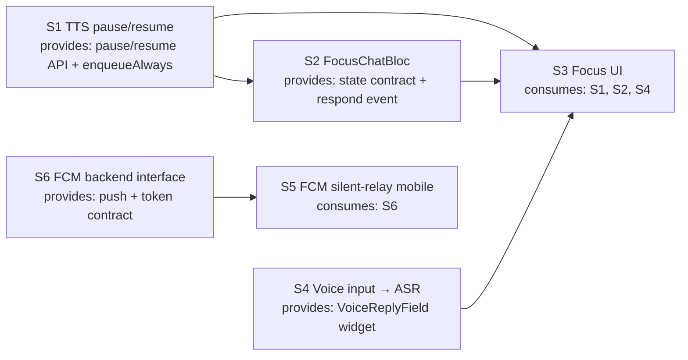

# Focus-Mode Voice Chat + FCM Wake-Up — Master Index

**Project ID**: `focus-mode-voice-chat`
**Created**: 2026.06.11
**Pattern**: Pattern A (Multi-Phase Implementation), cascade-shaped
**Review gate**: `/plan-review-cascaded` — MANDATORY before any implementation code (user directive 2026-06-11)
**Status**: 📝 DOC-SET AUTHORED — awaiting cascaded review kickoff

## Project Overview

A from-scratch focus-mode surface that becomes lupin-mobile's default screen, distilling the
notifications client to its essential 5%: receive Claude Code session notifications, speak them
through one serial TTS queue with pause/resume hold semantics, and reply by voice via the parent
Lupin Whisper ASR endpoint. One focused conversation at a time (last 7 messages), switched via an
always-visible vertical badge rail in session-establishment order. Stage 2 adds the standardized
Firebase Cloud Messaging silent-relay wake-up so a backgrounded/dozing Android device can be
re-summoned to reconnect its WebSocket — the "one listening channel" approach.

Born from interactive requirements elicitation 2026-06-11 (this doc-set is the plan-of-record).
Supersedes the May skeleton `../v0.1.7/2026.05.06-mobile-port-plans/03-session-switcher-port-plan.md`
(its Pattern A widget option was chosen; its §7 open questions are resolved by `02-decisions.md`).

## Quick Navigation

| Doc | Purpose |
|---|---|
| [00-working-contract.md](00-working-contract.md) | Rules of engagement — test ownership, user-involvement gate |
| [01-architecture.md](01-architecture.md) | Shared design anchor — system context, component inventory, diagrams |
| [02-decisions.md](02-decisions.md) | FROZEN decision log Q1–Q11 + open sub-questions |
| [03-testing-strategy.md](03-testing-strategy.md) | Shared testing anchor — tiers, venues, executor split |
| [10-section-s1-tts-pause-resume.md](10-section-s1-tts-pause-resume.md) | Cascade section S1 |
| [11-section-s2-focus-chat-bloc.md](11-section-s2-focus-chat-bloc.md) | Cascade section S2 |
| [12-section-s3-focus-ui.md](12-section-s3-focus-ui.md) | Cascade section S3 |
| [13-section-s4-voice-input-asr.md](13-section-s4-voice-input-asr.md) | Cascade section S4 |
| [14-section-s5-fcm-silent-relay-mobile.md](14-section-s5-fcm-silent-relay-mobile.md) | Cascade section S5 |
| [15-section-s6-fcm-backend-interface.md](15-section-s6-fcm-backend-interface.md) | Cascade section S6 |
| [20-fcm-background-isolate-explainer.md](20-fcm-background-isolate-explainer.md) | F-S5-S2-1 escalation companion — background-isolate blocker, web-sourced, 3 shapes compared |

## Stage & Section Summary

> **██ CASCADE CLOSED 2026-06-12T03:09Z ██** — all six sections through all three review
> stages (usability/reuse → viability/gap → ownership); ~43 findings resolved, every
> re-litigation round closed in one pass, 2 user rulings (F-S1-1 `enqueueAlways`,
> F-S5-S2-1 handler-does-the-work), ALL 7 OSQs ratified (ledger in `02-decisions.md`).
> Doc-set is **PLAN-OF-RECORD, implementation-ready**. Telemetry: `cascade_complete`
> post on commons topic `cascade-focus-mode-input-plan`.

| Stage | Section | Title | Status | Review |
|---|---|---|---|---|
| 1 | S1 | TTS pause/resume (TtsOrchestrator extension) | PLAN-OF-RECORD | ✅ 3-stage cascade closed |
| 1 | S2 | FocusChatBloc (state + session registry) | PLAN-OF-RECORD | ✅ 3-stage cascade closed |
| 1 | S3 | Focus UI surface (badge rail + chat pane + route swap) | PLAN-OF-RECORD | ✅ 3-stage cascade closed (+delta re-verify) |
| 1 | S4 | Voice input → Whisper ASR → reply | PLAN-OF-RECORD | ✅ 3-stage cascade closed |
| 2 | S5 | FCM silent-relay handler (mobile) | PLAN-OF-RECORD | ✅ 3-stage cascade closed (user-ruled reshape + 6/6 contract re-verify) |
| 2 | S6 | FCM backend interface (cross-repo, parent Lupin) | PLAN-OF-RECORD | ✅ 3-stage cascade closed (AC-S6.5 comparison PASS 6/6) |

## Cross-Section Dependency Map (DAG)

- **Providers state their interface in their own section file**; consumers cite the interface, never the sibling's prose (cold-reviewer independence).
- Valid topological orders include: S1, S4, S6 → S2 → S3, S5 (S1 precedes S2 since the Stage-1
  cascade close added the S1→S2 `enqueueAlways` edge — F-S1-1/F-S2-2, 2026-06-12).
- Stage 2 (S5+S6) has **no dependency on Stage 1** sections — the stages can be reviewed and
  implemented in parallel pipelines, but Stage 1 implements first (user directive: UI first).
  *Clarifying amendment (F-S5-1c, 2026-06-12)*: Stage 2's wake path terminates at the WS
  reconnect; the missed-message pull rides Stage 1's app-level reconnect re-hydration wiring
  (S2 §3.3 `FocusColdStartRequested` on WS reconnect), which exists before Stage 2 lands
  (Stage 1 implements first). S5 imports NO Stage-1 artifact; the pull is an integration-level
  seam, not a section dependency — the no-dependency claim survives.

## Cascade-Readiness Conformance (input-spec self-assessment)

1. **≥ 2 sections**: ✅ six sections.
2. **Section independence**: ✅ each section file is reviewable with only itself + the shared anchors (00/01/02/03 docs). Interfaces are restated at the consumption site.
3. **Explicit acyclic dependencies**: ✅ DAG above; provider/consumer direction documented both ends.
4. **Comparable scope**: ✅ approximately — S3 is the largest (UI assembly); S6 the smallest mobile-side (mostly cross-repo interface spec). Logged here per the no-silent-caps norm.

## Key Decisions (full log in [02-decisions.md](02-decisions.md))

- **Q1**: Focus-mode screen becomes the app's default surface; legacy screens demoted to a drawer
- **Q3**: Voice replies via parent Whisper endpoint `/api/upload-and-transcribe-wav` — NOT on-device STT
- **Q6**: TTS speaks every notification serially; PAUSE/RESUME hold semantics (not mute)
- **Q7**: Session rail keyed by `sender_id`, establishment order (first-seen first; workers append)
- **Q10**: Stage 2 follows the FCM silent-relay variant per `../v0.1.7/2026.04.21-fcm-apns-push-considerations.md` §7
- **Q11**: Vertical badge rail layout (Pattern A of the May skeleton)

## Recent Updates

- **2026.06.12**: Stage-1 cascade close revision wave applied (Author Tiffany 💍, Manager Mr.
  Radio 🦉). Headlines: `enqueueAlways()` ungated TTS path + FocusChatBloc sole dispatcher
  (F-S1-1 USER-RULED; F-S2-1 DI-seam mechanism); non-destructive urgent preempt on the focus path
  (F-S1-2); `FocusRespondRequested` single response-dispatch shape (F-S3-2); prompt-body
  extract-to-shared (F-S3-1); WS client-type marker added to the S5/S6 contract (F-S6-1);
  TTS-queue mirror dropped from the architecture anchor (F-S2-3); reuse seams named for the S5
  wake path (F-S5-1). Per-section details in each section file's §Revision Log.
- **2026.06.11**: Doc-set authored from completed requirements elicitation (session `dabf7fbb`, Mr. Radio 🦉). Wire-grounding done for ASR endpoint (`speech.py` router), mobile reply path (`NotificationRepository.respond`), and TtsOrchestrator seam. Awaiting cascaded review.

## Token Budget Status

| Document | Target | Status |
|---|---|---|
| This index | 500–1,500 | ✓ |
| Working contract | ≤ 1,000 | ✓ |
| Architecture | 4,000–8,000 | ✓ |
| Decisions | 2,000–5,000 | ✓ |
| Testing strategy | ≤ 2,000 | ✓ |
| Section files (each) | 1,500–4,000 | ✓ |

---

*Last updated: 2026.06.11*
