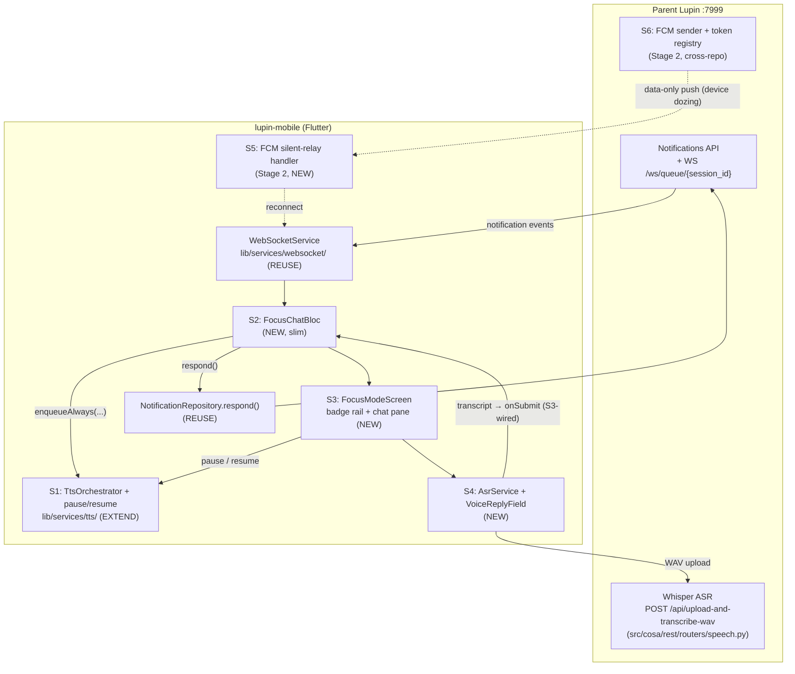

# Focus-Mode Voice Chat — Architecture (Shared Design Anchor)

**Created**: 2026.06.11
**Role in cascade**: shared anchor — every section reviewer loads this + `02-decisions.md` + their own section file, nothing else.

## Related Documentation

- **[Index](00-index.md)** · **[Working Contract](00-working-contract.md)** · **[Decisions](02-decisions.md)** · **[Testing Strategy](03-testing-strategy.md)**

## 1. System Context

The user runs many concurrent Claude Code sessions, each with a cosa-voice persona. Sessions emit
notifications (plain announcements and blocking asks) through the parent Lupin notifications API;
the mobile app receives them over WebSocket. Today's mobile UI is a verbatim web port — many
screens, much chrome. This milestone replaces the *default* surface with a single-purpose
focus-mode chat (Q1): hear everything, look at one conversation, reply by voice.

## 2. Existing-Component Inventory (REUSE — verified 2026-06-11)

| Component | Path | Reuse mode |
|---|---|---|
| WebSocketService | `lib/services/websocket/websocket_service.dart` | as-is; events already bridged in `lib/app.dart` |
| NotificationBloc (legacy) | `lib/features/notifications/domain/notification_bloc.dart` | file untouched; keeps driving legacy screens in the drawer. Focus mode does NOT extend it (Q2). Its Optional `tts` injection is WITHDRAWN in `service_locator` (F-S1-1 user ruling, F-S2-1 DI-seam) — FocusChatBloc is the sole TTS dispatcher |
| NotificationRepository | `lib/features/notifications/data/notification_repository.dart` | as-is; `respond( NotificationResponsePayload )` at `:42` is the reply path; per-sender fetch methods hydrate the last-7 window |
| NotificationItem / VoicePersona models | `lib/features/notifications/data/notification_models.dart`, `voice_persona.dart` | as-is |
| TtsOrchestrator | `lib/services/tts/tts_orchestrator.dart` | EXTENDED by S1 — has FIFO queue, urgent preempt, quota fallback, `stopAll()`; has NO pause/resume today. S1 adds pause/resume + ungated `enqueueAlways()` (F-S1-1 user ruling); legacy gated `enqueueIfSpeakable` retained unchanged (parity) |
| StreamingTtsPlayer | `lib/services/tts/streaming_tts_player.dart` | as-is (voiceId pipe-through already landed in voice-persona Phase 4) |
| PersonaBadge (+ dashed/dotted variants) | `lib/features/notifications/presentation/persona_badge.dart`, `lib/shared/painters/dashed_border_painter.dart` | as-is in the rail |
| InteractivePromptSheet bodies (Yes/No/Neither, choices) | `lib/features/notifications/presentation/interactive_prompt_sheet.dart` | prompt-body widgets adapted inline into chat bubbles (S3) |
| DI / service locator | `lib/core/di/service_locator.dart` | extended with new registrations |
| Whisper ASR endpoint | parent `src/cosa/rest/routers/speech.py` — `POST /api/upload-and-transcribe-wav` (multipart `file`, optional `prefix` query param, returns transcription text) | consumed by S4. The MP3 sibling endpoint queues a multimodal job — wrong tool, do not use |
| FCM deferral R&D | `../v0.1.7/2026.04.21-fcm-apns-push-considerations.md` §7 (silent-relay variant) | design basis for S5/S6 |
| May session-switcher skeleton | `../v0.1.7/2026.05.06-mobile-port-plans/03-session-switcher-port-plan.md` | prior art — Pattern A chosen (Q11); superseded by this doc-set |

## 3. New Components (by section)

| Section | New artifact | Home |
|---|---|---|
| S1 | `pause()` / `resume()` + paused-state + `queueDepthStream` + ungated `enqueueAlways()` on TtsOrchestrator | `lib/services/tts/tts_orchestrator.dart` |
| S2 | `FocusChatBloc` + events + state (session registry, focus pointer, last-7 windows, unread counts; respond dispatch via `FocusRespondRequested`) — NO TTS-queue mirror: S3 reads pause state/held count from S1's `pausedStream`/`queueDepthStream` directly (amended per F-S2-3; live depth stream per F-S1-S2-3) | `lib/features/focus_mode/domain/` |
| S3 | `FocusModeScreen`, `SessionRail`, `FocusChatPane`, inline prompt bubbles, pause/resume control; default-route swap + legacy drawer | `lib/features/focus_mode/presentation/` |
| S4 | `AsrService` (record → WAV → upload → transcript) + `VoiceReplyField` widget | `lib/services/asr/`, `lib/features/focus_mode/presentation/` |
| S5 | `FcmWakeupService` (data-message handler → WS reconnect → missed-message pull), Firebase bootstrap | `lib/services/push/` |
| S6 | Parent-Lupin: FCM sender hook + device-token registration endpoint + Firebase project config | cross-repo (parent `src/cosa/rest/`) |

## 4. Runtime Flows

### 4.1 Inbound notification (foreground)

1. WS frame arrives → `app.dart` bridge → `FocusChatBloc` (S2).
2. Bloc: upsert sender in registry (establishment order, Q7) → append to that sender's last-7
   window (Q8) → bump unread if not focused (Q4) → emit.
3. Bloc calls `TtsOrchestrator.enqueueAlways(...)` (ungated — bypasses the mute/priority gates;
   F-S1-1 user ruling) for EVERY notification (Q6) with the sender's `voiceId`. Orchestrator
   serializes; paused ⇒ accumulate (S1). FocusChatBloc is the SOLE TTS dispatcher — the legacy
   bloc's `tts` injection is withdrawn (F-S2-1 DI-seam).
4. UI (S3): focused chat re-renders; non-focused sender badge shows unread dot. Viewport never
   jumps (Q4).

### 4.2 Voice reply

1. User taps mic in `VoiceReplyField` (S4) → record WAV → release → upload to
   `/api/upload-and-transcribe-wav` → transcript shown editable → Send.
2. Send invokes the widget's `onSubmit` callback; S3 wires it to
   `FocusChatBloc.add( FocusRespondRequested(...) )`, whose handler calls
   `NotificationRepository.respond()` (F-S3-2 — one bloc-mediated dispatch shape). Structured
   asks answered via inline buttons dispatch the SAME event (Q5).

### 4.3 Background wake-up (Stage 2)

1. Device dozes → WS dies. Parent emits notification → S6 sender fires **data-only** FCM message
   (silent relay — no payload content beyond a wake hint, per the §7 variant).
2. S5 handler wakes app → pokes `WebSocketService`'s existing reconnect machinery → on reconnect,
   the app-level wiring re-dispatches `FocusColdStartRequested` (S2 §3.3 re-hydration — the
   missed-message pull, F-S5-1c) → normal flow resumes from 4.1.

## 5. Stage Boundary

Stage 1 (S1–S4) is complete and shippable with the app foregrounded; Stage 2 (S5–S6) removes the
foreground constraint. No Stage-1 artifact imports any Stage-2 artifact.
