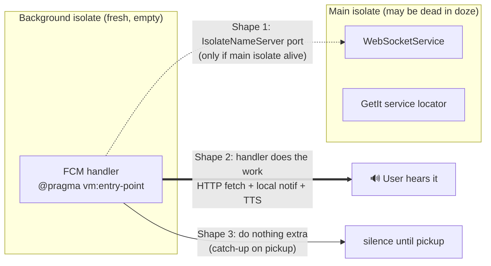

# 20 — FCM Background-Isolate Blocker, Explained (F-S5-S2-1 escalation companion)

**Date**: 2026-06-12
**Author**: Mr. Radio 🦉 (cascade Manager), at Rick's request during the F-S5-S2-1 escalation
**Audience**: Rick — plain-language synthesis + primary sources, to support the S5 goal ruling
**Status**: Decision-support document; no design authority of its own

---

## 1. The one-paragraph version

When Firebase Cloud Messaging (FCM) wakes our app with a silent push, the Dart code that
runs is **not running inside the app you see on screen**. On Android it runs in a separate,
freshly-spawned *isolate* — a sealed-off Dart runtime with its own memory. Nothing the main
app set up exists there: no GetIt service locator, no `WebSocketService` instance, no BLoCs,
no UI. So Section S5's written mechanism — "the background handler pokes WebSocketService's
reconnection machinery" — has **no object to poke**. The seam it names is real code, but it
lives on the other side of a wall the platform builds on purpose. And in the deep-doze case
the main app may not be running at all, so there is nothing alive to signal.

## 2. What an isolate is (and why Google did this)

Dart's concurrency model is the *isolate*: an independent event loop with **no shared
memory** with any other isolate ([dart.dev — Isolates](https://dart.dev/language/isolates),
[docs.flutter.dev — Concurrency and isolates](https://docs.flutter.dev/perf/isolates)).
Two isolates can only talk by passing messages through ports — they can never touch each
other's objects.

When a data-only FCM message arrives and the app is backgrounded or killed, Android spawns
a **new** isolate just to run the registered handler
([Firebase official docs — Receive messages in Flutter](https://firebase.google.com/docs/cloud-messaging/flutter/receive)).
The handler must be a top-level function annotated `@pragma('vm:entry-point')`. The
official docs are explicit about the consequences:

- ❌ "It is **not possible to update application state** or execute any UI impacting logic."
- ✅ It CAN: make **HTTP requests**, do **IO/local storage**, and **communicate with other
  plugins** (plugins re-register their platform channels in the new isolate).
- ⏱️ It must finish quickly — work beyond ~30 seconds risks OS termination.

So the blocker is not a bug and not a missing import — it is the platform's intended
security/lifecycle model. Any design that says "background handler calls a main-app
service" is unimplementable **by construction** on Android.

## 3. Why the written fallback is worth ~nothing

S5's stated guaranteed-minimum — "reconnect on next foreground" — is behavior Stage 1
already ships for free: app resume → lifecycle hook → WS reconnect → S2's re-hydration.
If the background path silently degrades to that, S5 adds only a freshness probe, and the
04-21 R&D's promise (below) is quietly broken: a phone dozing on the desk **says nothing**
until picked up.

## 4. What the April R&D actually promised

[2026.04.21-fcm-apns-push-considerations.md](/app/docs?path=lupin-mobile/src/rnd/v0.1.7/2026.04.21-fcm-apns-push-considerations.md)
§Option A′ (the recommended architecture S5/S6 descend from) draws this exact chain:

```
FCM ──(silent wake)──> Mobile background handler
background handler ── GET /api/notifications/{id} ──> Lupin backend
background handler ── flutter_local_notifications.show + flutter_tts.speak ──> User
```

The handler **fetches and speaks**. Hear-while-dozing is the documented expectation —
which is why this escalation is a goal-level question, not an author-level wording fix.

## 5. The three implementable shapes, with platform evidence



### Shape 1 — Poke the main isolate (cross-isolate signal)

Mechanism exists and is documented: the main isolate registers a `SendPort` under a global
name via
[`IsolateNameServer.registerPortWithName`](https://api.flutter.dev/flutter/dart-ui/IsolateNameServer-class.html);
the background handler looks it up and sends a one-shot message
([community guide](https://medium.com/@ipranilshah/demystifying-flutter-isolate-name-server-a-complete-guide-79721ff56e62),
[flutter-dev discussion](https://groups.google.com/g/flutter-dev/c/y85LGW-K4pQ)).
**Hard limit**: the lookup returns null when no main isolate is alive — i.e. in exactly
the killed/deep-doze states the wake-up exists for. Covers backgrounded-but-alive only.
Caveats: only simple payload types are reliable across the port; a release-mode
registration crash existed in older Flutter ([flutter#113825](https://github.com/flutter/flutter/issues/113825)) — version-pin check needed.

### Shape 2 — Handler does the work (the A′ pattern, recommended)

The official capability list ("HTTP requests… communicate with other plugins") is exactly
the A′ chain. Evidence per link in the chain:

| Link | Evidence |
|---|---|
| Authenticated fetch from handler | Officially supported ("perform HTTP requests") — [Firebase docs](https://firebase.google.com/docs/cloud-messaging/flutter/receive). Needs a self-contained auth path (read token from secure storage; NOT the main app's Dio singleton — empty locator). |
| Show local notification from handler | Proven pattern: `flutter_local_notifications` ships explicit background-isolate handling ([pub.dev](https://pub.dev/packages/flutter_local_notifications)); firebase_messaging interop issues resolved since v6.0.13 ([discussion](https://github.com/firebase/flutterfire/discussions/6113)); requires re-initializing the plugin inside the handler ([practitioner guide](https://apparencekit.dev/blog/flutter-notifications-push-and-locale/)). |
| Speak via TTS from handler | Plugin communication is allowed from the background isolate (same official clause). `flutter_tts` must be instantiated fresh in the handler; known crash mode on rapid repeated `speak()` calls ([flutter_tts#260](https://github.com/dlutton/flutter_tts/issues/260)) argues for the single-utterance, fetch-one-speak-one shape. **This is the link our Phase-0 probe must verify on a real device** — it is the least-documented hop. |
| Waking a dozing device at all | High-priority FCM data messages are delivered immediately in Doze and grant "limited processing including very limited network access" ([Firebase — Android message priority](https://firebase.google.com/docs/cloud-messaging/android-message-priority)). S6's payload already sets `"android": {"priority": "high"}`. |
| If longer audio needs a service | Android 12+ blocks foreground-service starts from background **except** a brief exemption window after a high-priority FCM message ([Android docs — FGS start restrictions](https://developer.android.com/develop/background-work/services/fgs/restrictions-bg-start), [troubleshooting](https://developer.android.com/develop/background-work/services/fgs/troubleshooting)); check `RemoteMessage.priority == high` before starting, start fast or get `ForegroundServiceStartNotAllowedException`. This is the contingency path, not the primary one — a single spoken utterance should fit inside the handler's ~30s budget without a service. |

Constraints to design around: ~30-second handler budget; fully self-contained dependency
bootstrap (own Dio/auth/prefs init — this is Arnold's residual #3); respect the user's
speak-toggle prefs read from local storage.

### Shape 3 — Honest de-scope (catch-up on pickup)

Zero platform risk; FCM still buys fresher-on-pickup + the S6 freshness probe. But it
formally retires hear-while-dozing for this milestone — a goal change vs the 04-21 A′
promise, which is why it needs your signature rather than Tiffany's.

## 6. Recommendation (unchanged by the research — strengthened)

**Shape 2**, scoped to the A′ single-utterance chain (fetch → local notification → one TTS
utterance), with a **Phase-0 on-device probe as the gate**: a throwaway handler that
fetches a canned payload and speaks one sentence with the screen off, on doze, on the
actual test device. Every link except TTS-from-handler is documented/proven above; the
probe converts the last link from "should work" to "observed working" before any S5
implementation task starts. If the probe fails on the device, we fall back to Shape 3
with evidence in hand — and Shape 1 can ride along as a cheap bonus for the
backgrounded-but-alive case in either outcome.

## 7. Sources

- [Firebase official — Receive messages in a Flutter app](https://firebase.google.com/docs/cloud-messaging/flutter/receive)
- [Firebase official — Android message priority & Doze](https://firebase.google.com/docs/cloud-messaging/android-message-priority)
- [Android official — FGS background-start restrictions (FCM exemption)](https://developer.android.com/develop/background-work/services/fgs/restrictions-bg-start)
- [Android official — FGS troubleshooting (exemption timing)](https://developer.android.com/develop/background-work/services/fgs/troubleshooting)
- [dart.dev — Isolates (no shared memory)](https://dart.dev/language/isolates)
- [docs.flutter.dev — Concurrency and isolates](https://docs.flutter.dev/perf/isolates)
- [api.flutter.dev — IsolateNameServer](https://api.flutter.dev/flutter/dart-ui/IsolateNameServer-class.html)
- [pub.dev — flutter_local_notifications (background-isolate support)](https://pub.dev/packages/flutter_local_notifications)
- [flutterfire discussion #6113 — local-notification + FCM interop](https://github.com/firebase/flutterfire/discussions/6113)
- [flutter_tts issue #260 — repeated speak() crash mode](https://github.com/dlutton/flutter_tts/issues/260)
- [flutter issue #113825 — IsolateNameServer release-mode regression](https://github.com/flutter/flutter/issues/113825)
- [flutterfire issue #10412 — duplicate-isolate spawn pitfall](https://github.com/firebase/flutterfire/issues/10412)
- [Practitioner guide — re-initializing notifications in the background isolate](https://apparencekit.dev/blog/flutter-notifications-push-and-locale/)
- In-repo: [2026.04.21-fcm-apns-push-considerations.md](/app/docs?path=lupin-mobile/src/rnd/v0.1.7/2026.04.21-fcm-apns-push-considerations.md) · [14-section-s5-fcm-silent-relay-mobile.md](/app/docs?path=lupin-mobile/src/rnd/2026.06.11-focus-mode-voice-chat/14-section-s5-fcm-silent-relay-mobile.md)
