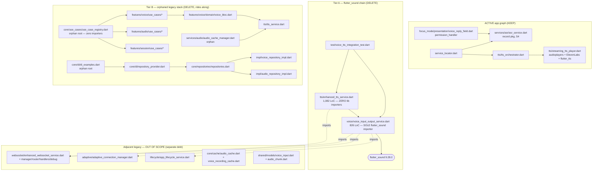

# Legacy Voice-Stack Retirement — Scoping Audit

> **STATUS: SCOPING DRAFT — retirement NOT scheduled.**
> Read-only audit output (2026-06-12). No code has been changed. This document is the
> plan-of-record *input* for a future retirement session; it authorizes nothing by itself.

**Trigger**: TODO.md debt item (OSQ-2 amendment, 2026-06-12) — *"flutter_sound REMOVAL-CANDIDATE
debt: two recording engines now in the dependency tree (`record` ^5.x active for S4;
`flutter_sound` ^9.2.13 = DI-disabled legacy). Remove flutter_sound WITH the legacy-voice-stack
retirement — not before (legacy wrapper `VoiceInputOutputService` still references it)."*

**Provenance**: OSQ-2 amendment F-S4-1 (`src/rnd/2026.06.11-focus-mode-voice-chat/02-decisions.md:135-140`),
cascade handoff §5 (`90-cascade-revision-handoff.md:147,157,249`), S4 section doc
(`13-section-s4-voice-input-asr.md:21,152-153,189`).

---

## 1. Executive Summary

- `flutter_sound` (pinned `^9.2.13` at `pubspec.yaml:27`, **resolved 9.28.0** in `pubspec.lock`)
  has exactly **one importer in the entire repo**: the legacy
  `lib/services/voice/voice_input_output_service.dart:4`.
- `VoiceInputOutputService` is **unreachable from the app entrypoint**: its only `lib/` importer is
  `lib/services/tts/enhanced_tts_service.dart`, which itself has **zero importers** anywhere in
  `lib/`. The only thing keeping both compiling is one root-level test file
  (`test/voice_tts_integration_test.dart`).
- The wider DI-disabled legacy voice/audio/TTS/use-case-registry stack (named in the
  `service_locator.dart:62-67` comment) is fully orphaned — every file traces back to roots with
  no active importers.
- **No functionality gap blocks retirement** (§5): every capability the legacy stack *actually
  delivered* is covered by the new stack; its unique-on-paper features (VAD, adaptive codec
  config, real-time mic streaming) were prototype simulations — the server-send calls are
  literally commented out (`voice_input_output_service.dart:394-395,438-442` — "Would send…"
  prints only).
- Headline counts: **Tier A (flutter_sound-critical): 3 files / ~2,179 lines deleted. Tier B
  (orphaned legacy stack, recommended to ride along): 16 files / ~4,931 lines deleted. 3 files
  modified. 7 quarantined test files (incl. 2 `.mocks.dart`) dropped.**
- Recommended posture: **GO** (when scheduled), with `flutter_sound` removal as the **final**
  phase per the do-not-remove-before rule.

---

## 2. Legacy-Stack Dependency Map

Boundary rule applied: the legacy *voice* stack imports the enhanced-websocket / adaptive /
lifecycle / cache surfaces, but those are shared with other still-present legacy code
(websocket debug dashboard, root-level `simple_websocket_test.dart`, `adaptive_services_test.dart`)
and are **not** retired here. Deleting the voice stack only removes *inbound* edges to them.

---

## 3. Inventory Tables

### 3.1 Tier A — flutter_sound-critical core (DELETE; sufficient on its own to unblock flutter_sound removal)

| File | LoC | Role | Retirement action |
|---|---|---|---|
| `lib/services/voice/voice_input_output_service.dart` | 826 | Legacy recorder/player/VAD/WS-audio wrapper; **sole `flutter_sound` importer** (`:4`); singleton, never DI-registered | **DELETE** |
| `lib/services/tts/enhanced_tts_service.dart` | 1,082 | Legacy "enhanced" TTS (ElevenLabs-era prototype); sole `lib/` importer of `VoiceInputOutputService`; **zero importers itself** | **DELETE** |
| `test/voice_tts_integration_test.dart` | 271 | Root-level (non-quarantined) smoke test of both classes above; the only thing forcing them to compile | **DELETE** |

Subtotal: **3 files, ~2,179 LoC**.

### 3.2 Tier B — orphaned legacy voice/audio/TTS/use-case-registry stack (DELETE; recommended to ride the same retirement)

This is the stack the `service_locator.dart:62-67` comment disables ("references symbols that
don't exist… Tree-shaker skips these files as long as nothing imports them from the active
graph"). Every root below has zero active importers (verified by repo-wide grep, 2026-06-12).

| File | LoC | Role | Retirement action |
|---|---|---|---|
| `lib/services/tts/tts_service.dart` | 290 | Legacy pre-orchestrator TTS service; importers: voice_bloc, audio_cache_manager, di_examples (all Tier B) + quarantined tests only | **DELETE** |
| `lib/services/audio/audio_cache_manager.dart` | 790 | Legacy audio cache; zero `lib/` importers | **DELETE** (removes `lib/services/audio/` dir) |
| `lib/features/voice/domain/voice_bloc.dart` | 334 | Legacy voice BLoC | **DELETE** |
| `lib/features/voice/domain/voice_event.dart` | 65 | Legacy voice events | **DELETE** |
| `lib/features/voice/domain/voice_state.dart` | 129 | Legacy voice states | **DELETE** |
| `lib/features/voice/use_cases/process_voice_input_use_case.dart` | 174 | Legacy use case | **DELETE** |
| `lib/features/voice/use_cases/start_voice_recording_use_case.dart` | 118 | Legacy use case | **DELETE** |
| `lib/features/voice/use_cases/stop_voice_recording_use_case.dart` | 125 | Legacy use case | **DELETE** |
| `lib/features/voice/use_cases/voice_interaction_orchestrator.dart` | 332 | Legacy orchestrator | **DELETE** (removes `lib/features/voice/` — `data/` + `presentation/` are already empty dirs) |
| `lib/features/audio/use_cases/generate_tts_audio_use_case.dart` | 308 | Legacy use case; importers: use_case_registry + voice_interaction_orchestrator only | **DELETE** (removes `lib/features/audio/`) |
| `lib/features/session/use_cases/create_session_use_case.dart` | 245 | Legacy use case; same importers | **DELETE** (removes `lib/features/session/`) |
| `lib/core/use_cases/use_case_registry.dart` | 440 | Orphan root — zero importers repo-wide | **DELETE** |
| `lib/core/di/di_examples.dart` | 336 | Orphan example file — zero importers | **DELETE** |
| `lib/core/di/repository_provider.dart` | 99 | Importers: di_examples + one quarantined test only | **DELETE** |
| `lib/core/repositories/impl/voice_repository_impl.dart` | 324 | SharedPreferences-backed legacy repo | **DELETE** |
| `lib/core/repositories/impl/audio_repository_impl.dart` | 366 | SharedPreferences-backed legacy repo | **DELETE** |
| `lib/core/repositories/voice_repository.dart` | 132 | Interface — importers all Tier B | **DELETE** |
| `lib/core/repositories/audio_repository.dart` | 324 | Interface — importers all Tier B | **DELETE** |

Subtotal: **18 files listed; ~4,931 LoC** (16 unique deletions beyond Tier A's 3; the two
interface files are included in the count).

### 3.3 MODIFY

| File | Change |
|---|---|
| `lib/core/repositories/repositories.dart` | Drop `voice_repository.dart`, `audio_repository.dart`, `impl/voice_repository_impl.dart`, `impl/audio_repository_impl.dart` export lines |
| `lib/core/di/service_locator.dart` | Rewrite/remove the now-obsolete legacy-stack comment block (`:62-67`) and the `_initializeRepositories` legacy remark (`:265-274` region) |
| `pubspec.yaml` | Remove `flutter_sound: ^9.2.13` (`:27`); update the `record` justification comment (`:31-34`) which references flutter_sound as in-tree debt — **LAST phase only** (§6 P5) |

### 3.4 KEEP (verified active users — do NOT touch)

| File / package | Why it stays |
|---|---|
| `audioplayers ^5.2.1` | Active: `streaming_tts_player.dart`, `audio_artifact_player.dart` (legacy users tts_service/enhanced_tts also use it, but active users remain) |
| `permission_handler ^11.0.1` | Active: `voice_reply_field.dart` (mic permission, AC-S4.5) |
| `path_provider` | Active: `asr_service.dart` temp-WAV dir |
| `record ^5.1.2` (resolved 5.2.1) | THE active recording engine (S4) — DI-registered at `service_locator.dart:313-317` |
| `flutter_tts ^4.2.0` | Active TTS fallback (orchestrator path) |
| `android/app/src/main/AndroidManifest.xml:5` `RECORD_AUDIO` | Required by `record`/`AsrService` push-to-talk |
| `lib/shared/models/voice_input.dart`, `audio_chunk.dart` | Shared with the enhanced-websocket stack + `core/cache` (out of scope) |
| `lib/core/cache/audio_cache.dart`, `voice_recording_cache.dart` | Cache-system surface, separate legacy debt |
| `lib/services/adaptive/`, `lib/services/lifecycle/`, enhanced-websocket family | Shared adjacent legacy; separate retirement (see §8 OQ-5) |
| `test/adaptive_services_test.dart`, `test/simple_websocket_test.dart`, `test/utils/websocket_test_utils.dart` | Subjects survive this retirement (adjacent-legacy debt) |

### 3.5 flutter_sound platform/lock footprint (all self-resolve after Phase 5)

| Trace | Location | Action |
|---|---|---|
| Direct pin | `pubspec.yaml:27` | Remove (P5) |
| Lock entries | `pubspec.lock:534-557` (`flutter_sound` 9.28.0, `flutter_sound_platform_interface`, `flutter_sound_web`) | Regenerate via `pub get` on the **laptop** (dev-server has no Android SDK — build/deploy split) |
| iOS registrant | `ios/Runner/GeneratedPluginRegistrant.m:45-48` | Auto-regenerates on next laptop build — do not hand-edit |
| Android registrant | `android/app/src/main/java/io/flutter/plugins/GeneratedPluginRegistrant.java:56` | Auto-regenerates on next laptop build |
| iOS `Info.plist` | No `NSMicrophoneUsageDescription` present (pre-existing; Android-primary) | No flutter_sound-specific action |

---

## 4. New-Stack Contrast (what replaced what)

| Capability | Legacy provider (DI-dead) | Active provider | Status |
|---|---|---|---|
| Mic recording | `flutter_sound` `FlutterSoundRecorder` in `VoiceInputOutputService` | `record` `AudioRecorder` in `AsrService` (`service_locator.dart:313-317`; WAV 44.1 kHz mono per OSQ-2-as-amended, mirroring parent `lupin_client.py:79-81`) | **Covered** |
| Speech→text | None real (audio "send to server" stubbed) | `AsrService` → parent Whisper `POST /api/upload-and-transcribe-wav` | **Superseded (better)** |
| Voice-input UX | None shipped (`features/voice/presentation/` is empty) | `VoiceReplyField` push-to-talk state machine (S4 §4.2) in focus mode | **Superseded** |
| TTS playback | `EnhancedTTSService` + `tts_service.dart` + WS `audio_chunk` buffering | `TtsOrchestrator` + `StreamingTtsPlayer` (ElevenLabs primary, `flutter_tts` fallback) + `notification_audio` | **Covered** |
| Mic permission | `permission_handler` inside legacy service | `permission_handler` inside `VoiceReplyField` | **Covered** |

---

## 5. Functionality-Coverage Gap Analysis

Capabilities the legacy stack has and nothing else does — each assessed as blocker / non-blocker:

| Legacy-only capability | Reality check | Blocker? |
|---|---|---|
| Voice-activity detection (VAD, amplitude/decibel loop) | Prototype simulation; leaks `onProgress` subscriptions on a 100 ms timer; never DI-wired, never reachable from app graph | **No** — new push-to-talk model has no VAD requirement (explicit S4 design) |
| Real-time mic streaming to server | **Never implemented** — send calls are commented out; code prints "Would send audio data to server" (`voice_input_output_service.dart:438-444`) | **No** — capability never existed in practice |
| Adaptive codec/bitrate config (`VoiceConfig.fromAdaptiveConfig`) | Configured a recorder that nothing invoked | **No** |
| Audio caching for offline (`_cacheAudioFile`, `audio_cache_manager`) | Wrote unindexed timestamped WAVs to cache dir; the real cache surface (`core/cache/*`) survives untouched | **No** |
| Legacy WS `audio_chunk`/`tts_start`/`tts_complete` handling | Active TTS path is HTTP-streaming via orchestrator; notification audio has its own service | **No** |

**Conclusion: ZERO retirement blockers found.** The legacy stack is dead weight: DI-disabled,
unreachable from `main.dart`, and its on-paper-unique features were simulations.

---

## 6. Proposed Retirement Phase Plan (ordered; flutter_sound removal LAST)

> Sequencing rule honored: `flutter_sound` leaves `pubspec.yaml` only **after** every file that
> imports it is gone (TODO.md "not before" clause).

- **P0 — Pre-flight (dev-server)**: re-run the zero-importer grep gates
  (`VoiceInputOutputService`, `EnhancedTTSService`, `package:flutter_sound`) to confirm nothing
  new grew an edge since this audit; capture a green baseline on the active suites
  (`./flutter.sh analyze`, `./flutter.sh test test/unit test/widget test/service_integration`).
- **P1 — Tier A deletion**: delete `voice_input_output_service.dart`,
  `enhanced_tts_service.dart`, `test/voice_tts_integration_test.dart`; remove the now-empty
  `lib/services/voice/`. After P1 the repo has **zero** `flutter_sound` imports.
- **P2 — Tier B deletion**: delete the 16 orphaned-stack files (§3.2) + empty dirs
  (`lib/features/voice|audio|session/`, `lib/services/audio/`); apply the two `lib/` MODIFYs
  (§3.3: repositories barrel, service_locator comments). `./flutter.sh analyze` must stay clean.
- **P3 — Quarantine drop**: delete the 7 coupled quarantined files (§7) + update
  `test/legacy_quarantine/README.md` table rows (per project convention: quarantined legacy
  tests + their `.mocks.dart` get dropped WITH the retirement).
- **P4 — Docs/tracking sweep**: mark the TODO.md debt item complete; note closure in the OSQ-2
  trail (`02-decisions.md` flag + `90-cascade-revision-handoff.md` straggler). Historical 2025.07
  R&D docs mentioning flutter_sound stay as-is (historical record).
- **P5 — flutter_sound removal (LAST)**: remove `pubspec.yaml:27` + rewrite the `record`
  comment (`:31-34`); then on the **laptop** (dev-server/laptop split — no SDK here): `flutter
  pub get` (lock purges `flutter_sound*` 9.28.0 entries), rebuild (registrants regenerate),
  `adb` deploy smoke.
- **P6 — Verification gates**: `./flutter.sh analyze` clean; active test suites green
  (tabulated pass/fail per tier); grep gate `flutter_sound` → only historical `src/rnd/` hits;
  on-device push-to-talk + TTS sanity via existing widget/service-integration coverage
  (`focus_app_wiring_test.dart`, `asr_service_test.dart`, voice_reply_field widget tests).

---

## 7. Test-Impact List

| Test file | Location | Impact |
|---|---|---|
| `test/voice_tts_integration_test.dart` | active root | **DELETE (P1)** — subjects deleted; this is the only active-suite casualty |
| `test/legacy_quarantine/unit/voice_bloc_test.dart` | quarantine | **DROP (P3)** — subject `voice_bloc.dart` deleted |
| `test/legacy_quarantine/repositories/voice_repository_test.dart` | quarantine | **DROP (P3)** |
| `test/legacy_quarantine/repositories/audio_repository_test.dart` | quarantine | **DROP (P3)** |
| `test/legacy_quarantine/services/audio/audio_cache_manager_test.dart` + `.mocks.dart` | quarantine | **DROP (P3)** — owner + mocks together |
| `test/legacy_quarantine/di/dependency_injection_test.dart` | quarantine | **DROP (P3)** — imports `tts_service.dart` + `repository_provider` + repositories barrel (all deleted); DI coverage now lives in `test/service_integration/focus_app_wiring_test.dart` + unit suites |
| `test/legacy_quarantine/integration/service_integration_test.dart` | quarantine | **DROP (P3)** — imports `tts_service.dart` + deleted repo impls |
| `test/adaptive_services_test.dart` | active root | **KEEP** — adaptive/lifecycle survive (adjacent debt) |
| `test/simple_websocket_test.dart` | active root | **KEEP** — enhanced-WS stack survives (adjacent debt) |
| `test/unit/services/asr/asr_service_test.dart`, focus-mode widget/service-integration suites | active | **KEEP** — these ARE the replacement coverage |
| Remaining quarantine files (websocket/cache/monitoring/user/job/session repos) | quarantine | **KEEP quarantined** — subjects out of this retirement's scope |

Net: active suite loses exactly one (legacy) file; no active green test is endangered.

---

## 8. Risks & Open Questions

| # | Item | Notes / recommendation |
|---|---|---|
| R-1 | Laptop dependency for P5 | `pub get`, registrant regen, and device smoke must run on the laptop (dev-server has no Android SDK/adb). Phases P0-P4 are fully dev-server-safe; schedule P5/P6 for a laptop-available window. |
| R-2 | Pin-vs-lock drift | Pubspec says `^9.2.13` but the lock resolved **9.28.0** — TODO/doc wording quotes the pin. Informational only; cite both in the closure note. |
| R-3 | Tier B bundling scope | Tier A alone unblocks flutter_sound removal. Recommendation: bundle Tier B (all orphaned, zero importers, ~4.9k LoC of confirmed-dead code) — but a minimal-scope retirement (Tier A + P5 only) is a valid fallback if review wants a smaller diff. **Needs user ratification at plan time.** |
| R-4 | Quarantine-drop confirmation | Project convention (auto-memory: quarantine-first, delete only when new coverage proves sufficient) — §7 argues sufficiency; confirm the 7-file drop list during the retirement session. |
| OQ-5 | Adjacent legacy NOT retired here | enhanced-websocket family (6 files + debug dashboard), `adaptive_connection_manager`, `app_lifecycle_service`, `core/cache/{audio_cache,voice_recording_cache}.dart`, shared models, `test/utils/websocket_test_utils.dart` (itself orphaned) — propose as a SEPARATE follow-on debt item ("legacy WS/adaptive stack retirement") rather than scope-creeping this one. |
| OQ-6 | `audioplayers` major-version debt | Both deleted TTS legacies and the ACTIVE `streaming_tts_player` share `audioplayers ^5.2.1`; retirement does not change its pin, but a future upgrade gets easier with 2 fewer consumers. No action here. |

---

*Audit performed read-only on branch `wip-v0.1.6-2026.04.16-tracking-lupin-work`, 2026-06-12.
All file:line references verified against the working tree on that date.*
