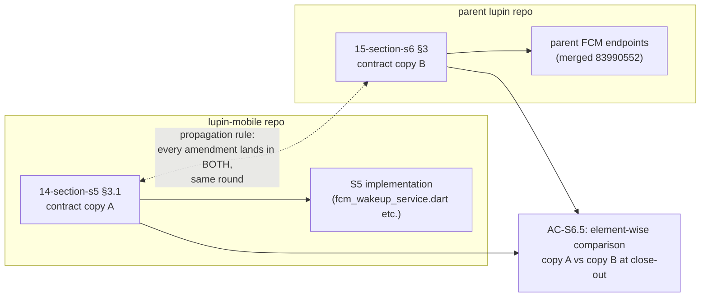

# The Two-File Contract Pattern — Explainer

**Date**: 2026.06.12
**Author**: Mr. Radio 🦉 (session dabf7fbb), at Rick's request during the focus-mode postgame (agenda item 5)
**Status**: EXPLAINER — describes the pattern as practiced in the focus-mode milestone; ratification as a standing pattern is the pending postgame question.

---

## 1. The problem it solves

Some features span two repositories. In the focus-mode milestone, section S5 (FCM silent
relay, **mobile side**) and section S6 (FCM backend interface, **parent Lupin side**) are two
halves of one wire protocol: the mobile app registers FCM tokens against endpoints the parent
serves, and the parent sends silent pushes shaped exactly the way the mobile wake chain
expects to parse them.

Two different fleets implemented those halves — my fleet in `lupin-mobile`, Tiberius's Lane-3
in the parent repo — working in different sessions, on different days, with no shared context
window. Anything they "agree on" exists only in documents. The question is: **where does the
agreement live, so that neither side silently drifts from it?**

## 2. What "the contract lives in two files" actually means

The interface specification — every endpoint, method, payload field, response shape, and
semantic rule the two sides share — is written out **verbatim, in full, in BOTH repos' design
docs**:

| Copy | File | Audience |
|------|------|----------|
| Mobile-side copy | `src/rnd/2026.06.11-focus-mode-voice-chat/14-section-s5-fcm-silent-relay-mobile.md` §3.1 | My fleet's S5 implementer |
| Parent-side copy | `src/rnd/2026.06.11-focus-mode-voice-chat/15-section-s6-fcm-backend-interface.md` §3 (work order handed to Tiberius's lane) | Parent Lane-3 implementer |

It is NOT a summary in one and a spec in the other, and NOT a link from one to the other.
Both files contain the same elements: `POST /api/fcm/register-token` and
`POST /api/fcm/unregister-token` with their exact JSON bodies, the silent-push message field
set, the `client_type: "mobile"` auth marker, the `reason` enum semantics, response shapes,
and the durable-storage requirement.

## 3. The two rules that make it work

Duplicating a spec is normally how you CREATE drift. The pattern only works because two
mechanical rules ride along:

**Rule 1 — Propagation: every amendment lands in both files in the same round.**
When the contract changes, the change is applied to both copies before the round closes —
never "update one now, sync the other later." Example from last night: the OSQ-6 second
amendment switched unregister from `DELETE` to `POST /api/fcm/unregister-token`. Both files
were amended within 30 seconds of each other (04:39:00Z and 04:39:30Z, recorded in each
file's Revision Log) plus a decision record in `02-decisions.md` — all BEFORE any
implementation touched that endpoint.

**Rule 2 — Verification: an element-wise comparison AC at close-out.**
AC-S6.5 requires someone to literally compare the two copies element by element — endpoint by
endpoint, field by field — and report matches/mismatches. Not "do they look in sync" but a
checklist diff. The redline draft (#9) adds owner/instant tags so this AC has a named owner
and a defined execution moment, because an unowned comparison AC is how the check gets skipped.

## 4. Why we believe it works: two live incidents

1. **AC-S6.5 caught 4-of-6 element drift at cascade close.** During the cascade reviews the
   comparison ran and found 4 of 6 contract elements had silently diverged between the S5 and
   S6 copies (wording-level and shape-level drift introduced by parallel revision waves). It
   was caught at the DOC stage — before either fleet implemented against the wrong shape.
   That's the cheapest possible catch point.
2. **The OSQ-6 amendment propagated cleanly pre-implementation.** Rule 1 in action (the
   example above): the contract changed mid-cascade and both implementations were built
   against the amended, synced contract. The parent side landed (merge `83990552`), the
   mobile side landed (commit `b34fa01`), and AC-S6.1 rehydration verified 6/6 against the
   live `:8000` server.

## 5. The alternative and its failure mode

The obvious alternative is **single-homing**: the contract lives in ONE repo and the other
repo links to it.

- Cross-repo links rot, and the doc-viewer scope boundary makes "just click through" a
  real friction for a fleet working heads-down in its own repo.
- The implementing fleet that can't see the contract IN ITS OWN section doc is precisely the
  one that drifts — they implement from memory of the contract rather than the contract.
  The 4/6 drift that AC-S6.5 caught is what that looks like even WITH local copies; without
  one it goes undetected until integration.
- A worker's context is loaded from its own repo's doc-set. A remote contract is a fetch a
  busy implementer may skip; a local §3.1 is unskippable — it IS their spec.

## 6. The honest costs

- **Dual maintenance**: every amendment is two edits plus a decision record. (Mitigated by
  Rule 1 making it a single round-step, and in practice the same author/manager does both.)
- **The comparison AC must actually run**: the pattern degrades to ordinary duplication-drift
  if AC-S6.5-style checks are skipped. Hence the owner/instant tagging in redline #9.
- **Scale**: with two repos this is cheap. With N repos sharing a contract it becomes N
  copies — at that point a generated/schema-derived contract would beat prose copies. Nothing
  in the current ecosystem is at N>2 yet.

## 7. What ratification would mean (the pending question)

A YES on postgame item 5 makes this the **standing pattern for any cross-repo interface**:
whenever a feature spans repos, the manager (a) writes the contract verbatim into both repos'
section docs, (b) enforces same-round amendment propagation, and (c) includes an owned,
instant-tagged element-wise comparison AC at close-out. The redline draft already carries the
supporting fold (entry #9 → personas.md proposed Convention 7 + contract-AC tagging), so
ratifying here folds with the rest of the ledger under the review-then-fold disposition.

A NO leaves it as a technique managers may reach for ad hoc.

---

*Related: `14-section-s5-fcm-silent-relay-mobile.md` §3.1, `15-section-s6-fcm-backend-interface.md` §3,
`02-decisions.md` (OSQ-6 amendment records), `2026.06.12-pip-redline-draft-workflow-guidance-ledger.md` (#9),
TODO.md §POSTGAME item 5.*
