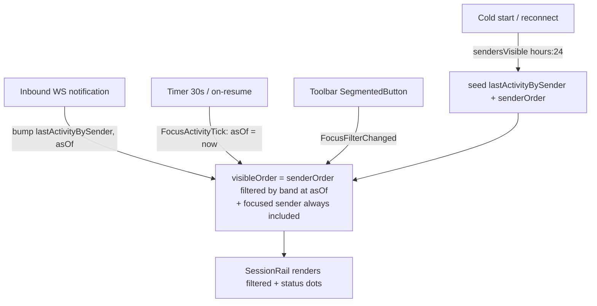

# Focus UI — Active / Recent-24h Session Filter

**Date**: 2026.06.25
**Author**: Tiffany 💍 (session f53bc7b3)
**Status**: PLANNING (pre-implementation)
**Prefix**: [LUPIN-MOBILE]
**Related**: `2026.06.11-focus-mode-voice-chat/`, `2026.06.23-focus-mode-status-summary.md`

---

## 1. Goal

Make the Focus rail actually *focus*. Today it shows **every** sender the app
has ever seen (establishment order, never re-sorted). Rick wants:

- **Default view = currently-active sessions only** — the personas he can talk
  to *right now*.
- **A toggle** to a **rolling 24-hour history** of sessions that were active in
  the last day.
- Round-trip freely between the two views.

He is explicit that **history older than the rolling 24h window is out of
scope** — this is a live-comms surface, not an archive.

---

## 2. Confirmed definition of "active" (cross-client alignment)

Per Rick's instruction, I asked **Mr Radio 🦉** how the web **notifications**
client and the **multiplexer** client compute "active" so mobile matches them
rather than inventing a threshold. His answer (2026.06.25, DM thread
`77099736`):

> **Both web clients use the SAME recency math. It is a pure CLIENT-SIDE
> threshold on `last_activity` — there is NO server liveness / heartbeat /
> presence signal feeding these "active" glyphs.**

| Band | Predicate | Meaning |
|------|-----------|---------|
| 🟢 Active | `now − last_activity < 1h` (`3_600_000` ms) | **our default view** |
| 🟡 Recent | `now − last_activity < 24h` (`86_400_000` ms) | **our history toggle** (🟢+🟡) |
| ⚪ Stale | `>= 24h` or no activity | **dropped** from both views |

**Source of truth** (cite in code comments — there is no cross-language shared
constant; mobile is Dart, web is TS/JS):
- Notifications: `src/lupin_app/static/js/notifications.js` `getSenderStatusIndicator()` ~13214–13221.
- Multiplexer: `src/lupin_app/static/js/multiplexer/render/templates/senderCard.ts:257-263` (`senderStatusGlyph()`).

**Two caveats Mr Radio flagged (both shape this plan):**

1. **Endpoint parity** — the web clients call
   `GET /api/notifications/senders-visible/{email}` (visibility-filtered).
   Mobile's Focus cold-start currently calls the **unfiltered**
   `GET /api/notifications/senders/{email}`, so it could surface senders the
   web deliberately hides. → **Switch to `senders-visible`.** (Good news:
   `NotificationRepository.sendersVisible()` already exists, unused —
   `notification_repository.dart:164`.)

2. **No aging timer** — the web clients have **no** `setInterval`/timer; they
   recompute the glyph only when a WebSocket notification forces a re-render.
   A session silently ages past 1h with no event firing. Mobile **cannot**
   rely on that — we need an explicit re-evaluation cadence (timer + on-resume),
   or a session sits 🟢 forever in the Active filter.

**Not conflated** (Mr Radio's warning): the multiplexer also has
`StripSession.active` (voice-persona *allocation*) and
`conversation_mode_active` (mic on). Those are orthogonal real-time flags —
**not** "active session." Our filter is recency-of-traffic only. "Active" and
"executing" are **not** distinguished anywhere — there is no job-running signal
to read.

---

## 3. Current-state gaps (what's missing today)

Mapped against the existing Focus code:

| # | Gap | Evidence |
|---|-----|----------|
| G1 | State **does not retain** `lastActivity` per sender — cold-start sorts by it then **throws the timestamps away**, keeping only the id order. | `focus_chat_bloc.dart:163-175` sorts `SenderSummary` by `lastActivity` DESC → emits `senderOrder` (ids only). `FocusChatState` has no timestamp map (`focus_chat_state.dart:53-68`). |
| G2 | No filter mode in state or events. | `focus_chat_state.dart`, `focus_chat_event.dart` |
| G3 | No re-evaluation cadence — nothing recomputes a recency predicate over time. | bloc has no `Timer` |
| G4 | Cold-start uses unfiltered `senders()`. | `focus_chat_bloc.dart:163`, `:208` |
| G5 | `SessionRail` renders **all** of `state.senderOrder`. | `session_rail.dart:29` (`itemCount: state.senderOrder.length`) |
| G6 | Inbound notifications append to `senderOrder` but never record a per-sender activity timestamp. | `focus_chat_bloc.dart:56-89` (`_onInbound`) |

---

## 4. Proposed design

### 4.0 Core model: retain every card, toggle VISIBILITY (Rick ruling, 2026.06.25)

The governing mental model, in Rick's words: **we keep all the cards — it's just
a matter of whether we render them visible or not.** Nothing is destroyed.

- The session registry, windows, and per-card history are **retained in state**
  regardless of filter. The filter never deletes a sender; it flips a derived
  **`visible`** flag per card.
- **Live / focus mode (toggle ON):** show ONLY currently-live sessions. A
  session that has **exited** has its persona icon **and** its whole card
  **rendered invisible** (`visible = false`) — because the point of focus is the
  current live sessions. Aged-out (`>1h`) sessions are likewise invisible here.
- **History mode (toggle OFF):** the hidden cards flip back to `visible = true`
  within the rolling window (last hour / last 24h). All cards are kept; we just
  re-reveal them.

Implementation note: the `visibleOrder` selector in §4.2 IS this `visible` flag,
expressed as "the ordered ids whose card is currently visible." Underlying
`senderOrder` / `windows` are never pruned by the filter — pure retention, a
derived render lens on top. This is the single most important contract in the
feature: **filter = visibility, not deletion.**

### 4.1 The widget — what the toggle looks like

The rail is **56px wide** (`session_rail.dart:16`) — far too narrow for a
horizontal control. So the toggle lives **above** the rail+pane Row, not inside
the rail.

**Recommended: a slim filter toolbar between the AppBar and the Row**, hosting
a Material-3 `SegmentedButton<FocusFilter>` with live counts:

```
┌────────────────────────────────────────────────┐
│ ☰   Focus                                  ⏸    │  AppBar (unchanged)
├────────────────────────────────────────────────┤
│   ┌─────────────┬──────────────┐                │  ← NEW slim toolbar (~48px)
│   │ ● Active (3)│ Recent 24h (8)│               │     SegmentedButton
│   └─────────────┴──────────────┘                │
├──────┬─────────────────────────────────────────┤
│ 🟢🦉 │                                          │
│ 🟢💍 │   FocusChatPane (unchanged)              │  ← SessionRail now renders
│ 🟡 R │                                          │     a FILTERED list, each
│      │                                          │     badge gets a status dot
└──────┴─────────────────────────────────────────┘
```

Why this over an AppBar-embedded control: the segmented button has room to show
**counts per band** (the at-a-glance "3 active, 8 in the last day" that makes
the toggle meaningful), and it keeps the AppBar's existing pause/resume action
uncluttered.

**Secondary enhancement — per-badge status dot.** Mirror the web 🟢/🟡 glyphs:
a small colored dot at the bottom-right of each `PersonaBadge`/avatar in the
rail (green `<1h`, amber `<24h`). This makes "why is this one here" legible in
the Recent-24h view (you can see which are truly live vs merely recent). Uses
the same `Stack` + `Positioned` idiom already in `_RailEntry`
(`session_rail.dart:97-119`).

**Empty state.** When Active mode yields zero senders, the rail shows a gentle
hint + a one-tap jump: *"No active sessions — see Recent 24h"* (button flips the
filter). Prevents a blank rail reading as "broken."

*(Alternative widget placements — AppBar-embedded `SegmentedButton`, or a
`FilterChip` pair — are catalogued in §7 Open Decisions for Rick to pick.)*

### 4.2 State changes — `FocusChatState`

```dart
enum FocusFilter { active, recent24h }   // NEW

class FocusChatState extends Equatable {
  // ... existing fields ...
  final Map<String, DateTime> lastActivityBySender;  // NEW (G1)
  final FocusFilter           filter;                 // NEW (G2), default .active
  final DateTime?             asOf;                    // NEW (G3) evaluation clock

  /// Derived, pure: the senders the rail should show under the current
  /// filter, in establishment order, evaluated at `asOf`. The focused
  /// sender is ALWAYS included (never blank the pane mid-read — §4.6).
  List<String> get visibleOrder { ... }
}
```

`copyWith` / `props` / `.initial()` extended accordingly (default
`filter = FocusFilter.active`, empty `lastActivityBySender`, `asOf = null`).

### 4.3 Events — `FocusChatEvent`

```dart
class FocusFilterChanged extends FocusChatEvent {   // NEW — toolbar tap
  final FocusFilter filter;
}

class FocusActivityTick extends FocusChatEvent {}   // NEW — timer/resume re-eval
```

### 4.4 Bloc changes — `FocusChatBloc`

```dart
// Injectable clock for deterministic tests (100% coverage mandate).
final DateTime Function() _now;            // defaults to DateTime.now
Timer? _activityTimer;                     // Timer.periodic(30s) → add(FocusActivityTick())

static const Duration activeWindow  = Duration( hours: 1  );  // 🟢  (mirror web 3.6e6 ms)
static const Duration recentWindow  = Duration( hours: 24 );  // 🟡  (mirror web 8.64e7 ms)
static const Duration tickInterval  = Duration( seconds: 30 );
```

- **`_onColdStart` / `_coldStartBuild` / `_reconnectRefresh`**: switch
  `_repo.senders()` → `_repo.sendersVisible( hours: 24 )` (G4 + caveat 1) and
  **populate `lastActivityBySender`** from each `SenderSummary.lastActivity`
  (G1). Bounding the fetch to `hours: 24` means stale (⚪) senders never even
  arrive — the history window is enforced server-side, the 1h Active band is
  the client predicate on top.
- **`_onInbound`**: record `lastActivityBySender[sid] = item.timestamp` (or
  `_now()`), and refresh `asOf` (G6) so a freshly-speaking session re-enters
  the Active band immediately.
- **`FocusActivityTick`**: emit `copyWith( asOf: _now() )`. Because `asOf` is in
  `props`, Equatable fires a rebuild and `visibleOrder` re-derives — aged-out
  sessions drop, no data refetch.
- **`FocusFilterChanged`**: emit `copyWith( filter: e.filter, asOf: _now() )`.
- **`close()`**: cancel `_activityTimer` (no leaked timer).

### 4.5 `SessionRail` changes

- Iterate **`state.visibleOrder`** instead of `state.senderOrder`
  (`session_rail.dart:29-31`).
- Add the status-dot overlay in `_badgeFor`/`_RailEntry` (green/amber by band).
- Render the empty-state hint when `visibleOrder.isEmpty`.

### 4.6 Focused-sender pin invariant (edge case)

If the user is reading a session's chat and it ages out of the Active band, the
pane must **not** blank. **Rule: the focused sender is always in `visibleOrder`,
regardless of filter.** It keeps its rail entry (optionally with an amber dot
signalling "this one went quiet") until the user taps away. Documented as a
first-class invariant + a dedicated test.

### 4.7 State-flow diagram



### 4.8 Session-exit → persona icon disappears (event-driven — NEW, Rick 2026.06.25)

Rick's refinement: when a session **exits**, its persona icon must **disappear
from the Focus tray immediately** — not linger until the 1h recency window
expires. This is a genuine **event-driven exit signal**, distinct from the
recency bands, and it nuances Mr Radio's "no liveness signal" note: persona
allocation/release **is** broadcast over the FastAPI WebSocket.

**Today's behavior** (not what Rick wants): `voice_persona_released`
(`app.dart:122-125`) → `FocusPersonaUpdated(sid, null)` →
`personasBySender[sid] = null` → the rail **falls back to a grey initial-letter
avatar** (`session_rail.dart:51-61`). The entry stays; it just loses its glyph.
Rick wants the icon **gone**.

**Mr Radio's forensic findings (2026.06.25, same DM thread) — confirmed:**

- **No dedicated exit frame.** The entire WS state-update catalog is
  `voice_persona_assigned` / `voice_persona_released` / `speakerphone_changed` /
  `session_reaped` (`notifications.py:609-618`). There is **no**
  `session_exit`/`closed`/`disconnected` frame. `voice_persona_released` is the
  only persona-deallocate signal.
- **No discriminator in the payload.** The release payload is literally
  `{"session_id": …}` — no `reason` field (`voice_persona.py:570-579`). A
  **benign** release (reassignment / `/clear` preservation / borrowed-seat
  return) and a **true exit** are **wire-identical**. The only cue is
  **temporal**: a fresh `voice_persona_assigned` for the same session shortly
  after ⇒ benign; silence ⇒ exit.
- **True exit isn't detected in real time at all** — only host-side and slow:
  PID prune at the *next* SessionStart, or an mtime TTL sweep with a **12h**
  default (`session_bridge.py`). Far too slow for "the moment it exits."
- **What the web clients do today: they REMOVE the glyph on release (not grey
  it).** So mobile's current grey-to-initial fallback is a **divergence** —
  *removing* is the parity behavior. (Legacy `notifications.js:5743-5753`
  removes the badge; multiplexer omits the sender-card badge once
  `voice_persona` is undefined, `senderCard.ts:97-106`.)
- **`session_reaped` IS unambiguous** — but only for harvested *workers*
  (emitted by `dismiss_sessions`). If the tray ever shows managed workers, honor
  it as a definite hard-remove.

**Resulting design (§4.8) — RESOLVED by Rick's visibility model (§4.0):**

This is **not** a destructive removal — it's the §4.0 visibility flag applied to
the exit case:

1. **On `voice_persona_released`, mark the sender exited** (drop the live persona
   glyph — switch off today's grey-to-initial fallback, which diverges from web).
2. **In Live/focus mode, an exited session's card goes `visible = false`** — icon
   AND card hidden, per Rick. The sender + its window stay in state.
3. **In History mode, the card is `visible = true` again** within the 24h window —
   shown without a live persona glyph (the persona was released), i.e. the
   last-known/initial avatar. Nothing is lost; toggling reveals it.
4. **Debounce the benign-release false-hide** (the only guard available, since the
   payload has no `reason`): on release, arm a ~3–5s timer; if a
   `voice_persona_assigned` for the same `session_id` lands first, **cancel** —
   the session merely handed its seat back (reassignment / `/clear` /
   borrowed-return). If the timer expires in silence ⇒ confirmed exit. Timers
   held in the bloc, cancelled on `close()`.
5. **Honor `session_reaped`** as an immediate confirmed-exit (workers only,
   unambiguous — no debounce needed).
6. State: add `final Set<String> exitedSenders`, cleared if the sender
   re-establishes; feeds the `visible`/`visibleOrder` derivation alongside the
   recency band.

**Server-side clean fix — APPROVED (Rick, §7 #7) & MINTED:** Mr Radio filed
**task `69edd619`** (lupin, P2, queued, owned by Mr Radio) adding
`reason={exit|reassigned|borrowed_return|clear}` to the release payload — threaded
through each `voice_persona.py:570` release call-site, `notifications.py:609`
catalog passthrough, two consumers (web `notifications.js` + mux
`SessionStripStore`/`senderCard`; **mobile swaps off the debounce when it lands**),
100% L/B/F tests incl. the no-`reason` backward-compat path. The visibility-model
framing is recorded in that task body so the implementer keeps it consumer-side
and does not touch mobile's removal semantics. **Mobile dependency:** ships the
debounce v1 now, swaps to the `reason` field when `69edd619` lands. The debounce
ships a working v1 in the meantime.

This whole section gates §4.8 only; the recency filter (§4.1–4.7) ships
independently.

---

## 5. Testing strategy (100% lines/branches/functions)

Per the mobile testing mandate — automate before recommending any on-device
check; widget flows driven by `MockBloc` + `whenListen`.

| Tier | Coverage |
|------|----------|
| **Unit** | Band predicate at the exact boundaries — `59m59s` → active, `1h00m01s` → recent, `23h59m` → recent, `24h00m01s` → dropped, `null lastActivity` → dropped. Clock injected. |
| **Bloc** | `FocusFilterChanged` flips `visibleOrder`; `FocusActivityTick` ages a session out of Active; inbound bumps a stale sender back into Active; focused sender stays pinned when aged; `sendersVisible(hours:24)` called on cold-start; timer cancelled on `close()`. |
| **Widget** | `SegmentedButton` renders + tap dispatches `FocusFilterChanged`; rail shows only `visibleOrder`; status dots colored by band; empty-state hint + its flip button; counts in segment labels. |
| **On-device (named, not silently deferred)** | Subjective: dot contrast in light/dark theme, toolbar height feel. Everything functional is automated. |

Clock injection (`DateTime Function() _now`) is the linchpin — without it the
1h/24h boundaries can't be tested deterministically.

---

## 6. Phasing

- **Phase 1 — logic**: `FocusFilter` enum, state fields (`lastActivityBySender`,
  `filter`, `asOf`), `visibleOrder` selector, two events, bloc timer + clock,
  `sendersVisible(hours:24)` switch, inbound timestamp recording. Unit + bloc
  tests green.
- **Phase 2 — UI**: slim filter toolbar + `SegmentedButton` with counts, rail
  status dots, empty state. Widget tests green.
- **Phase 3 — polish/optional**: persist last-chosen filter across launches
  (vs always-default-Active), tune dot styling, on-resume tick wiring
  (`WidgetsBindingObserver` / `AppLifecycleState.resumed`).

---

## 7. Open decisions for Rick

1. **Toggle widget placement** — *(rec: slim toolbar `SegmentedButton` with
   counts, §4.1)* vs AppBar-embedded control vs `FilterChip` pair.
2. **Per-badge status dots** — *(rec: yes — mirrors web glyphs, makes the
   Recent-24h view legible)* vs keep the rail clean, no dots.
3. **Persist filter across app launches** — *(rec: no — always default to
   Active, honoring the "focus" intent)* vs remember last choice.
4. **Timer interval** — *(rec: 30s)* vs 60s. (Trade-off: snappier aging vs
   fewer rebuilds; both negligible cost.)
5. **`hours:24` fetch bound** — confirm we're happy enforcing the 24h history
   ceiling server-side at fetch (rec: yes — matches "drop ⚪", smaller payload).
6. **Exit removal scope (§4.8)** — ✅ **RESOLVED (Rick 2026.06.25): visibility,
   not deletion** (§4.0). In Live mode an exited session's icon + card go
   `visible=false`; cards are retained and re-shown in History. Not a destructive
   remove.
7. **Server-side `reason` field (§4.8)** — ✅ **RESOLVED (Rick 2026.06.25): YES** —
   debounce now + Mr Radio mints the parent-repo `reason={exit|reassigned|…}`
   ticket. Debounce retires once it lands.
8. **History sub-range (NEW, open)** — Rick described History as "the last hour or
   the last 24 hours." Confirm whether History is a single 24h view, or needs its
   own 1h/24h sub-selector. *(rec: ship History = 24h single view first; add a
   1h/24h sub-range later only if wanted — keeps the toggle to two clean
   segments.)* Does NOT block Phase 1/2.

---

## 8. Why this is low-risk

- **No backend work** — pure client filter over data the app already fetches;
  `sendersVisible()` already exists.
- **Reuses confirmed thresholds** — no new "active" definition invented; mirrors
  two shipped web clients (Mr Radio-verified).
- **Additive** — `senderOrder` / establishment order / TTS / backfill all
  unchanged; we only add a derived `visibleOrder` lens + a timestamp map on top.
- **The one genuine subtlety** (time-based membership going stale with no event)
  is handled head-on by the tick + on-resume re-eval — the exact gap the web
  clients leave open.
