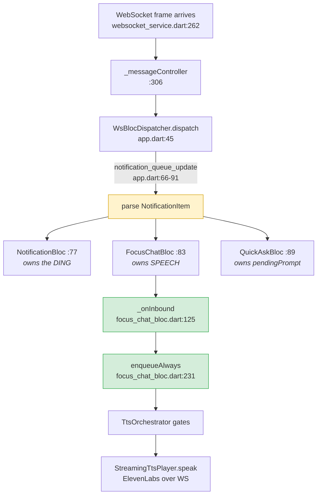

# Demo-time notification toggle — options and the trace behind them

**Date**: 2026.09.04
**Author**: Tiffany 💍 (session `3d7921bc`)
**Status**: 🔴 **AWAITING RICK'S DECISION — nothing implemented.** Store row `9604b634`, blocked on user, chase 18:30 ET.

---

## The problem, in Rick's words

> "Every time I try to use whatever it is you're putting in front of me as new functionality, it subscribes to all the usual events and everything that I'm hearing from the browser client via WebSocket is duplicated via socket on the emulator."

And, added second:

> "This also includes the action-required yes/no, multiple-choice, open-ended question notifications that my managers send me from time to time. They inevitably make a request of my attention while I'm looking at your app on the emulator and that's annoying and distracting as hell."

So: **two classes of interruption** — duplicated announcements, and blocking asks that demand attention mid-demo.

---

## 🔴 The finding that reshaped every option

**"Drop everything not addressed to me" is not buildable on the client today.**

| Evidence | Where |
|---|---|
| Client asks for *everything* — `'subscribed_events': []`, commented "Empty array = receive all events" | `lib/services/websocket/websocket_service.dart:210` |
| No addressee field arrives — no `recipient`, no `websocket_id`, no `target`, no broadcast flag | `lib/features/notifications/data/notification_models.dart:56-83` |
| `user_id` **is** parsed… | `notification_models.dart:131` |
| …and is read by **zero consumers** — nothing ever compares it to the logged-in user | grep, whole tree |
| Scoping is entirely server-side (`emit_to_user`) | comment at `lib/app.dart:67-68` |

`target_user` / `target_system_id` exist in this codebase but only on the **outbound** `POST /api/notify` — how this app addresses others, never how others address it, and stripped by the time anything returns over the socket.

⇒ **`sender_id` is the only workable identity axis.** A filter is naturally expressible as *"mute these senders"*, never as *"keep only what's mine."*

Escape hatch if the server ever adds a field: `NotificationItem.raw` retains the entire decoded JSON (`notification_models.dart:151`), so a new server-side key is readable as `n.raw['whatever']` with zero model changes — the same trick `speakerphone_changed` already uses.

---

## The path a notification takes

**All three blocs receive the same frame in parallel.** That is why "where you cut" determines what survives.

### The three cut points

| # | Site | Speech | Ding | Card | Notes |
|---|---|---|---|---|---|
| **A** | `app.dart:71-76` — after parse, before all three `.add()` | ❌ | ❌ | ❌ | Total. **Starves Quick Ask's watchdog.** |
| **B** | `focus_chat_bloc.dart:131` — top of `_onInbound` | ❌ | ✅ | ❌ | Speech + focus UI + unread badge |
| **C** | `TtsOrchestrator.enqueueAlways`, above `:336` | ❌ | ✅ | ✅ | Speech only; lacks `userId` in its signature |

---

## The four options

### 1. Second account (`ricey@google.com`) — Rick's own idea ⭐ recommended

**Zero code.** Log out, log in as a different identity; the server never sends the traffic.

**Verified it is a runtime switch, not a rebuild:**
- `LoginScreen` is real — `lib/features/auth/presentation/login_screen.dart:10`
- Logout exists — `lib/features/auth/domain/auth_bloc.dart:129`
- `LUPIN_DEV_EMAIL` / `LUPIN_DEV_PASSWORD` only **prefill** the debug form — `auth_gate.dart:15-16`, used at `:58-59`

| Advantages | Disadvantages |
|---|---|
| No engineering, no maintenance | Coarse and total — reachable, or not |
| Cuts at the source: no battery, no bandwidth, no filter bug can leak | **Managers cannot reach him, and won't know** — asks expire to defaults |
| Not a mode you forget is on; identity *is* the setting | Logout/login resets app state; not a mid-demo move |
| Clean empty inbox — nicer to demo | History, personas, trust state fork across accounts |
| Exercises the multi-user path, almost certainly untested | 🔴 **Unverified**: does the server actually scope per user? |

🔴 **Test before relying on it** (~15 min): log in as `ricey@`, have a manager fire one `notify` at Rick's main account, see whether the emulator speaks. If any event class fans out to every connected socket regardless of account, this option changes nothing — and that is exactly what the client's `subscribed_events: []` stance cannot rule out from this side.

### 2. Mute at the speaker — one tap, cards survive

App-bar toggle beside the existing pause control, plus a visible badge. Guard at cut point **B**. Notifications still arrive and render; they do not speak.

**Managers' asks: still on screen, still answerable — nothing expires behind his back.** ~1 hour.

### 3. Drop at the door — total silence ❌ not recommended

Cut point **A**. No speech, no ding, no card.

Two hazards the trace found:
- **Starves Quick Ask's watchdog.** An inbound ask is its proof-of-life in the window before a job id exists (`quick_ask_bloc.dart:700-715`); suppressing it can make one of Rick's *own* live questions wrongly report `lost`.
- Blocked asks hold the sender's HTTP thread ~210s each before defaulting.

### 4. Mute by sender — selective, best long-term shape

Silence named personas while Rick's own Quick Ask answers still speak. The only option that keeps the app useful *as a voice app* during a demo. Most work: the current stop-list matches **message text**, not sender (`notification_stop_list.dart:116-126`).

---

## Gotchas any implementation must respect

**1. Door A interview turns carry `response_requested == false`.**
They are identifiable only by sender + empty job id — `speech_intent.dart:54-56`. A filter keyed on the obvious flag misses them. Use the existing `isActionableQuestion()` (`speech_intent.dart:48`), which has both arms.

**2. Asks must not be silently dropped.** Two precedents exist:
- Exempt them, as the stop-list does — `focus_chat_bloc.dart:169` (`!actionable`). The comment at `:160-168` documents that an earlier version *did* drop asks and left the server blocked with nothing on screen.
- Or auto-post the default, as Quick Ask does — `quick_ask_bloc.dart:487`, explicitly *"NOT a local hide."*

**3. There is no global prompt overlay.** Every prompt renders inside a feature's widget tree; `InteractivePromptSheet` is pull-not-push and needs a `BuildContext`. So a dropped ask simply never appears anywhere — nothing would still pop it.

---

## 🐛 Separate pre-existing bug, found while tracing

**The "Master mute" switch does not silence speech.**

- Switch: `notification_audio_settings_screen.dart:65` → `NotificationPreferences.masterMute`
- `masterMute` is checked at exactly one place: `tts_orchestrator.dart:257` — the **dead** legacy path (`_tts` is never injected into `NotificationBloc`, `service_locator.dart:306-312`)
- The production path, `enqueueAlways`, deliberately bypasses it — `tts_orchestrator.dart:329-331`

So the switch only silences the **ding**. Anyone testing a new toggle by flipping Master mute first gets a confusing half-result. **Offered to fix alongside; awaiting Rick.**

---

## Runtime plumbing already exists

Whichever option wins, the toggle needs no new machinery: `NotificationAudioSettingsScreen` is a plain switch list writing straight to a SharedPreferences wrapper, and the orchestrator **re-reads the getter on every enqueue** (`tts_orchestrator.dart:257`, `:479`, `:501`). A flip takes effect on the next inbound frame — no bloc, no stream, no restart.

Adding one = a getter/setter pair in `notification_preferences.dart`, one `SwitchListTile`, one `TestKeys` constant, one read at the chosen cut point.

---

## Dead code — do not build here

`enhanced_websocket_service.dart`, `websocket_message_router.dart`, `websocket_subscription_manager.dart`, `websocket_dynamic_subscription_controller.dart` are referenced by nothing outside `lib/services/websocket/` except the debug dashboard. `WebSocketSubscriptionManager.subscribeToEvents()` is a complete, wired-to-nothing implementation of mid-session narrowing.
