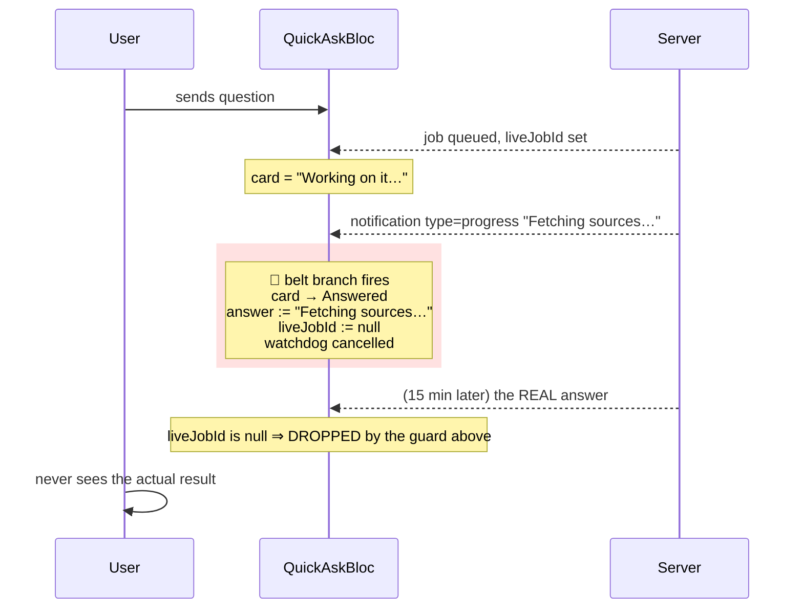
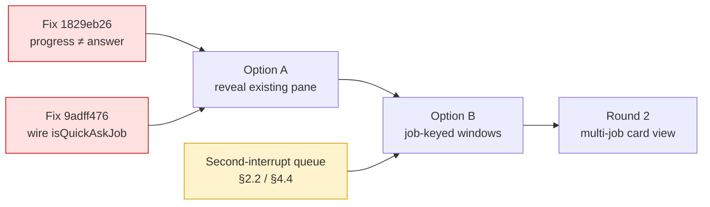

# Long-running Quick Ask: progress, interrupts, and a notification pane

**Date**: 2026.09.04
**Author**: Tiffany 💍 (session `3d7921bc`)
**Status**: 🔴 **PLAN ONLY — nothing implemented, by Rick's explicit instruction.** For discussion and possibly cascade review.

> Rick, 2026-09-04: *"Let's [say] that quick ask turns into a long running process anywhere from 2 to 20 minutes to wrap up. What do you do when you receive the first notification event as this long running job pushes progress reports and occasionally action required interrupts along the way? How would you implement an invisible pane that could be displayed to contain the notification history while the long running process interacts with the user? We already have this notion implemented on the notification client for a browser, but I don't think we do for a question asked on the mobile app."*

**Method note**: Rick was AFK during this work with no way to answer questions. So every fork is resolved with a **stated assumption** rather than a blocking ask, marked `ASSUMED:`, and every one is collected in §9 with what changes if he rules differently. Nothing here was built.

---

## 1. The short answer to "what do you do today?"

**Today the first progress notification ends the question.** Not visually — genuinely. It marks the card answered, prints the progress fragment where the answer belongs, and stops watching the job.

That is a real defect, filed separately as **`1829eb26`** so it does not live only inside a design document.

```dart
// quick_ask_bloc.dart, _onNotification, "belt channel" (~:777-793)
final live = state.liveJobId;
if ( live == null || n.jobId != live ) return;     // ← the ONLY guard
final current = state.liveEntry;
if ( current == null || current.isTerminal ) return;
final completed = current.copyWith(
  state   : JobLifecycleState.completed,           // ← marks it ANSWERED
  details : JobSummary( ..., responseText: n.message ),  // ← progress text AS the answer
);
emit( _replaceEntry( completed ) );
_cancelWatchdog();                                 // ← stops watching a live job
```

There is no check on `n.type`, even though `NotificationItem.type` carries `task | progress | alert | custom | ...` (`notification_models.dart:56`) and **both other consumers switch on it** — `notification_bloc.dart:230` and `app.dart:148`. Quick Ask is the only one that doesn't.

**The cascade for a 20-minute job:**



**Why nobody has hit it**: the belt channel was built for a genuine case — the completion *frame* goes missing, and the notification's `message` really is the answer. That premise holds for a fast question and breaks the moment a job emits anything intermediate.

**Severity, as mechanism**: it is silent, and it yields a *wrong answer* rather than an error. The card looks answered.

---

## 2. Three more constraints found in the same pass

These are not defects — they are the design envelope any pane has to live inside.

### 2.1 The user is locked out for the entire job

`liveJobId != null` ⇒ `blockReason.liveJobInFlight` ⇒ `canRecord == false` ⇒ the button reads *"Waiting on your last question"* (`quick_ask_state.dart:184`).

A 20-minute job is **20 minutes of not being able to ask anything else**. The one-live-question guard is deliberate and documented as a round-1 simplification — *"lifting it in round 2 is one clause, not a redesign"* (`:194-196`) — but a long-running job is exactly the case that makes it intolerable.

### 2.2 `pendingPrompt` holds exactly one interrupt

`state.pendingPrompt` is a single nullable field. A second action-required interrupt during the same job **overwrites the first**, and the overwritten one is never rendered, never answered, and runs its ladder out to its default — which for Door C is `no`.

Rick's premise is *"occasionally action required interrupts"*, plural. Today the second one silently discards the first.

### 2.3 The watchdog is already fine — do not "fix" it

Worth stating because it looks like the obvious suspect and isn't. A found-alive probe calls `_armWatchdog( reset: true )` (`:857`), so a job the server can still see resets the ladder indefinitely. `lost` requires **three consecutive found-nowhere probes AND** more elapsed time than the server's own 120s stall threshold (`:67-76`).

A 20-minute job that stays visible in the `run` queue will never be declared lost. **This part already handles long jobs correctly.**

---

## 3. What "an invisible pane" has to mean here

Rick's phrasing — *"an invisible pane that could be displayed to contain the notification history"* — is doing two jobs, and they should be separated because they have different costs:

| Job | What it means | Where it can live |
|---|---|---|
| **Collect** | Every notification a job emits is retained somewhere, in order, attributed to that job | State. Cheap. |
| **Reveal** | The user can pull that history into view on demand, and it is out of the way otherwise | UI. The design question. |

**The collect half is the one that fixes `1829eb26`.** Progress notifications currently have no destination, which is *why* they get misread as answers — the belt branch is the only branch they can fall into. Give them a home and the misread stops being possible.

The reveal half is genuinely a UI choice, and it is where the options in §6 differ.

---

## 4. What already exists on mobile — surveyed

Mobile is **not** starting from nothing, and the framing "build a pane" turns out to be wrong.

### 4.1 The pane already exists, and Quick Ask already routes into it

`FocusChatBloc` + the focus rail + `focus_chat_pane.dart` are a notification-history surface with inline answerable prompts — the shape Rick describes. And the app dispatcher **already sends Quick Ask's notifications there**: `_dispatchToFocus` (`app.dart:144-175`) admits `task | progress | alert | custom | user_initiated_message | session_topic`, and the `ask.flow@lupin.deepily.ai` sender establishes a rail entry like any other.

🔴 **It is invisible today for an accidental reason.** `ask.flow` is **persona-less** — no voice-persona glyph — and the rail's default scope is `Personas`, which requires a non-empty `icon` (`focus_chat_state.dart:195-198`). So the job's history is being collected *right now*, into a rail entry the user cannot see unless they switch the scope to `All`.

Rick asked for "an invisible pane that could be displayed." **Half of it is already built and is invisible in the wrong sense** — hidden by a filter default rather than revealable on demand.

### 4.1bis 🔴 VERIFIED LATE, AND IT CHANGES THE RECOMMENDATION: sender id already **is** the job key

I verified §4.1 and §4.2 myself rather than trusting the survey — the second plausible-but-wrong mechanism I caught today. This one inverts a conclusion.

**Agentic jobs emit a PER-JOB sender id, deliberately.**

```python
# cosa/agents/swe_team/job.py:474
sender_id = f"{sender_id}#{self.id_hash}"

# cosa/agents/swe_team/orchestrator.py:424
"sender_id" : f"claude.code@swe-team#{self.job_id}" if self.job_id else "claude.code@swe-team"

# cosa/agents/deep_research/job.py:249-252
# "...so concurrent DR jobs don't leak each other's sender_id."
per_job_sender_id = cosa_interface._get_sender_id( suffix=self.base_id )
```

The intent is stated outright in the deep-research comment: **per-job sender ids exist so concurrent jobs don't mix.** The browser relies on this too — it recovers a missing `job_id` by regex on the sender (`notifications.js:5960-5967`, `/#([a-z]+-[a-f0-9]{8})$/`).

⇒ **Focus mode's `Map<senderId, …>` windows therefore ALREADY give one bucket per job.** Not by design, but by consequence — a long-running job's notifications land in a sender bucket nothing else writes to.

**This substantially deflates Option B.** I recommended teaching focus mode a second grouping dimension keyed on `job_id`. The grouping is already there; the key just has the job id embedded in it rather than sitting in its own field. Adding `windowsByJob` would largely duplicate what `windows` already achieves for exactly the jobs that matter.

**What remains genuinely broken after this correction:**

| Gap | Still real? |
|---|---|
| Progress read as the final answer (`1829eb26`) | ✅ **yes** — unaffected, and still the headline |
| The 7-message cap truncating a long job's history | ✅ **yes** — the bucket exists, it is just too small |
| `ask.flow` persona-less ⇒ hidden by the default rail scope | ✅ **yes** — Option A's other half |
| No `job_id` grouping dimension | ❌ **largely moot** — the sender id carries it |
| Two concurrent jobs interleaving in one bucket | ❌ **moot for agentic jobs** — they get distinct senders by construction |

✅ **Settled — I traced all eleven builders (Q11).** Ten set a per-job sender. **`claude_code` alone does not** — zero suffix calls in its `job.py`, only the shared module-level `SENDER_ID`. So the "sender id is already the job key" property holds for every agentic job type except that one, whose concurrent jobs would share a bucket.

---

### 4.2 The remaining blocker: the window is 7

| Fact | Evidence |
|---|---|
| `windows` is `Map<senderId, List<FocusMessage>>` at **every** read and write site | `focus_chat_state.dart:134-149` |
| Window cap is **7 messages per sender**, hard | `focus_chat_bloc.dart:30`, evicted at `:185-187`, `:554`, `:705`, `:776-778`, `:796-798` |
| An inbound with **no `sender_id` is dropped outright** | `focus_chat_bloc.dart:131-134` |
| `job_id` is **never stored** — read only as a speech-predicate input | `focus_chat_bloc.dart:153`, `:242`, `focus_chat_pane.dart:158` |
| `NotificationItem.jobId` **is** on the wire and parsed | `notification_models.dart:73`, `:142` |

**This is the crux.** A 20-minute job's notifications land in the `ask.flow` sender's bucket, interleaved with anything else that sender says, and **everything past the newest 7 is evicted**. A job emitting fifteen progress updates keeps the last seven and silently discards the rest — including, potentially, the early ones that explain what it is doing.

The data needed to group by job is already on the wire. Focus mode simply never looks at it.

### 4.3 What already works and should be reused, not rebuilt

- **Progress collapse by `progress_group_id`.** Consecutive messages sharing the key fold into one row showing the latest plus a `×N` chip, tap to expand in place (`focus_chat_pane.dart:470-510`; algorithm `progress_group_collapse.dart:22-40`). Governed by a user pref. **This is most of the "don't flood me with progress" behaviour, already shipped.**
- **A pending ask is never buried.** `_groupKey` deliberately returns null for `responseRequested` items (`focus_chat_pane.dart:79-80`), so an interrupt cannot be collapsed into a progress run. Exactly the right instinct, already there.
- **Present-but-hidden is an established pattern**, twice: the stop-list render lens and the rail scope both hide without deleting, so the state is intact when the lens moves.

⚠️ But `progress_group_id` collapse is **render-only, contiguous-runs-only, and evaporates under the 7-cap**. It makes a burst tidy; it does not make a 20-minute history survive.

### 4.4 The second-interrupt problem is worse than §2.2 said

Focus mode has the same single-actionable-ask limit as Quick Ask, by explicit design: only the **newest** unanswered ask gets controls. An older unanswered ask renders its text with **no buttons and no tap handler** (`focus_chat_pane.dart:367-371`, commented *"one ask actionable at a time, F-S3-S2-1"*).

So Rick's *"occasionally action required interrupts"*, plural, is unhandled on **both** surfaces. The escape hatch is that `expired` counts as answered (`focus_chat_state.dart:98-100`), which promotes the next — meaning **the way to reach the second interrupt today is to let the first one time out to its default.**

### 4.5 No double-speech risk — but for a different reason than expected

Worth stating because it removes a hazard I had assumed would constrain the design. There is exactly **one** production TTS dispatcher: `focus_chat_bloc.dart:231`. `QuickAskBloc` never touches `TtsOrchestrator` at all, and the legacy bloc's `tts` was deliberately un-injected at the DI seam to stop double-speech (`service_locator.dart:300-311`).

So routing more into focus mode **cannot** cause double-speech. The de-duplication is architectural, not runtime.

🔴 **However the survey found a live, unrelated defect while establishing this — filed as `9adff476`.** `isQuickAskJob` is accepted by `FocusChatBloc` and used for the verbatim-speech decision, but **never passed by `service_locator.dart:314-323`**. So today a Quick Ask *answer* is non-verbatim: truncated to `ttsFraction` (default 0.2 — the user hears a fifth of their answer), and **dropped entirely** if `speakSystemSenders` is off, because `ask.flow` is persona-less. The test wires the dependency itself, so it passes while production is unplugged.

### 4.6 Nothing persists

All focus state is in-memory (`registerLazySingleton`, no `hydrated_bloc` anywhere). It survives navigation but **not restart**; cold start refetches senders seen in the last 24h and lazily backfills per sender on first tap, re-capped to 7. A 20-minute job spanning an app restart loses its history entirely.

---

## 5. What the browser already does — surveyed

Rick said *"we already have this notion implemented on the notification client for a browser."* Confirmed, and it is more considered than expected. **Mirror this vocabulary; do not invent a parallel one.**

### 5.1 🔴 TWO nested mechanisms, not one — I had this wrong

| Level | Key | What it is |
|---|---|---|
| **Container** | `job_id` | The job card's **Activity Log** — one job's notifications in one place. **This is the job-scoping mechanism.** |
| **Row inside it** | `progress_group_id` (`pg-{8hex}`) | A **single repetitive phase** within a job, rendered as one row that mutates in place |

**One job mints many progress groups.** SWE team mints five-plus — one each for delegation, coder, tester, verify, redelegate (`swe_team/orchestrator.py:911, 961, 1355, 1491, 1643`). Deep research mints one for its per-subquery loop (`deep_research/cli.py:561`).

⚠️ **This corrects §7 of this document.** I speculated `progress_group_id` might be the grouping key Rick wants. It is not — it is a *noise suppressor within* a job. The container key is `job_id`, which is exactly the dimension mobile lacks (§4.2). **Option B was the right call for the right reason.**

### 5.2 How the Activity Log works — trivially simple routing

```js
// notifications.js:7728 — the container's DOM id IS the job id
<div class="interactions-content collapsed" id="interactions-content-${idKey}"></div>

// notifications.js:7063 — routing is one getElementById
const contentEl = document.getElementById( `interactions-content-${jobId}` );
```

Newest-first, auto-expands on arrival, scrolls into view. A notification carrying `job_id` is **diverted to the job card only** and never reaches the global sender list (`notifications.js:5968-5979`).

Nice touch worth stealing: when the server omits `job_id`, the browser **recovers it by regex on the sender id** (`notifications.js:5960-5967`) — `deep.research@…#dr-77b330d8` → `dr-77b330d8`.

### 5.3 The in-place progress row

On a repeat `progress_group_id`, `updateProgressGroupEntry()` (`notifications.js:7151-7227`) moves the *current* head text into a hidden history list, **overwrites the head in place**, bumps `data-progress-group-count`, and updates a `▼ #17` toggle pill. No new row appears. A 0.6s pulse marks the update.

**Net UX**: one job = one card; one repetitive phase = one row wearing a counter you click to unroll.

💡 **The multiplexer's newer implementation is the better model for Flutter.** Legacy mutates the DOM; the TS rewrite **keeps every member in the store and elects a head at render time** (`senderCard.ts:216-228` — earliest timestamp per group, ties on `id_hash`), building history lazily on expand. That is a declarative, reactive shape — exactly how a bloc + widget tree wants to work, and it avoids the multi-head bug the comments say the election fixed.

### 5.4 🔴 Interrupts: the browser DOES queue them — this answers Q5

**An ask leaves the job card while pending and returns once answered.**

1. `response_requested` is intercepted **before** job routing and diverted to a **global Action Required pane** (`notifications.js:5937-5952` — note the early `return`).
2. That pane has **an active slot and a pending queue**: exactly one prompt fully rendered, the rest as minimized one-liners **showing queue position** (`notifications.html:411-432`).
3. `activateNextNotification()` (`:19801-19864`) promotes one at a time.
4. **The countdown is deferred until activation** — `expiresAt: null` on arrival, set only on promotion (`:19710`, `:19836-19838`). **This is the detail that makes queueing safe**: a queued ask does not burn its timer while it waits.
5. Once answered, the Q&A pair is **back-filled into the job card** (`routeCompletedNotification()`, `:23727-23757`) — the answer prefixed `↳ `.
6. Answering **resumes the job in place**: the agent is blocked on an SSE stream and continues on the same job, no re-queue (`notifications.py:1450-1462`).

⇒ **Mobile's one-actionable-ask-at-a-time is a gap, not a design choice.** The browser solved this, including the timer subtlety. §9 Q5 is upgraded accordingly.

Not a modal, but it *does* claim attention: forced 50/50 pane split in horizontal layout, and a **TTS Focus Mode that pauses the speech queue while you answer** (`:20816-20886`). It also persists to localStorage to survive refresh.

### 5.5 Cadence — coarser than I assumed, which is good news

Progress is **milestone-driven, not a tick.** Deep research over 5-15 minutes emits ~7-10 frames (`deep_research/orchestrator.py:160-297`: *"Starting research…"*, *"Creating research plan…"*, *"Starting parallel research…"*, *"Gathering and analyzing findings…"*, *"Synthesizing report…"*, *"Adding citations…"*, *"Research complete!"*), plus one burst inside the parallel loop **all sharing one group id** — which is precisely what `pg-` exists to collapse.

⇒ **This relaxes my retention assumption (Q2).** I guessed ~40 items at one update per 30s. The real shape is under a dozen milestones plus collapsible bursts. **50 is comfortable; even 25 would do.**

### 5.6 Confirmed: a quick ask really can become a 20-minute job

`POST /api/v2/ask` returns `status: waiting` with a `job_id` when the router resolves an agentic command — `QueuedExecutor` *"never runs the job, so it never produces an answer"* (`v2/executor.py:186-219`), and `waiting` is an explicit success (`flow.py:43-48`). The slow set is enumerated at `agentic_job_factory.py:665-677`: deep research, podcast, presentation, research→podcast, research→presentation, claude code, **swe team**, test suite, bug fix expediter, test fix expediter.

So *"research the state of solid-state batteries"* → argument interview → queue → `{status:"waiting", job_id:"dr-77b330d8"}` → 2-20 minutes of frames. **Rick's premise holds exactly.**

### 5.7 One mobile-specific gift already in the server

`_maybe_send_fcm_wake()` fires on **enqueue**, independent of whether the WebSocket emit happens — commented as existing *"precisely for the user whose WebSocket isn't there"* (`notification_fifo_queue.py:487`). A phone that backgrounds mid-job is already thought about server-side.

### 5.8 Vocabulary to reuse verbatim

| Term | Meaning |
|---|---|
| **Activity Log** | the per-job feed (relabelled *"Notification Conversation"* once terminal) |
| **Action Required** | the global interrupt pane — active slot + pending queue |
| `progress-group-head` / `-history` / `-toggle` | the mutating row, its folded older members, the `▼ #N` pill |
| `job_id` · `progress_group_id` | container key · within-job phase key — **never interchangeable** |

---

## 6. Design options

Three, ordered by cost. All three depend on the same prerequisite, so it is stated once.

### 6.0 Prerequisite for every option: stop misreading progress as an answer

`1829eb26` must be fixed regardless of which option wins, and the fix is one clause:

```dart
// belt channel — accept only an answer-shaped notification
if ( live == null || n.jobId != live ) return;
if ( n.type == 'progress' ) { /* → the pane, per the chosen option */ return; }
```

`ASSUMED:` the belt channel should accept `task` and `custom` as answer-shaped, and treat `progress` as never-an-answer. Rationale: `progress` is the only type whose *name* promises it is intermediate, and `_dispatchToFocus` already treats the set as distinct (`app.dart:144-175`). Question 1 in §9.

⚠️ **Do not "fix" this by dropping progress notifications.** A fix that silently discards them is not obviously better than one that misreads them — the user still learns nothing during 20 minutes. The destination matters, which is the rest of this section.

---

### Option A — Reveal what is already being collected *(cheapest by a wide margin)*

**Do almost nothing new.** Quick Ask's notifications already flow into focus mode (§4.1). They are hidden because `ask.flow` is persona-less and the rail defaults to `Personas` scope.

**The work**: fix `1829eb26`; give Quick Ask a way to open focus mode focused on the job's sender (a "Show activity" affordance on the live card, dispatching `FocusSenderSelected`); optionally give `ask.flow` a persona glyph so it stops being filtered out by default.

| | |
|---|---|
| ✅ | Reuses a shipped, tested surface — progress collapse, never-bury-an-ask, inline answering, all free |
| ✅ | No new grouping dimension, no state redesign, no second TTS path |
| ✅ | Probably a day |
| ❌ | **The 7-message cap still applies.** A 20-minute job's history is the last 7 items, interleaved with anything else `ask.flow` says |
| ❌ | Grouped by sender, so two concurrent jobs from the same sender interleave with no way to tell them apart |
| ❌ | Lost on app restart |

**Honest assessment**: this is the 80% answer for a *2-minute* job and a poor answer for a *20-minute* one. It is worth doing first regardless, because every other option builds on it.

---

### Option B — Teach focus mode about jobs *(the real fix)*

Add `job_id` as a **second grouping dimension** alongside sender. The data is already on the wire and parsed (`notification_models.dart:73`, `:142`); focus mode simply never reads it.

**The work**: a `windowsByJob` index (or a job-aware key on the existing windows); a per-job cap distinct from the per-sender 7; a job-scoped view in the pane; the rail gains job entries or the pane gains a job filter.

| | |
|---|---|
| ✅ | Actually solves the stated problem — one job's noise collects in one place, in order, uncapped-by-sender |
| ✅ | Fixes 6.0 properly: progress notifications get a real home |
| ✅ | Sets up the "round 2 multi-job card view" the code already anticipates (`focus_mode_screen.dart:198-202`, `quick_ask_screen.dart:18-20`) |
| ❌ | `windows` is `Map<senderId, …>` at **every** read and write site — this is a genuine state refactor, not a config change |
| ❌ | Raises a retention question the 7-cap currently answers by accident: how much of a 20-minute job do we keep? |
| ❌ | Days, not a day, and it wants tests at each of the eviction sites |

`ASSUMED:` per-job retention of **50 items**, evicting oldest, with pending asks exempt from eviction the way they are already exempt from collapse. Rationale: 20 minutes at one update per 30s is ~40; 50 covers it with headroom, and an ask that gets evicted is an ask that expires to its default. Question 2 in §9.

---

### Option C — A dedicated job-activity sheet on the Quick Ask screen *(most control, most duplication)*

Build the pane Rick literally described: a sheet on the Quick Ask card itself, hidden until pulled up, containing that job's notification history.

| | |
|---|---|
| ✅ | Exactly the requested shape, and the history sits where the user is already looking |
| ✅ | No focus-mode refactor |
| ❌ | **Duplicates a surface that exists.** Progress collapse, ask rendering, the answered-chip, the hidden-count caption — all re-implemented or extracted |
| ❌ | Two places render notifications ⇒ two places to keep in step. The repo already has an AC (`S4.11`) devoted to *not* fracturing prompt-body shape across hosts |
| ❌ | Still needs job-keyed state, so it is Option B's storage work **plus** a new UI |

**Honest assessment**: I would not pick this. It looks cheaper than B because the state work is less visible, but it is B's cost plus a second surface — and the repo has already paid for the lesson about parallel notification surfaces once.

---

### 6.4 Recommendation

**A, plus raise the cap. B is largely unnecessary. Not C.**

🔴 **Revised after §4.1bis.** I originally recommended "A now, B next." Verifying my own premise showed that agentic jobs already emit **per-job sender ids**, so focus mode's sender-keyed windows already give one bucket per job. Option B's main deliverable — a job grouping dimension — mostly already exists.

**What that leaves, and it is much smaller than Option B:**

1. **Fix `1829eb26`** — progress must stop being read as the answer. Unchanged, still the headline, still required first.
2. **Option A** — reveal the bucket that already exists: an affordance from the Quick Ask card into focus mode scoped to that job's sender, and a persona glyph (or scope fix) so `ask.flow` stops being filtered out by default.
3. **Raise the per-sender cap for job senders** — the one real piece of Option B that survives. A cap of 7 chosen for a chatty human sender is wrong for a job that emits ~10 milestones. This is a cap change plus an eviction-exemption for pending asks, **not** a state refactor.
4. **Queue the second interrupt** (§5.4, Q5) — with the browser's deferred-countdown detail, which is the part that makes it safe.

C remains declined: it is a duplicate surface, and now it would duplicate a surface whose grouping already works.

**The one caveat is now settled** (Q11, answered): ten of eleven agentic builders set a per-job sender. **`claude_code` is the sole exception** and would need either a one-line fix at the source — the recommended route — or client-side special-casing. Nothing else blocks.

**Two things worth doing alongside, both already filed:**
- `9adff476` — the unwired `isQuickAskJob`. A long job's *answer*, when it finally arrives, is today truncated to a fifth or silently dropped. Fixing the pane while the answer is still inaudible would be an odd order of operations.
- §2.2 / §4.4 — the second-interrupt problem. Rick explicitly said interrupts are plural, and **both** surfaces handle exactly one, with "let the first expire to its default" as the only way to reach the second. This is arguably more urgent than the pane, because it silently answers questions on the user's behalf.

---

## 7bis. Sequencing, if all of it is wanted



---

## 7. The `progress_group_id` lead — resolved, and I was half wrong

I speculated this might be the job-grouping key already on the wire, which would have made this a wiring problem rather than a design one. **It is not.** §5.1 settles it: `progress_group_id` groups *a phase within* a job, and one job mints many. The container key is `job_id`.

**What survives the correction**: mobile already parses BOTH fields (`notification_models.dart:73` for `jobId`, `:75` for `progressGroupId`) and already implements the *inner* mechanism — contiguous-run collapse with a `×N` chip (§4.3). So mobile has the row-level noise suppressor and lacks the container. That is a smaller gap than "build a pane" implies, and a larger one than "just wire it up."

**Recorded because it nearly misled the design**: a plausible mechanism that explains the symptom is not the mechanism. Two levels of grouping look like one until you read the emitter.

---

## 8. Non-goals

Stated so scope does not drift during review:

- **Not** lifting the one-live-question guard as part of this. It is related (§2.1) and probably wants doing, but it is a separate decision with its own blast radius.
- **Not** changing the TTS speaking rules. Whether progress reports should be *spoken* is a different question from whether they are *retained and displayable*.
- **Not** touching the server. Everything proposed should be client-side unless the surveys prove a field is missing from the wire.

---

## 9. Questions for Rick

Each has an assumption I proceeded under, so nothing here blocks. Answer only the ones where my default is wrong — **1, 3, 5 and 8 are the ones that change the shape of the work**; the rest are calibration.

### 🔴 The four that matter

**Q1. Is `progress` never an answer?**
`ASSUMED:` yes — the belt channel accepts `task`/`custom` as answer-shaped and treats `progress` as always-intermediate.
*If wrong*: the whole 6.0 fix changes shape, because there is then no reliable client-side way to tell a progress update from an answer, and the discrimination has to move to the server.

**Q3. Which option — A, B, or C?**
`ASSUMED:` A now, B next, not C (§6.4).
*If wrong*: everything downstream of §6 changes. This is the decision the document exists to support.

**Q5. Should the second action-required interrupt be queued? — ✅ THE BROWSER ALREADY ANSWERED THIS**
`ASSUMED:` **queued.** This is no longer my opinion against the code's stated intent — §5.4 shows the browser does exactly this, and solves the part I would have got wrong.

The browser's Action Required pane has an **active slot plus a pending queue** showing queue position, promotes one at a time, and — the detail that matters — **defers each ask's countdown until it is promoted** (`notifications.js:19710`, `:19836-19838`). Without that, a queued ask burns its timer while waiting and expires before the user ever sees it.

*Why I flag it hardest*: today on mobile the only way to reach a second interrupt is to let the first **expire to its default** — Door C's being `no`. The system answers questions on the user's behalf, silently, as a side effect of a UI limit. `F-S3-S2-1` reads as intentional at the one-fast-question scale; at 20 minutes with plural interrupts it is a gap, and there is now a working precedent to copy rather than a design to invent.
*If you disagree*: it stays one-at-a-time and long jobs quietly answer their own questions.

**Q8. Do you want progress reports SPOKEN, or only displayed?**
`ASSUMED:` **displayed, not spoken.** A 20-minute job narrating itself aloud every 30 seconds is the thing you spent today trying to escape.
*If wrong*: the TTS gating changes and `9adff476` becomes more urgent, since the verbatim path would then carry progress as well as answers.

### Calibration

**Q2. Per-job retention: how much of a 20-minute job do we keep?**
`ASSUMED:` **50 items**, evict oldest, pending asks exempt from eviction.
*Revised down in confidence — this is now comfortable rather than tight.* I originally guessed ~40 items at one update per 30s. §5.5 shows the real cadence is **milestone-driven**: deep research emits ~7-10 named milestones over 5-15 minutes, plus bursts that share one `progress_group_id` and therefore collapse into a single row. Even 25 would likely do. SWE team is the chattiest case (five-plus phases) and still nowhere near 50.

**Q4. Should `ask.flow` get a persona glyph?**
`ASSUMED:` yes — it is the cheapest half of Option A, and without it the job's history stays hidden behind the default `Personas` rail scope.
*Caveat*: it would then appear in the rail as a pseudo-person, which may read oddly next to María and Mr Radio.

**Q6. Should the record button stay locked for the whole job (§2.1)?**
`ASSUMED:` out of scope here — related, worth doing, but its own decision with its own blast radius (§8).
*Note*: a 20-minute job means 20 minutes of not being able to ask anything else. If that is intolerable, it may outrank the pane.

**Q7. Should a job's history survive app restart?**
`ASSUMED:` no — matching focus mode's current behaviour, which persists nothing.
*Note*: a 20-minute job is exactly long enough to span a restart, so this is a real gap rather than a theoretical one. Adding persistence is a larger change than anything else in §6.

**Q9. Is a cascade review wanted before implementation?**
`ASSUMED:` you will decide after reading this. Option B touches `windows` at every read and write site, and the browser survey turned up two subtleties I would not have invented — the deferred countdown (§5.4) and the head-election-vs-DOM-mutation choice (§5.3). A review that catches a third would pay for itself.

**Q11. ✅ ANSWERED — I checked all eleven builders. Ten of eleven set a per-job sender; `claude_code` does not.**

No longer a question. The result decides §6.4, so it is recorded here in full.

| Builder | Per-job sender? | Evidence |
|---|---|---|
| deep_research | ✅ | `job.py:251`, `:412` — `_get_sender_id( suffix=self.base_id )` |
| research_to_podcast | ✅ | `deep_research_to_podcast/job.py:207`, `:376` |
| research_to_presentation | ✅ | `deep_research_to_presentation/job.py:202`, `:339` |
| podcast_generator | ✅ | `job.py:226`, `:447` |
| presentation_generator | ✅ | `job.py:337`, `:494` |
| bug_fix_expediter | ✅ | `job.py:221`, `:646` |
| test_suite | ✅ | `job.py` — 2 suffix calls |
| test_fix_expediter | ✅ | `job.py` — 1 suffix call |
| test_fix_expediter_resume | ✅ | same module |
| swe_team | ✅ | different mechanism — `job.py:474` `f"{sender_id}#{self.id_hash}"`, `orchestrator.py:424` |
| **claude_code** | ❌ | **zero suffix calls in `job.py`**; only the module-level shared `cosa_interface.py:54` `SENDER_ID = _get_sender_id()` |

⇒ **The work is a CAP CHANGE, not a state refactor** — for ten of eleven agentic job types. Option B is confirmed unnecessary for everything except one.

⇒ **`claude_code` is the single named exception.** Its jobs share one sender bucket, so two concurrent Claude Code jobs would interleave in focus mode with nothing to tell them apart, and §4.2's original problem applies to them specifically.

**Two ways to handle the exception, and the first is clearly better:**
1. **Fix it at the source** — give `claude_code/job.py` the same `suffix=self.base_id` call the other ten already have. It is one line, in the parent repo, and it makes the mobile client's assumption true everywhere rather than true-with-an-asterisk. **Recommended.**
2. Special-case it on the client, keying off `job_id` for that sender only — which is Option B's machinery reintroduced for one job type.

`ASSUMED:` option 1. Filed nowhere yet — it is a Lupin-repo change and belongs to whoever owns that surface, so it is Question 12 rather than a row I raise unasked.

**Q10. Should mobile mirror the browser's "ask leaves the card, then returns" pattern?**
`ASSUMED:` yes. In the browser a pending ask is diverted to the global pane and the Q&A pair is back-filled into the job card once answered (§5.4). It keeps the interrupt visible wherever the user is looking, and keeps the job's record complete afterwards. Mobile has both halves already — focus mode renders asks inline, and the job card would be the new container — so this is a routing decision rather than new machinery.

---

## 10. What was filed while writing this

Three live defects, none fixed, all found in passing. None was asked for.

| Row | P | What |
|---|---|---|
| `1829eb26` | P2 | Quick Ask treats the first progress notification as the final answer — a long job ends its own card and the real answer is dropped |
| `9adff476` | P2 | `isQuickAskJob` never injected at the DI seam — a Quick Ask answer is truncated to a fifth, or silently unspoken when `speakSystemSenders` is off |
| `f872a4f5` | P2 | `ask_*` collapses timeout / expiry / offline / transport error / server error into one indistinguishable default |

**A pattern across all three**, worth one line because it is the same shape three times: each is a mechanism that is *present and correct in isolation* but unconnected at one seam — the type check that was never written, the dependency that was never passed, the error shape that was never returned. All three pass their own tests. None of them works.

---

## 11. Two corrections I made to my own plan, and why they are in here

Recorded because the corrections are more useful than the conclusions they replaced.

**1. `progress_group_id` is not the job key** (§7). I speculated it was, which would have made this a wiring problem. It groups a *phase within* a job; one job mints many. Caught by the browser survey.

**2. Sender id already carries the job id** (§4.1bis). I recommended building a job grouping dimension. Agentic jobs already emit per-job senders, so the grouping largely exists. Caught by verifying my own premise instead of trusting the survey that produced it.

Both were plausible mechanisms that explained the symptom. **Neither was the mechanism.** The second one inverted a recommendation I had already written down and was about to hand over — which is the argument for Q11 being answered before anyone builds anything.

