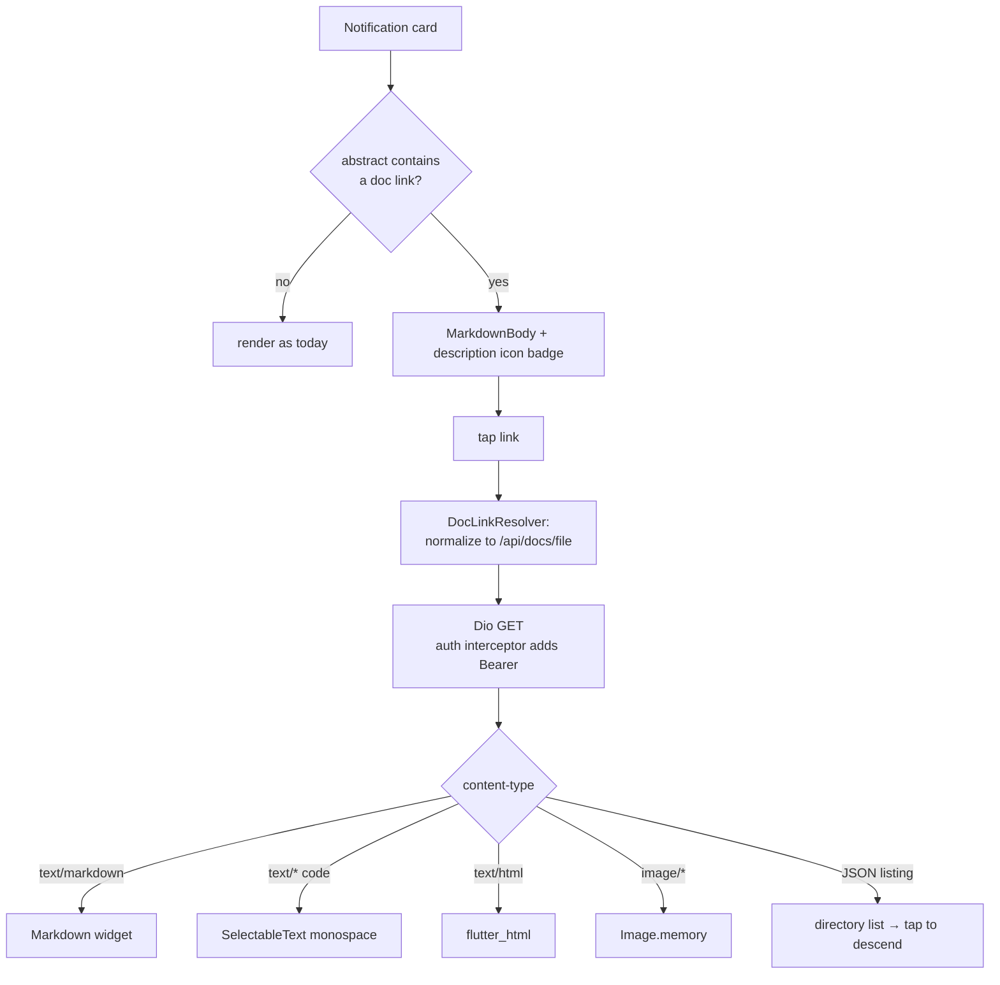

# Abstract Doc-Link Viewer — Feasibility & Implementation Plan

**Date**: 2026-09-08
**Author**: Tiffany 💍 (session a08d762c)
**Status**: Research complete → plan proposed, awaiting go
**Verdict**: **Viable, and cheaper than expected — no WebView required.**

---

## 1. The Ask

Two things, in the notification/conversation card UI:

1. **An abstract icon** — a visible affordance on a card whose `abstract` carries a
   doc-viewer link, so the user knows there is something to open.
2. **Tap → render** — open the linked document *inside the app*, rendering markdown
   (or HTML) rather than punting to an external browser.

Rick's framing question: *"Does the Android widget/UI toolkit support this notion?"*

---

## 2. Answer to the toolkit question

**The toolkit in play is Flutter, not the native Android view system** — this app is
`lupin_mobile`, a Flutter app (`pubspec.yaml`, `lib/`). So the honest answer is in
two halves:

| Toolkit | Markdown | HTML |
|---|---|---|
| **Native Android (View/Compose)** | No first-party widget. `Markwon` (3rd-party) is the standard. | `Html.fromHtml()` → `Spanned` handles a *tiny* tag subset; anything real needs `WebView`. |
| **Flutter (what we actually use)** | `flutter_markdown_plus` — full GFM: tables, task lists, code blocks, links, images, footnotes. | `flutter_html` (parses to native widgets, no JS/complex CSS) **or** `webview_flutter` (embeds the real OS WebView). |

**So: yes, comfortably supported** — and we already ship a working proof of it at
`lib/features/artifacts/markdown_report_viewer.dart`, which renders job reports with
`Markdown( data: …, selectable: true )` and a share action. The new viewer is that
widget generalized, not a new capability.

---

## 3. The finding that collapses the scope

The Lupin backend's doc endpoint **already returns raw source text**, not a rendered
HTML page.

`GET /api/docs/file?path=<project>/<rel>` — `src/cosa/rest/routers/docs_files.py:122`

| Resolved path | Response |
|---|---|
| Text file | `PlainTextResponse` with the real media type (`text/markdown`, `text/x-python`, …) |
| Image file | `FileResponse`, `image/*` bytes |
| Directory | `JSONResponse` — a listing (`entries`, `parent`) |

Servable extensions (`MEDIA_TYPES`, `docs_files.py:50`): `.md .txt .json .yaml .yml
.py .ts .tsx .js .jsx .css .html .sh .sql .toml .ini .cfg .xml` + image MIMEs.

**Consequence**: we fetch bytes and render them ourselves with a native Flutter
widget. We do **not** need `webview_flutter`, we do **not** need to load the Lupin SPA
in a browser view, and we do **not** need a session cookie — auth is JWT Bearer, which
our shared Dio already injects (`lib/services/auth/auth_interceptor.dart:29`).

That kills the two things that would have made this expensive: WebView memory/lifecycle
cost, and cookie-vs-JWT auth plumbing.

### Auth is already solved

`lib/core/di/service_locator.dart:208` wires an auth interceptor onto the shared Dio
that injects `Authorization: Bearer <token>` and refreshes on 401. A doc fetch is a
plain `dio.get( "/api/docs/file", queryParameters: { "path": … } )`.

---

## 4. Current behavior (the defect)

Abstracts render as a **plain `Text` widget** today:

- `lib/features/notifications/presentation/conversation_by_date_screen.dart:217`
- `lib/features/notifications/presentation/conversation_screen.dart:315`

So an abstract carrying `[Open: README.md](/app/docs?path=lupin-mobile/README.md)`
displays as literal brackets and parentheses. The link is dead text. There is no icon,
no affordance, nothing tappable.

---

## 5. Link shapes we must parse

The fleet convention (global `CLAUDE.md § DOCUMENT VIEWER LINKS`) is a markdown link
whose href is an SPA route:

```
[Open: <filename>](/app/docs?path=<project>/<rel>)
```

Historical/variant forms seen in the wild:

| Form | Handling |
|---|---|
| `/app/docs?path=proj/rel` | canonical — map to `/api/docs/file?path=proj/rel` |
| `/app/docs?path=rel&scope=proj` | **legacy** — backend now 400s on `?scope=`; rewrite to `path=proj/rel` client-side |
| `/api/io/file?path=…` | io/ artifacts (reports, podcast audio) — separate endpoint, same treatment |
| `http(s)://…` external | not ours — hand to `url_launcher` / external browser |

A tolerant parser plus a normalizer is the right shape here; the legacy `?scope=` form
still exists in older stored notifications, and rewriting it client-side costs one
function and avoids a wave of 400s.

---

## 5a. Markdown renders in BOTH places (confirmed 2026-09-08)

Rick's check: the abstract is not *only* a link — it is prose with light markdown
(bold, bullets, tables, headings) that happens to *contain* a link. Both surfaces
render markdown, using the same package, at two call sites:

| Surface | Widget | Notes |
|---|---|---|
| **The abstract card itself** (inline, in the notification/conversation list) | `MarkdownBody` | Inline, shrink-wraps to content, no scroll view of its own — the right widget for embedding inside an existing card. Bold / italics / bullets / tables / inline code / headings all render. Links become **tappable**, which is the tap target for #2. |
| **The document opened by following the link** | `Markdown` | Full-screen, scrollable, `selectable: true`. Exactly what `markdown_report_viewer.dart` already does today. |

`MarkdownBody` and `Markdown` are the same renderer with different scroll/layout
wrappers — one dependency, consistent typography across both surfaces. Both take a
`styleSheet` so the inline card can use the muted `bodySmall` scale it uses today
while the full viewer uses the reading scale.

**Non-markdown targets** (`.py`, `.json`, `.yaml`, `.html`, images, directories) are
the P4 dispatch branches; markdown is the primary and P2 path.

---

## 6. Proposed implementation



### Files

| File | Change |
|---|---|
| `pubspec.yaml` | `flutter_markdown` → `flutter_markdown_plus: ^1.0.12`; add `flutter_html` |
| `lib/features/docs/doc_link.dart` | **new** — parse + normalize abstract links (pure, unit-testable) |
| `lib/features/docs/doc_repository.dart` | **new** — Dio fetch, content-type dispatch |
| `lib/features/docs/doc_viewer_screen.dart` | **new** — polymorphic renderer + share |
| `lib/features/docs/abstract_body.dart` | **new** — `MarkdownBody` + link tap + icon badge |
| `conversation_screen.dart`, `conversation_by_date_screen.dart` | swap `Text( abstractText )` → `AbstractBody(…)` |
| `markdown_report_viewer.dart` | retarget import to `flutter_markdown_plus` |

### Phasing

| Phase | Scope | Gate |
|---|---|---|
| **P1** | Dependency swap + `doc_link.dart` + unit tests | compiles, tests green |
| **P2** | `doc_repository` + `doc_viewer_screen` for markdown/text/code | widget tests |
| **P3** | `AbstractBody` — icon badge + tappable links, wired into both card screens | widget tests |
| **P4** | Directory listings, images, HTML, external-URL fallback | integration test |

---

## 7. Risks

| Risk | Severity | Mitigation |
|---|---|---|
| `flutter_markdown` is **discontinued** (Google, 2025-05-30) | Medium | swap to `flutter_markdown_plus` (160 pub points, 142 likes, 518k downloads, v1.0.12 ~60 days old, all 6 platforms). API-compatible fork. Do it in P1 either way — we carry the dead package today. |
| Legacy `?scope=` links 400 | Low | client-side rewrite in the normalizer |
| HTML with real CSS/JS renders poorly in `flutter_html` | Low | `.html` is a rare abstract target; degrade to source view, add `webview_flutter` only if a real case appears |
| Blocklist refusals (400/500 from the credential floor) | Low | surface the server's own message verbatim — it is written to be read |
| Large files / slow render | Low | show a spinner; cap at a size threshold with a "view source" escape |

---

## 8. Costs

- **New dependencies**: `flutter_markdown_plus` (replaces an equal-weight dead one),
  `flutter_html` (pure Dart, no native code). **No WebView, no platform channels.**
- **No backend work.** The endpoint exists, is authenticated, and returns exactly what
  a native renderer wants.
- **Estimated**: 4 phases, all client-side, each independently testable.

---

## 9. Bottom line

Viable and low-risk. The expensive design (embed the Lupin SPA in a WebView, solve
auth twice) is **not** the design we need — the backend hands us raw markdown over the
Dio we already authenticate. The real work is the tolerant link parser and a
polymorphic viewer, and we already have two-thirds of the viewer in tree.

The one thing worth doing regardless of this feature: `flutter_markdown` is dead
upstream and we are still on it.
