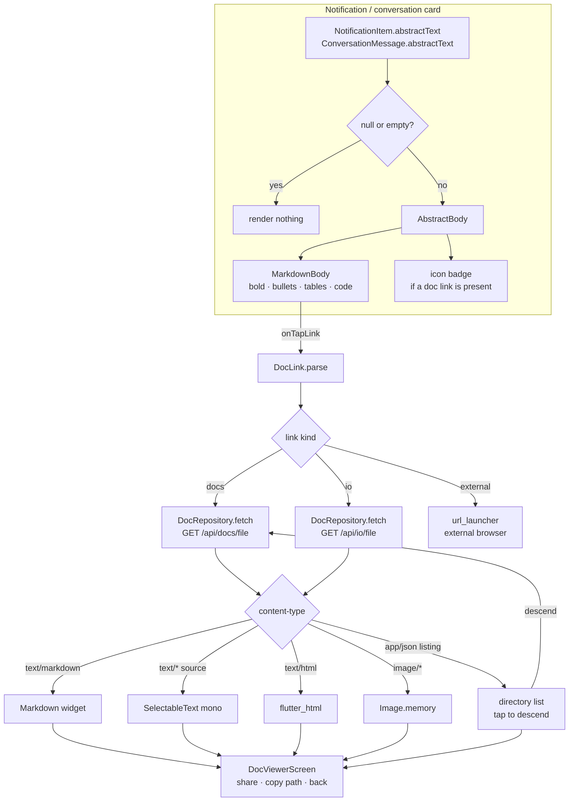

# Abstract Rendering + Doc-Link Viewer — Implementation Plan

**Date**: 2026-09-08
**Author**: Tiffany 💍 (session a08d762c)
**Ticket**: `2df54cf6-ab31-420a-b20e-4c02909fef12` (P0)
**Feasibility study**: [2026.09.08-abstract-doc-link-viewer-feasibility.md](2026.09.08-abstract-doc-link-viewer-feasibility.md)
**Status**: **APPROVED 2026-09-08** — all four §9 recommendations taken, plus one amendment

> **Rick's amendment (2026-09-08)**: *"we do not need to support the legacy scope
> links for the doc link rendering feature. We will only be rendering current modern
> format."* → §5 drops the `?scope=` rewrite. A legacy-form link classifies as
> `unknown` and renders as inert text, exactly like any other unrecognized href.
> This **shrinks** the parser; nothing else in the plan moves.

**Baseline regression floor** (measured 2026-09-08, before any change):
**882 pass / 46 fail**. All 46 pre-existing — 44 in `test/legacy_quarantine/`
(known debt, see the 2026.06.12 quarantine triage), 2 in
`notification_bloc_dispatch_test.dart` that require a sibling `../cosa` checkout
absent from this standalone clone (the tests name that cause in their own failure
message). This is the number the package swap must not move.

---

## 1. The behavior, in Rick's words

> A notification carries the abstract field, so you conditionally render it
> according to whether the abstract field is none or not. And then be able to
> follow the link from there and render that document content also.

Two conditionals and a navigation:

1. `abstractText == null || isEmpty` → render nothing (today's behavior, preserved).
2. `abstractText` present → render it **as markdown**, inline in the card, with an
   icon badge when it carries a doc link.
3. Tap a doc link → fetch → render the target document **as markdown** (or as source /
   image / directory listing, per content type).

---

## 2. Architecture



**Layering** matches the existing Tier-2 pattern (`NotificationRepository` over the
shared Dio): a pure model/parser layer, a repository, then presentation. No new DI
graph — `DocRepository` registers alongside the other repos in `service_locator.dart`.

---

## 3. New files

| File | Role |
|---|---|
| `lib/features/docs/data/doc_link.dart` | **Pure.** Parse an abstract for links; classify + normalize each into a `DocLink`. No Flutter, no IO → fully unit-testable. |
| `lib/features/docs/data/doc_models.dart` | `DocContent` (bytes + mediaType + kind), `DocDirectoryListing`, `DocApiException`. |
| `lib/features/docs/data/doc_repository.dart` | Dio fetch + content-type dispatch. Mirrors `NotificationRepository` style exactly. |
| `lib/features/docs/presentation/abstract_body.dart` | `AbstractBody` — the conditional render + `MarkdownBody` + icon badge + link tap. |
| `lib/features/docs/presentation/doc_viewer_screen.dart` | Full-screen polymorphic viewer + share. |
| `lib/features/docs/presentation/doc_directory_screen.dart` | Directory listing (P4). |

## 4. Modified files

| File | Change |
|---|---|
| `pubspec.yaml` | `flutter_markdown: ^0.7.3` → `flutter_markdown_plus: ^1.0.12`; add `flutter_html: ^3.0.0`, `url_launcher: ^6.3.0` |
| `lib/features/artifacts/markdown_report_viewer.dart` | import swap only (API-compatible) |
| `lib/features/notifications/presentation/conversation_screen.dart:306-315` | `Text( abstractText )` → `AbstractBody( abstractText )` |
| `lib/features/notifications/presentation/conversation_by_date_screen.dart:209-217` | same swap |
| `lib/core/testing/test_keys.dart` | add the doc keys (§7) |
| `lib/core/di/service_locator.dart` | register `DocRepository( _getIt<Dio>() )` |

**Note on the two card screens**: they render the abstract in a
`Container` with `surfaceContainerHighest` + rounded corners and
`theme.textTheme.bodySmall`. `AbstractBody` keeps that chrome and passes the same
text scale in as a `MarkdownStyleSheet`, so the visual weight does not change — only
the formatting comes alive.

---

## 5. `DocLink` — the parser (the one piece worth getting exactly right)

```dart
enum DocLinkKind { docs, io, external, unknown }

class DocLink {
  final DocLinkKind kind;
  final String      rawHref;    // exactly as written in the abstract
  final String      label;      // markdown link text
  final String?     project;    // "lupin-mobile"
  final String?     relPath;    // "src/rnd/foo.md"
  final String      apiPath;    // "/api/docs/file"
  final Map<String, String> query;
}
```

Forms it must accept:

| Written in the abstract | Kind | Normalizes to |
|---|---|---|
| `/app/docs?path=lupin-mobile/src/rnd/x.md` | `docs` | `/api/docs/file?path=lupin-mobile/src/rnd/x.md` |
| `/api/docs/file?path=…` | `docs` | pass through |
| `/api/io/file?path=report.md` | `io` | pass through |
| `https://…` / `http://…` | `external` | hand to `url_launcher` |
| `/app/docs?path=…&scope=…` (**legacy**) | `unknown` | inert text, no tap — per Rick 2026-09-08 |
| anything else | `unknown` | inert text, no tap |

**Legacy `?scope=` is deliberately unsupported** (Rick, 2026-09-08): modern format
only. A legacy-form link carries the retired `scope` parameter that the backend now
400s on (`docs_files.py:130`, aggressive-400 policy 2026-05-21); rather than rewrite
it, we classify it `unknown` so it renders as plain text instead of offering a tap that
would fail. The parser detects the parameter explicitly so this is a **decision**, not
an accident of pattern-matching.

Percent-decoding: hrefs arrive URL-encoded; decode before splitting `<project>/<rel>`,
and re-encode when rebuilding the query (reuse the `_enc` idiom from
`notification_repository.dart:16`).

---

## 6. Phases

### Phase 1 — dependency swap + parser (no UI change)

- Swap `flutter_markdown` → `flutter_markdown_plus`; retarget the one existing import
  in `markdown_report_viewer.dart`. Add `flutter_html`, `url_launcher`.
- Write `doc_link.dart` + `doc_models.dart`.
- `flutter pub get`, `flutter analyze`.

**Gate**: analyzer clean, full existing suite still green, `doc_link` unit tests green.
This phase is worth landing on its own merit — we currently ship a package Google
discontinued on 2025-05-30.

### Phase 2 — repository + viewer

- `DocRepository.fetch( DocLink )` → `DocContent`, dispatching on the response
  `content-type`. `responseType: ResponseType.bytes` so images and text share one path;
  decode UTF-8 only on the text branch.
- `DocViewerScreen` renders markdown / source / image, with a share action modeled on
  `markdown_report_viewer.dart:18-30`.
- Error states surface the **server's own message verbatim** — the credential-floor
  refusals (400 "content is credential material" / 500 "could not be read") are written
  to be read by a human, and paraphrasing them loses the distinction.

**Gate**: unit tests on dispatch, widget tests on each render branch.

### Phase 3 — `AbstractBody` wired into the cards (the visible feature)

- `AbstractBody( abstractText )`: returns `SizedBox.shrink()` when null/empty;
  otherwise the existing container chrome wrapping a `MarkdownBody` with
  `onTapLink` → parse → push `DocViewerScreen`.
- Icon badge (`Icons.description_outlined`) shown **only** when the abstract contains
  at least one `docs`/`io` link — the affordance Rick asked for.
- Swap both card call sites.

**Gate**: widget tests — null abstract renders nothing; markdown formats; badge appears
only with a link; tapping pushes the viewer.

### Phase 4 — the long tail

- Directory listings (`DocDirectoryScreen`, tap to descend, `parent` navigation).
- `flutter_html` branch for `.html`.
- `url_launcher` for external URLs, with a confirm-before-leaving-the-app step.
- Integration test end-to-end against a live server.

**Gate**: integration test green.

---

## 7. Test plan

New `TestKeys`:

```dart
// Docs / abstract viewer
static const abstractBody          = 'docs.abstract.body';
static const abstractDocBadge      = 'docs.abstract.badge';
static const abstractLinkPrefix    = 'docs.abstract.link.';   // + href hash
static const docViewerScreen       = 'docs.viewer.screen';
static const docViewerMarkdown     = 'docs.viewer.markdown';
static const docViewerSource       = 'docs.viewer.source';
static const docViewerImage        = 'docs.viewer.image';
static const docViewerError        = 'docs.viewer.error';
static const docViewerShareButton  = 'docs.viewer.share';
static const docDirEntryPrefix     = 'docs.dir.entry.';       // + name
```

| Tier | File | Covers |
|---|---|---|
| Unit | `test/unit/docs/doc_link_test.dart` | every link form · legacy `?scope=` classifies `unknown` (NOT rewritten) · percent-decoding · multiple links in one abstract · zero links · malformed href |
| Unit | `test/unit/docs/doc_repository_test.dart` | content-type dispatch · 400 credential refusal · 500 unreadable · 404 · directory JSON |
| Widget | `test/widget/docs/abstract_body_test.dart` | **null → renders nothing** · empty string → nothing · plain prose renders · bold/bullets/table format · badge only with a doc link · tap pushes viewer |
| Widget | `test/widget/docs/doc_viewer_screen_test.dart` | markdown branch · source branch · image branch · error branch shows server text verbatim |
| Integration | `integration_test/docs_flow_test.dart` | card → tap → fetch → render, live server |

**Regression floor**: the existing suite must stay green through the `flutter_markdown`
swap — that is the actual risk in P1, and it is checked before anything else lands.

---

## 8. Acceptance criteria

1. A notification with `abstract: null` renders exactly as it does today — nothing.
2. A notification with a prose abstract renders **formatted** markdown inline in the
   card: bold, italics, bullets, tables, inline code, headings.
3. An abstract containing a doc link shows a document icon badge.
4. Tapping the link opens the target **in-app**, rendered as markdown.
5. A legacy `?scope=` link renders as plain, untappable text — never an offered tap that would 400.
6. A `.py`/`.json`/`.yaml` target renders readably as source, not as garbled markdown.
7. A refused file shows the server's own explanation.
8. No WebView is added to the app.

---

## 9. Open questions for Rick

| # | Question | My recommendation |
|---|---|---|
| Q1 | Should the whole card be tappable when the abstract has exactly one doc link, or only the link text? | **Link text only.** The card already has a tap target (Respond); a second whole-card gesture would collide. |
| Q2 | Inline abstracts: cap the rendered height with a "show more", or always render in full? | **Cap at ~8 lines with a fade + tap-to-expand.** Some abstracts are long tables and would swamp the list. |
| Q3 | Do we ship P1 (the discontinued-package swap) independently, ahead of the feature? | **Yes — land it first.** It is a standalone hygiene win and de-risks everything after it. |
| Q4 | External `http(s)` links: open in the external browser, or refuse? | **External browser, behind a confirm.** Leaving the app should be deliberate. |

---

## 10. What this plan does *not* do

- No backend change. `/api/docs/file` already returns what we need.
- No WebView. No platform channels. No new native code.
- No change to how abstracts are *authored* — the fleet convention in
  `CLAUDE.md § DOCUMENT VIEWER LINKS` stays exactly as-is; this makes the mobile client
  finally honor it.
