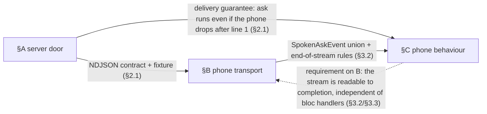
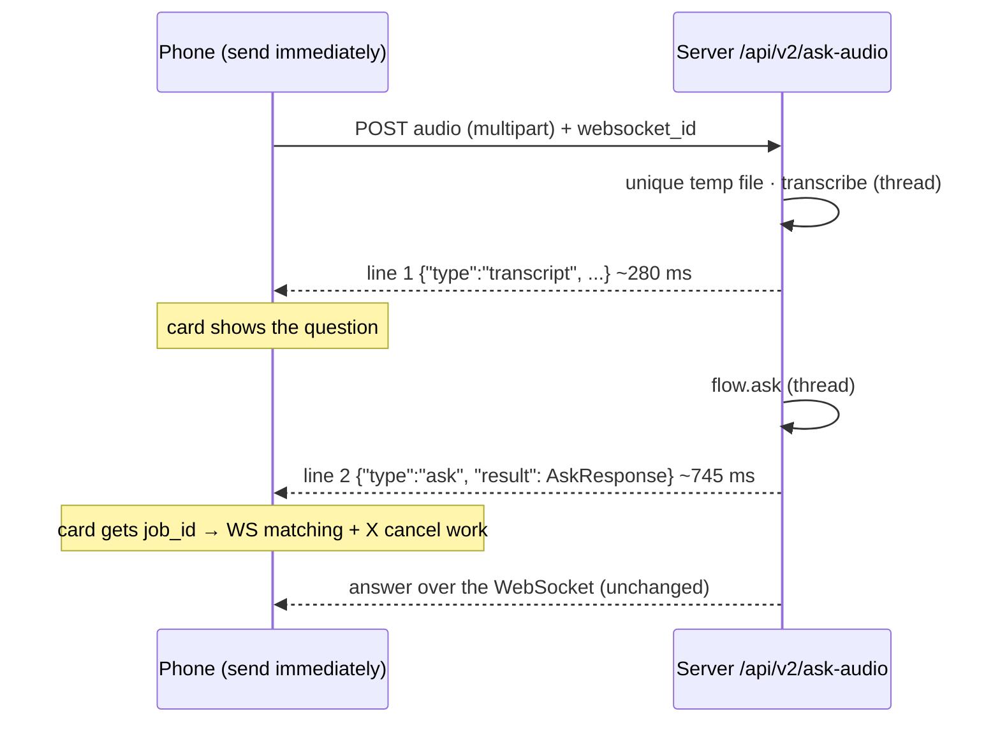

# Spoken Quick Ask, one leg: implementation plan

**Date**: 2026-09-11 · **Author**: Tiffany 💍 (session afe9bfdc), for Rick
**Rows**: server `fad583f7` (P0, owner Mr. Radio) · phone `39639293` · decision `9df9f1c2` · cascade `epic:cascade-spoken-ask-door`
**Decision brief**: `src/rnd/2026.09.11-voice-one-leg-ask-decision-brief.md` (rulings at the top)
**Status**: PLAN **rev 9** (see §7; the revision number lives there and here only). Rick approved it "for the most part"
and asked for a cascaded review before building. **THE CASCADE IS COMPLETE — nine stages, nine closes, all classified;
rounds 0, votes 0, escalations 0.** Every finding is folded here against pin `26b66a09` (rev 8, committed `32b2055c`).
**F5 is ruled** — the single `speech.insert_stt_io_row` helper — and F3, the task-registration choice, was ruled earlier
and is already in. **Nothing is built until Rick okays this revised plan.**

## 0. Cascade readiness

**Cast** (approved by Rick 17:23; spawned 17:26, cold, project=lupin)

| Role | Persona | Seat |
|---|---|---|
| Author | Tiffany 💍 | lupin-mobile session afe9bfdc |
| Manager | Mr. Radio 🦉 | owns `fad583f7`, accountable for `39639293` |
| Workflow Steward | María 🌸 | — |
| Stage 1 Usability/Reuse | Sam 🎙️ | cc-reviewer-mr-radio-2 |
| Stage 2 Viability/Gap + Step 0 light review | Chloé 🗼 | cc-reviewer-mr-radio-1 |
| Stage 3 Ownership-Language | John 🏄🏽 | cc-reviewer-mr-radio-3 |

**Sections**

| § | Section | Plan text | Repo | Size (code + test lines) |
|---|---|---|---|---|
| **A** | Server spoken-ask door | §2 | lupin | ~150 + ~280 (**two** NEW helpers counted, §2.2 — `_ndjson` and `_stream_headers`. `identity_or_401` moves into the existing `cosa/rest/auth.py` (F1) and the io-row helper into `speech.py` (F5), so neither is new in `v2_ask.py`) |
| **B** | Phone transport: `stopToFile`, `askSpoken` NDJSON reader, `SpokenAskEvent`, contract fixture | §3.2 · §3.4 rows tagged **B** | lupin-mobile | ~130 + ~220 |
| **C** | Phone behaviour: preference, toggle, `QuickAskBloc` branch, reading the stream through to the end, cancel before job ID | §3.1 · §3.3 · §3.4 rows tagged **C** | lupin-mobile | ~200 + ~280 |

**Shared anchors** every reviewer loads: §1 · **§2.1 wire contract and delivery guarantees** · §5 · §6 · the decision brief's rulings.

**Independence** (cold-reviewer test)
- **A** needs only §2.1, `v2_ask.py` conventions and the merged temp-file helpers (`91a45173`).
- **B** needs only §2.1 as consumer, `QueueRepository` / `AsrService` conventions, and the shared-recorder constraint.
- **C** needs only the `SpokenAskEvent` union and its end-of-stream rules (§3.2, *B provides*), §2.1's delivery guarantees, and today's `QuickAskBloc`.

**Dependencies**: every edge is stated with its provider and its consumer.



The dashed C→B line is a **requirement**, not a data dependency. B satisfies it by returning a plain single-subscription
`Stream` with no hidden cancellation, so the graph stays acyclic. Topological order: A → B → C.

**Provenance**: every requirement traces to Rick's rulings (brief top; §6), to the measurements (brief §3), or to code read
at lupin `5ff67833` (with `91a45173` as an ancestor) and lupin-mobile `e103594`.

**Recon for the Manager and builders** (Step 0.2 plus G9 and G16)

| Item | Rule |
|---|---|
| Coverage mandate | lupin's 100% gate applies to **§A** (`src/cosa` is in the coverage source, `pyproject.toml:201`; tree-wide `fail_under` 97, `:376`). **lupin-mobile is excluded by name** (lupin CLAUDE.md § 100% coverage mandate, Excludes line), so §B/§C carry no coverage gate |
| `:8000` venue | Scheduled and monopolize-only. Verify with `PYTHONPATH=src python3 -m cosa.rest.venue_idle --port 8000 ; echo "exit=$?"`, where **only 0 is idle** (2 = unknown ≠ idle). Submit **only** through `POST /api/test-suite/submit`: no direct requests, no queue push, no in-process server (lupin CLAUDE.md § Testing venues) |
| `:8000` refresh | `src/scripts/refresh-test-server.sh` (restarts `lupin-rest-test`, polls `/health`), after `venue_idle` exits 0. `bounce-dev-server.sh` is for `:7999` only |
| What `:8000` sees | `lupin-rest-test` mounts the **main checkout's** `./src` (`docker-compose.yml:380`). A branch is invisible there until merged into the checked-out branch and `:8000` is refreshed (§4) |
| Worktree test runs | pin `LUPIN_ROOT="$PWD" PYTHONPATH="$PWD/src"`, or the tier and coverage runs measure the main tree instead |
| Commits | `git commit -F <msgfile> -- <paths>` (scope guard). lupin commits: the §A builder under Mr. Radio. **lupin-mobile commits: Tiffany only** |
| Spawns | a spawned builder for §B/§C with a lupin-mobile working directory is a **cross-project spawn** and needs Rick's direct word. The plan assumes none: Tiffany builds §B/§C herself |
| Phone verdict | `./flutter.sh test --reporter json > /tmp/now.json && python3 tool/check_ac_g2.py /tmp/now.json`. The verdict is the script's **exit 0** ("no previously passing test id disappears") against `test/fixtures/ac_g2_passing_baseline.json` (`failing_count` 44, recorded at `ac94811`), not a failure count |
| Cross-project handoff | memory `feedback_cross_project_handoff_doc` **applies**: a lupin contract consumed by lupin-mobile, with this plan living only in lupin-mobile. §4 step 7 adds the lupin-side handoff summary and TODO seed |
| Standing | no `curl` for API tests · `py_compile` after every `.py` edit · the phone E2E is not automatable without a microphone (§3.4) |

## 1. What we're building, and why

Today a spoken Quick Ask takes two requests. The audio goes up and the text comes back; you read it and press
send; then the text goes up again. Rick ruled (2026-09-11):

1. A phone setting: **send immediately** or **review first**, with **review first as the default**.
2. In send-immediately mode, **one request** whose reply comes in **two parts**: the transcript as soon as it
   exists (~280 ms), then the ask result with the **job ID** (~745 ms), so tracking and cancelling keep working.

**Review-first mode does not change at all.** Neither does the phone's voice-reply field, which keeps its
text-only door.



## 2. Server (lupin) — §A, row `fad583f7`

### 2.1 The endpoint — **shared anchor**

**`POST /api/v2/ask-audio`**, a **new** door in `src/cosa/rest/routers/v2_ask.py`. Neither existing audio door changes.

| Input | Type | Default | Note |
|---|---|---|---|
| `file` | multipart `UploadFile` | required | **any audio the transcriber reads**: WAV today, Ogg/Opus or AAC after the compression row (decision 4). The temp-file suffix is the **vetted extension** from `speech.audio_suffix_from_filename( file.filename, fallback=".wav" )` (`speech.py:97`: only `^\.[A-Za-z0-9]{1,5}$` survives). Nothing else from the client filename reaches the path |
| `websocket_id` | **query parameter — not a form field** | `None` | `session_id = websocket_id or f"api-{user_id[:8]}"`, exactly as `v2_ask.py:415`. 🔴 **CB1/B-J1, and it fails SILENTLY if the phone gets it wrong**: sent in the `FormData` instead — the natural move, since the upload is already multipart — FastAPI ignores it, the server falls back to `api-<uid8>`, **both NDJSON lines still arrive perfectly, the card still gets its `job_id`**, and the answer goes to a session nobody is listening on. Chloé built a minimal FastAPI app with this signature and watched a form-sent id return **200 with no validation error**. §3.2 pins the transport and §3.4 carries a row asserting the query string actually holds it |
| `speak` | query bool | `True` | passed to `flow.ask` |
| `interactive` | query bool | `True` | passed to `flow.ask`; keeps the parked-interview behaviour |
| auth | `Depends( get_current_user )` | required | 401 without a uid and email, as `v2_ask.py:409-414` |

**Reply**: `200`, `media_type="application/x-ndjson"`, headers from a **NEW** `_stream_headers()` carrying **only**
`Cache-Control: no-cache` and `X-Accel-Buffering: no`. Do **not** copy `_sse_headers()` (`notifications.py:348`): it also
sets `Content-Type: text/event-stream`, `Connection: keep-alive` and `Access-Control-Allow-Origin: *`.

🔴 **Framing, pinned (S2-3)** — §2.4 row 1 asserts **byte equality** against the committed fixture, so the framing is part
of the contract rather than an accident of whichever `json.dumps` defaults were in force when the fixture was captured:
**exactly one compact JSON object per line**, serialised with `json.dumps( obj, separators=( ",", ":" ) )` — no space
after `:` or `,` — and **every line terminated by `\n`, including the last**. Without this, a later switch to compact
separators reddens a test about the *contract* rather than about behaviour, and §B's `LineSplitter` tolerates either, so
the phone would never catch it.

```text
{"type":"transcript","transcription":"<text>","trace":{"stt_ms":271.4,"upload_bytes":249000}}
{"type":"ask","result":{ ...the exact AskResponse body /api/v2/ask returns... }}
```
or, when `flow.ask` raises after line 1:
```text
{"type":"error","stage":"ask","detail":"<message>"}
```

**Line 2 is the full `AskResponse`** (`v2_ask.py:89-109`). The phone parses it with its existing `AskResponse.fromJson`
(`queue_models.dart:208`; `routeReason` and `traceId` are required).

**`trace`'s two values have named producers (S2-2)** — neither was stated, and because the fixture is copied byte for byte
into lupin-mobile (§3.2), whatever a builder invented would have become §B's pinned shape:
- `stt_ms` — a `time.perf_counter()` span taken **around the `run_in_threadpool` transcribe await only**, rounded to one
  decimal. Not the whole handler: the temp-file write and the io-row insert are outside it.
- `upload_bytes` — `len( content )`, the bytes actually read from the request.

Both are **diagnostic**, never load-bearing: §B parses line 1 for `transcription` and ignores `trace`. That is why
`Request` is **not** among §2.2's new imports — the trace block needs nothing from it (S2-7, resolved here rather than
left as a conditional in a list whose purpose is to be exhaustive).

**Delivery guarantees** (consumed by §B and §C)

| # | Guarantee |
|---|---|
| D1 | A non-200 status means **nothing was asked** (401, 422 empty speech, 503 GPU OOM or flow disabled) |
| D2 | A 200 always starts with exactly one `transcript` line |
| D3 | After line 1 there is exactly one more line, either `ask` or `error`, then the body closes |
| D4 | **The ask is already started before line 1 is sent.** The handler creates the ask task **before the `StreamingResponse` exists**, so it lives outside that response's cancel scope, and the generator awaits it with `asyncio.shield`. A disconnect cancels the generator, not the ask: the job queues and its answer reaches the session over the WebSocket, and that client has lost only the job ID. ⚠️ **Why it must be created outside**: `anyio.to_thread.run_sync` awaits `checkpoint()` and the capacity limiter **before** entering `CancelScope( shield=not abandon_on_cancel )` (`anyio 4.13.0 _backends/_asyncio.py run_sync_in_worker_thread`). A cancel landing in that window means the worker thread never starts, so an ask created *inside* the generator could be killed after a 200 and a transcript had already gone out. **What makes D4 true is the cancel-scope placement above — nothing else.** Separately, and as defence in depth, the handler holds the task in a **module-level set in `v2_ask.py`**, discarded in the done-callback, so a strong reference outlives the response. ⚠️ Deliberately **not** `speech.get_active_tasks`: that dict's only consumer, `websocket.py:334-341`, cancels-awaits-deletes by **bare `session_id`** on audio-WS disconnect, which would kill exactly what D4 promises (§2.2 carries the full reason, because it has to survive next to the code). ⚠️ **That second point is documented practice, not a measured failure here**: CPython tracks running tasks weakly and the docs tell callers to keep a reference, but Chloé measured a task with no strong reference running to completion on 3.13.7. So the registration is cheap insurance, and D4 does **not** rest on it. ⚠️ **It is explicitly NOT "a handle for cancellation" (A-v)** — that clause is struck, not softened. Nothing in the tree can cancel by it, and cancelling an in-flight ask is the exact failure Rick ruled against on 18:52: the cancel path is `POST /api/jobs/{id}/cancel` **on the job**, after line 2, never on the ask task. The §2.4 D4 tests guard the placement, the exception retrieval **and the registration**, including against someone later passing `abandon_on_cancel=True`. **A consequence, accepted**: the job can queue even when line 1 never reaches the client — the POST ordered it |

The exact two-line body the unit test pins is committed as a **contract fixture**,
`src/tests/fixtures/ask_audio_ndjson_contract.json` (lupin). It's copied byte for byte into lupin-mobile (§3.2), following
the existing `test/fixtures/asr/transcribe_endpoint_contract.json` pattern.

### 2.2 Order of work inside the handler

```python
@router.post( "/api/v2/ask-audio" )
async def ask_audio( file: UploadFile = File( ... ), websocket_id: Optional[ str ] = None, speak: bool = True,
                     interactive: bool = True, current_user: dict = Depends( get_current_user ),
                     flow = Depends( get_ask_flow ), provider = Depends( speech.get_speech_provider ),
                     whisper_pipeline = Depends( speech.get_whisper_pipeline ),
                     config_mgr = Depends( speech.get_config_manager ) ):
    user_id, user_email = identity_or_401( current_user )          # F1: lives in cosa.rest.auth, not here
    session_id = websocket_id or f"api-{user_id[ :8 ]}"            # as :415
    content    = await file.read()
    suffix     = speech.audio_suffix_from_filename( file.filename, fallback=".wav" )
    temp_path  = speech.save_audio_upload( content, user_id, suffix, speech.resolve_stt_upload_dir( config_mgr ) )
    try:
        # BEFORE the stream opens, so a failure is a real HTTP status (D1)
        text = ( await run_in_threadpool( lambda: provider.transcribe( temp_path, whisper_pipeline=whisper_pipeline ) ) ).strip()
    except torch.cuda.OutOfMemoryError:                            # F2: §2.3 promised this; the code has to carry it
        # Verbatim the shape both existing doors use (speech.py:506-508 and :907-909), including the
        # message text, so all three doors tell a client the same thing about the same condition.
        print( "[ERROR] ask-audio transcription failed: CUDA out of memory (after retry)" )
        raise HTTPException( status_code=503, detail="Server GPU memory temporarily unavailable. Please retry in a few seconds.", headers={ "Retry-After": "5" } )
    except Exception as e:                                         # S2-1: the OOM branch alone is NOT the whole fix
        # The wav door wraps its WHOLE body in OOM-then-generic (speech.py:906-913). Without this second
        # clause every non-OOM transcribe failure returns a bare FastAPI 500 whose body shape differs from
        # both existing doors — D1 stays true (nothing was asked) but the status it names is wrong.
        print( f"[ERROR] ask-audio transcription failed: {e}" )
        raise HTTPException( status_code=500, detail=f"Transcription failed: {str( e )}" )
    finally:
        speech.remove_audio_upload( temp_path )
    if not text: raise HTTPException( 422, "No speech was recognised, so nothing was asked." )
    # F5, ruled: the SHARED helper in speech.py, not a fourth per-request InputAndOutputTable build here.
    await run_in_threadpool( lambda: speech.insert_stt_io_row(
        input_type="stt_wav_ask", input=text, output_raw=text, output_final=text ) )

    # D4 — START THE ASK HERE, before the StreamingResponse exists, so the task is NOT inside the
    # response's cancel scope. Created on the running loop, it survives a client disconnect; the
    # generator only waits for it. Creating it inside lines() would put it under the scope Starlette
    # cancels on http.disconnect, and anyio's checkpoint + limiter run BEFORE its shield, so the ask
    # could be killed before its thread ever started (see §2.1 D4).
    # A PLAIN asyncio task started before the first yield survives the disconnect. Anything spawned
    # inside an anyio task group that lives under the response does NOT — that group is what gets
    # cancelled (Chloé, acceptance point 1).
    ask_task = asyncio.create_task(
        run_in_threadpool( lambda: flow.ask( question=text, user_id=user_id, user_email=user_email,
                                             session_id=session_id, websocket_id=session_id,
                                             speak=speak, interactive=interactive ) ) )
    # Keep a strong reference — defence in depth, NOT what makes D4 true (that is the cancel-scope
    # placement above). CPython tracks running tasks weakly and the docs say to hold a reference; the
    # only other one here lives in the lines() closure, which dies with the response. Measured
    # counter-evidence: Chloé saw a no-strong-reference task finish on 3.13.7, so treat this as cheap
    # insurance, not as a proven fix.
    #
    # ⚠️ NOT speech.get_active_tasks, and this reason is load-bearing — read it before "tidying" this
    # to the house pattern. That dict has exactly ONE consumer: websocket.py:334-341 cancels, awaits
    # and deletes by BARE session_id when the audio WebSocket disconnects. It is a cancel-on-disconnect
    # registry, not a task registry. An ask registered there under a bare key would be killed by
    # websocket.py on the very disconnect D4 promises to survive. The earlier composite key
    # ask-audio:<session>:<rand> dodged that ONLY by not matching its neighbours at speech.py:644/:801
    # — so the next reader who normalises it to the house shape silently re-breaks D4 in a diff that
    # reads as a cleanup. A module-level set in THIS file has no such consumer and no such neighbour.
    _INFLIGHT_ASKS.add( ask_task )          # module level: _INFLIGHT_ASKS: set[ asyncio.Task ] = set()

    # One callback, two jobs: discard the reference, and retrieve the exception so a client that
    # leaves after line 1 plus a failing ask cannot surface as "Task exception was never retrieved"
    # (Chloé, acceptance point 2). The generator still raises it into the error line on the normal path.
    def _release( t ):
        _INFLIGHT_ASKS.discard( t )
        if not t.cancelled(): t.exception()
    ask_task.add_done_callback( _release )

    async def lines():
        yield _ndjson( { "type": "transcript", "transcription": text, "trace": { ... } } )   # NEW helper _ndjson
        try:
            result = await asyncio.shield( ask_task )     # shield: a cancelled generator must not cancel the ask
            yield _ndjson( { "type": "ask", "result": result } )
        except asyncio.CancelledError:
            raise                                          # the client went away; ask_task keeps running
        except Exception as e:
            yield _ndjson( { "type": "error", "stage": "ask", "detail": str( e ) } )
    return StreamingResponse( lines(), media_type="application/x-ndjson", headers=_stream_headers() )   # NEW helper
```

**NEW imports in `v2_ask.py`** (it currently imports only `os`, `typing`, `APIRouter`/`Depends`/`HTTPException`,
`run_in_threadpool`, pydantic, `ConfigurationManager`, `get_current_user` — verified at `5ff67833`): `asyncio`,
`File` and `UploadFile` from `fastapi`, `StreamingResponse` from
`fastapi.responses`, **`torch`** (F2's `torch.cuda.OutOfMemoryError`, as `speech.py` imports it), `InputAndOutputTable`,
`identity_or_401` from `cosa.rest.auth` (F1), and `cosa.rest.routers.speech` for the reused helpers and seams.
`uuid` is **no longer needed** — it existed only for the retired composite task key.

**NEW module-level state in `v2_ask.py`**: `_INFLIGHT_ASKS: set[ asyncio.Task ] = set()` (see §2.2's warning).

**NEW functions in `v2_ask.py`**: `_ndjson` and `_stream_headers` — **two, not four**. `Request` is **not** imported:
S2-7's conditional is resolved by §2.1's named `trace` producers, which need nothing from it.
**MOVED OUT, and neither is new in this file**: `identity_or_401` goes into the existing `src/cosa/rest/auth.py` (F1 —
the file is already there, so this is a move plus a re-point of the three inlined sites, not a new module), and the io-row
helper goes into `speech.py` (F5, below). **Reused**: `speech.audio_suffix_from_filename`
(:97), `save_audio_upload` (:110), `remove_audio_upload` (:144), `resolve_stt_upload_dir` (:79), `get_config_manager` (:230),
`get_speech_provider`, `get_whisper_pipeline`; `v2_ask.get_ask_flow` (:275), `get_current_user`.

**F5 — RULED (Mr. Radio, 19:20), and it carries A5's consequences.** Sam's finding: a private `_insert_io_row` here
would be the **fourth** per-request `InputAndOutputTable` build. Verified in the tree — inline per request at
`speech.py:488` and `:896` (and `running_fifo_queue.py:2250`, `main.py:865`); held long-lived at
`notification_fifo_queue.py:274`, `running_fifo_queue.py:103`, `receptionist_agent.py:89`. House practice is genuinely
split, but inside the **speech door family this door joins** it is inline, twice.

**The fix**: one shared `speech.insert_stt_io_row( input_type, input, output_raw, output_final )`, with `:488` and `:896`
**re-pointed onto it in the same commit**. That retires the duplication instead of adding a fourth copy, and costs
`v2_ask.py` nothing — it already imports `speech` for five helpers.

🔴 **A5 — this ruling widens §A's change footprint, and it has THREE consequences. All three are required to close it.**
Extracting the helper pulls `speech.py` into the commit: a **third in-frame file**.

- **A5-i — the coverage gate's `--include` scope.** With A1's `auth.py`, the §A commit touches **three** files in the
  coverage frame while the gate measures **one**. Unwidened, the new code ships uncovered while the gate reports green
  and the tree-wide `fail_under = 97` absorbs the drop.
- **A5-ii — the regression row goes FALSE.** It asserts the existing `test_speech_*` suites pass **untouched**.
  Re-pointing `speech.py:488` and `:896` changes the module those suites exercise, so they may legitimately need edits
  and the row's own criterion then fails **for a correct implementation** — red on the right answer.
- **A5-iii — the dependency-override list SHIFTS.** §2.4's unit row overrides `speech.get_speech_provider` and
  `speech.get_config_manager`. Once `_insert_io_row` becomes `speech.insert_stt_io_row`, **the seam the test must
  control moves from a `v2_ask.py`-local function to a `speech` module function — a different override and a different
  assertion target.** ⚠️ This is the consequence a builder hits **first**, at the moment they write the unit test, and it
  was missing from the fold queue, the §A section row and the pre-committed checklist alike. Recovered from John's own
  file rather than a paraphrase, which is how it was lost.

All three are folded into §2.4 below.

*(Label note: this finding is **F5**. Rev 8 called it "F3" in three places — F3 is the task-registration choice, ruled
separately and already folded. Author's error, corrected throughout this revision.)*

**Why transcription happens before the stream opens**: a GPU OOM stays a 503 with `Retry-After`, as the existing doors do
(`speech.py:508`, `:909`), and empty speech stays a 422. Line 1 couldn't be sent any sooner anyway.

**Both slow calls go through `run_in_threadpool`**, as `/api/v2/ask` does (`v2_ask.py:421`). The existing doors block the
event loop: `upload_and_transcribe_mp3_file` calls `provider.transcribe` (`speech.py:389`) and `ask_flow.ask` (`:471`), and
`upload_and_transcribe_wav_file` calls `provider.transcribe` (`:887`), all at `5ff67833`. The new door must not repeat that.

**Upload size: no cap, inherited and out of scope (S2-6).** Measured — there is no `content-length`, `max_upload` or
`len( content )` guard anywhere in `speech.py` or `main.py`, and `await file.read()` loads the whole body into memory.
This door inherits that posture rather than introducing it, and §2.1 now invites any audio format, which does not change
the exposure. **Stated as a choice, not an oversight**: a cap belongs in one place for all three audio doors, so adding
one here alone would leave the other two unguarded while implying otherwise. Out of scope for this plan; worth its own row.

### 2.3 Edge cases

| Case | Behaviour |
|---|---|
| No token, or a token without uid or email | 401, no transcription |
| `v2 flow enabled = False` | `get_ask_flow` raises **503** (`v2_ask.py:275-300`); it never returns None |
| GPU OOM during transcription | 503 + `Retry-After: 5` |
| Empty transcript | 422; ask never runs |
| Unfit question | line 2 carries `status: "rejected"` |
| Missing argument | line 2 carries `needs_input`, or `parked` + `pending_id` |
| `flow.ask` raises | line 2 is `{"type":"error"}`; the body closes cleanly |
| Client disconnects after line 1 | D4: ask still runs; the job and its WebSocket answer are unaffected |

### 2.4 Server tests

| Tier | Test | File / venue |
|---|---|---|
| Unit | Body is exactly two lines in order; `FakeFlow` records that line 1 was already yielded when `ask` ran; the body equals the committed contract fixture | `src/tests/unit/test_v2_ask_audio.py` (model `test_v2_ask.py:39-64`; `dependency_overrides` for `get_current_user`, `v2_ask.get_ask_flow`, `speech.get_speech_provider`, `speech.get_config_manager`, **and `speech.insert_stt_io_row` (A5-iii)**. 🔴 **That last one is the seam shift F5 causes, and it is the consequence a builder hits first.** While the io-row insert was a `v2_ask.py`-local `_insert_io_row`, the test controlled it as a local function; once F5 moves it to `speech.insert_stt_io_row` it becomes **a different override and a different assertion target** — a `speech` module function, patched the way the other `speech.*` seams in this row already are. A test written against the old seam passes while exercising nothing. Chloé's N1 — an override for `speech.get_active_tasks` — is **retired**, because the handler no longer touches that dict) |
| Unit | 401 no user · 503 flow disabled · 422 empty transcript (flow never called) · 503 OOM with `Retry-After` · error line when `ask` raises | same |
| Unit | `needs_input` / `parked` results pass through whole (`pending_id` set, `job_id` null) | same |
| Unit | Temp file removed on success, 422 and exception · suffix from `audio_suffix_from_filename` (`x.ogg` → `.ogg`; `../../a b.wav;rm` → vetted or `.wav`) · no other filename text in the path | same |
| Unit | Transcribe and ask both go through `run_in_threadpool` · `_stream_headers()` has exactly the two headers, no `text/event-stream` | same |
| Unit | **D4, five arms**: (a) the ask task is created **before** the response is returned — `FakeFlow`'s threading event is set even when the generator is never iterated; (b) the generator is closed after line 1 and `flow.ask` still completes; (c) **executable form, A-3**: a deliberately-wrong variant that creates the ask *inside* `lines()` is asserted to **fail arm (a)** — parametrise the handler's task-creation site and assert the inside variant leaves `FakeFlow`'s event unset. Without a pass/fail signal this arm was a rationale, not a test; (d) **exception retrieval**: the generator is closed after line 1 **and** `flow.ask` then raises — assert no "Task exception was never retrieved" is logged (`caplog`) and the failure is consumed; (e′) **registration — ADDED, not the old arm (e) restored.** The task is in `_INFLIGHT_ASKS` while in flight and **gone once settled, on BOTH the success and the failure path**, and **two overlapping asks are held simultaneously**. 🔴 Retiring (e) was right — it asserted on the shared dict N1 removed — but (e) carried a second claim that was never about the dict: **no eviction**, which is the whole reason a set works. This also discharges **S2-8**: `_INFLIGHT_ASKS` appears 4× in the plan and 0× in a test row, so today one could drop the `add()` or the `discard()` and nothing would redden | same |
| Coverage gate | **Every file the folds touch, at 100% lines and branches — A1 + A5.** `coverage run --branch -m pytest src/tests/unit/test_v2_ask.py src/tests/unit/test_v2_ask_audio.py src/tests/unit/test_auth.py src/tests/unit/test_speech_*.py` then `coverage report --include=src/cosa/rest/routers/v2_ask.py,src/cosa/rest/auth.py,src/cosa/rest/routers/speech.py --fail-under=100`. 🔴 **`--include`ing `v2_ask.py` alone was the defect**: F1 puts a NEW `identity_or_401` into `auth.py` and F5 a NEW helper into `speech.py` — both in the coverage frame — so either could ship untested while this gate reported 100% green and the tree-wide `fail_under = 97` silently absorbed the drop. **A2, ruled by the Manager so nobody waits on him**: the gate is **unconditional 100% on the post-fold files**; the step-1 baseline is **informational only**; the only relief is `# pragma: no cover` with a same-line reason, never a manager conversation. The former "any pre-existing gap is named to Mr. Radio before the gate is set" clause is **struck** — a baseline measured before the folds describes files that are about to change | worktree run with `LUPIN_ROOT`/`PYTHONPATH` pinned |
| Regression | `test_v2_ask.py` passes untouched. **`test_speech_*` passes AFTER the helper extraction, not untouched — A5.** F5 re-points `speech.py:488` and `:896` onto the shared `insert_stt_io_row`, so `speech.py` changes in this same commit; a row claiming those suites are untouched would be false the moment F5 lands. The assertion is that they pass **with the extraction applied**, with no behavioural change to either existing door | `:7999`-eligible unit tier |
| Integration | real provider, mock-jobs account, `speak=false`: (1) a committed 5 s WAV gives line 1 before the body closes, and line 2's `job_id` is accepted by `POST /api/jobs/{id}/cancel`; (2) **a committed ~3 s Ogg/Opus clip** (ffmpeg from the kept real-speech WAV) gives a non-empty transcript line. That proves the format-agnostic claim with a real transcriber | `src/tests/integration/test_v2_ask_audio_live.py`, **`:8000` only via `POST /api/test-suite/submit` after `venue_idle` exits 0**, after §4 step 3's merge and refresh |

## 3. Phone (lupin-mobile) — §B and §C, row `39639293`

### 3.1 The setting — §C

- **`QuickAskPreferences`** (`lib/services/quick_ask/quick_ask_preferences.dart`) copies `NotificationPreferences`
  (`lib/services/notification_audio/notification_preferences.dart`). One key, **`quick_ask.send_immediately`**,
  **default `false`**. Registered in `service_locator.dart` next to `NotificationPreferences` (:280).
  🔴 **SC3 — the key name is a ONE-WAY DOOR, and it has a deadline (C-J4).** The dotted form matches the house
  convention; the earlier `quick_ask_send_immediately` does not. Once either spelling ships to a device it is in that
  device's `SharedPreferences`, and renaming afterwards **silently resets every user's setting** — no error, no failed
  assertion, no log, and **no tier can catch it**. So this is not a cosmetic preference deferred to a tidy-up: it must
  land **before §4 step 5 commits**, while the cost is exactly zero. §4's order says so explicitly.
- **The control**: a two-segment `SegmentedButton` on the Quick Ask screen, above the record button, labelled
  **Review first | Send immediately**. Location was Rick's ruling (§6). **SC4 — a template already exists**:
  `server_context_toggle.dart:59-85` is a persisted two-value `SegmentedButton`; follow it rather than inventing a shape.
- **CC5 — the injection point, stated, because it decides whether `QuickAskState` grows a field.** `QuickAskBloc`'s
  constructor (`:102-110`) takes required named dependencies, so `QuickAskPreferences` arrives as **a constructor
  parameter**, not a locator lookup inside the bloc — a lookup would break `_quick_ask_harness.dart`'s DI-free
  construction. The screen is a `StatelessWidget` driven by `BlocBuilder` (`:27`, `:47`), so the control reads the mode
  from **`QuickAskState`**, which therefore gains one field and the matching `copyWith` and `props` entries. Not a
  blocker either way — `NotificationPreferences`' getters are synchronous `bool get` over an already-resolved
  `SharedPreferences` — but §3.4's widget row cannot be written until it is chosen, so it is chosen here.

### 3.2 Transport — §B (the voice-reply path stays untouched)

`AsrService` is shared with the focus-mode voice reply (`voice_reply_field.dart:78/96/116`), so `stopAndTranscribe()` does not change.

| Change | Where |
|---|---|
| **SB1 — EXTRACT `stopToFile()` out of `stopAndTranscribe`, do not write a sibling.** `asr_service.dart:109-125` already *is* the stop half: stop, typed exception + orphan delete on throw, `stopped ?? _activePath`, clear `_activePath`, "Recorder produced no file". Written as a sibling, that `_activePath` bookkeeping exists **twice**, and a later fix to one copy misses the other — after which `isCapturing` lies, which is exactly the state the concurrent-capture guard at `:84` protects and `asr_concurrent_capture_test.dart` exists to defend. After extraction `stopAndTranscribe()` becomes `final path = await stopToFile();` plus today's upload and `finally` delete, so **the voice-reply path is provably unchanged — it runs the same code** | `lib/services/asr/asr_service.dart` |
| `Stream<SpokenAskEvent> askSpoken( String audioPath, String websocketId )` — **`websocketId` goes on the QUERY STRING** (`?websocket_id=…`), never in the `FormData`. See §2.1: a form-sent id is silently ignored and the answer is delivered to a session nobody is listening on | `lib/features/queue/data/queue_repository.dart`, beside `ask()` (:37); same Dio, `askReceiveTimeout` (240 s, reuse-as-is: its documented rationale is the blocking confirm ladder inside `flow.ask`, and line 2 waits on that same ladder) |
| **CB2 — the multipart field is named `file`, and the filename carries the REAL extension.** The server binds `file: UploadFile = File( ... )`, so the field name is load-bearing; and the temp-file suffix comes from `file.filename` via `audio_suffix_from_filename`. Today's `AsrService` hardcodes `voice-reply.wav`; carrying that habit here ships **Ogg bytes named `.wav`** the moment decision 4's Opus/AAC switch lands — a format bug that surfaces inside the transcriber, far from its cause. This is the line that makes §5's format-agnostic claim true from the phone's side | same |
| **SB3 — `sealed class SpokenAskEvent extends Equatable`**, matching the app's only union precedent (`quick_ask_event.dart:8`). `queue_models.dart` holds 14 plain classes with no sealed type and no `Equatable`, so without saying this an implementer writes a plain `abstract class` with `==` unimplemented — and §C's tests then compare emitted events by identity, failing a correct parser or passing because both sides are the same instance | `lib/features/queue/data/queue_models.dart` |
| Contract fixture copied from lupin **with its source sha recorded and asserted** — see the fixture-currency item below | `test/fixtures/asr/ask_audio_ndjson_contract.json` + provenance |

**§B provides → §C consumes: the `SpokenAskEvent` union and its end-of-stream rules**

| Wire outcome (§2.1) | Event(s) emitted, in order | Then |
|---|---|---|
| non-200 | `SpokenAskFailed( detail, statusCode )` | stream closes |
| body closes before any line | `SpokenAskFailed( "closed before transcript" )` | closes |
| `transcript` line | `SpokenAskTranscript( text )` | continues |
| `ask` line | `SpokenAskResult( AskResponse )` | closes |
| `error` line | `SpokenAskFailed( detail )`, **after** a Transcript | closes |
| **body closes after the transcript, with no second line** (network drop, D4) | **`SpokenAskCutOff( transcript )`** | closes |
| malformed line or a network error mid-body | treated as the closed-body row for its position (Failed before the transcript, CutOff after) | closes |

A stream never emits more than one terminal event (Result, Failed or CutOff), and never throws: every failure becomes an event.

🔴 **SB5 — "reuses the `QueueApiException` mapping" and "never throws" are both true only as BUILD-THEN-EMIT.** `_err( DioException, fallback )` at `queue_repository.dart:308-313` already extracts `detail` and the status code — exactly what `SpokenAskFailed( detail, statusCode )` needs — but **all ten of its existing call sites `throw` it**. An implementer who follows the call sites throws, and §C, which *subscribes* rather than awaits, gets an unhandled stream error instead of a `SpokenAskFailed`. **State it as one sentence**: catch the `DioException`, call `_err` for the message and status, and **emit** the result as an event. Never rethrow out of the stream.

**§C's requirement on §B**: `askSpoken` returns a single-subscription `Stream` that is **read to completion by whoever
listens**. Nothing inside §B cancels it on a timer or a lifecycle event. (Satisfied by construction — a Dart `async*`
stream is single-subscription — so the requirement lands on §C, where it already sits.)

🔴 **SB2 + CB3 — ONE owner for the recording, and the never-subscribed case is the half nobody covers.** Rev 8 said
`stopToFile`'s caller owns deletion *and* that `askSpoken` deletes in `finally`. Both cannot be true, and between them
sits a window with no owner at all: `stopToFile()` clears `_activePath`, so `AsrService` has forgotten the file, and
`cancelRecording()` — which only knows `_activePath` — can no longer help. Worse, a Dart `async*` stream is **lazy**: a
caller that holds the stream without subscribing never fires the request, so the `finally` never runs and the recording
is orphaned in temp forever. At 44.1 kHz that is ~2.6 MB per 30-second question, and §3.4's "audio file deleted in **all
cases**" cannot hold.

**Ruling, and the two reviewers proposed different homes — this picks Sam's, with the reason stated.** `AsrService`
**retains ownership**: it keeps the path as `_pendingUploadPath` and exposes `discardPendingUpload()`, which §C calls
from its own `finally`. Sam's layering argument decides it — `AsrService` owns *every* delete today (`:95`, `:117`,
`:158`, `:168`), while `QueueRepository` is a typed API wrapper holding only a `Dio` and has no business owning files.
It also covers the lazy-stream case without depending on a stream callback firing at all, which Chloé's `onCancel`
variant does. ⚠️ **Flagged for the Manager**: CB3's own fix text named `askSpoken` as the owner, so this is a choice
between two reviewers rather than a fold of one — say the word and it flips.

### 3.3 Behaviour — §C: one branch in `_onRecordReleased`, everything after it reused

The bloc is an **app-lifetime lazy singleton** (`service_locator.dart:360`) provided at the app root (`app.dart:244`). Leaving
the Quick Ask screen does not close it.

`_onRecordReleased` (`quick_ask_bloc.dart:192`) reads the preference **at release time**:

- **Review first (default)**: today's code, line for line.
- **Send immediately**:
  1. Capture the epoch (as :194), set phase `transcribing`, `stopToFile()`, then subscribe and **store the handle in a
     `Map<int, StreamSubscription> _spokenSubs` keyed by epoch**:
     `_spokenSubs[ epoch ] = _repo.askSpoken(...).listen( ( ev ) => add( QuickAskSpokenEventArrived( epoch, ev ) ) )`.
     It deliberately does **not** use `emit.forEach` inside the handler, so neither the handler finishing nor an epoch
     bump stops reading. Every event re-enters the bloc as an event, so state changes still happen inside a handler.
     🔴 **CC6/SC1 — the event class is PUBLIC, and this is a compile constraint, not a style note.**
     `QuickAskEvent` is `sealed` (`quick_ask_event.dart:8`), and Dart 3 permits extending a sealed class **only inside
     its own library**. So the class must live in `quick_ask_event.dart` — and a leading underscore would then hide it
     from the bloc that has to register `on<…>`. It cannot be both private and a `QuickAskEvent`. Measured on the repo's
     own `flutter/bin/dart analyze`, three arms with a positive control: the plan's original shape →
     `invalid_use_of_type_outside_library`; the same subclass inside the sealed base's library → clean; move-then-name-it-
     privately → `non_type_as_type_argument`. **Declare `class QuickAskSpokenEventArrived extends QuickAskEvent` in
     `quick_ask_event.dart`** — the 16th sibling in a file holding 15. Nothing switches exhaustively over
     `QuickAskEvent` (the four switches are over state, phase, queueName and lane), so no `case` grows.
     🔴 **CC1/C-i — ARM THE PRE-ATTRIBUTION BUFFER HERE, at subscribe time.** `_shouldBuffer:646-647` returns false
     while `liveQuestion` is null, and on this path `liveQuestion` is not set until step 2, on the Transcript — while D4
     starts the ask **before** line 1. Every `job_state_transition` in that window is therefore **neither buffered nor
     applied**: dropped, not errored, and invisible at every tier. The typed path has no such window by construction
     (`_onDraftSent:236-240` runs before `_submit:325`, which clears at `:330`). Gate `_shouldBuffer` on *"a spoken
     stream is live"* using its **session branch at `:660-661`**, which matches `meta['session_id']` against
     `_ws.sessionId` and needs no question text. ⚠️ **Depends on the transport being pinned (CB1)**: if
     `websocket_id` is sent as a form field the server falls back to `api-<uid8>`, which will not match `_ws.sessionId`
     and this fix is **inert**. The two fold together or not at all.
     ⚠️ **Stated limit, and it must survive this fold**: the *mechanism* above is established; the **width** of the
     window is **not measured**. The bloc declares no event transformer, so ordering between the arrival event and
     `QuickAskTransitionReceived` is not guaranteed — whether the gap is 5 ms or 200 ms is unknown. Do not upgrade this
     to a measured figure.
  2. **Current epoch, `SpokenAskTranscript`**: `_buffer.clear()` (as `_submit` does at :330), `liveQuestion` = text,
     phase `submitting`.
  3. **Current epoch, `SpokenAskResult`**: `_applyResolvedAsk( res, transcript, emit )` (:353) — **three arguments, not
     one (SC2 + CC4)**. `emit` is the handler's emitter, which is why step 1 re-enters through an event at all. The
     third, `transcript`, is the real gap: on this path the text arrived on a **different event** than `res`, so it has
     to survive between the two. 🔴 **Ruled: use the carrier that already exists — `state.liveQuestion ?? live.question`,
     the house answer at `:620`. Do NOT add a new field.** Step 2 already writes the text there. ⚠️ Write down the sharp
     edge rather than leaving it: a cancel between line 1 and line 2 sets `clearLiveQuestion`, so the value is null on
     exactly the stale-epoch path — which §3.3 drops anyway, making it safe **by accident** until stated. It is stated.
     Everything after this call is inherited unchanged: the job card, frame replay, `liveJobId`, the watchdog, the parked
     interview, needs_input and rejected, exactly as the typed path.
  4. **Current epoch, `SpokenAskFailed`**: idle with the error, as a failed transcription today.
  5. **Current epoch, `SpokenAskCutOff`**: a failed card reading *"Sent, but the reply was cut off. The answer may still
     arrive."* (D4 makes that true.) There's no job ID, so nothing to cancel.
  6. Any terminal event removes **its own key**: `_spokenSubs.remove( epoch )`. Never null a shared handle — that was
     the CC2 defect, and with two streams live it removed the wrong one.

**Cancel before the job ID arrives (Rick's ruling 3).** Cancel or clear bumps `_opEpoch` (:247, :257) and **never cancels
any entry in `_spokenSubs`** — the read continues to completion. A **stale-epoch** `SpokenAskResult` carrying a `job_id` → `_repo.cancelJob( jobId )` fire-and-forget, no card.
A stale Result without a job ID, or a stale Transcript, Failed or CutOff → dropped. This extends the stale-transcript rule at
:201/:210 to work the server has already started.

**A new press while a spoken stream is live** counts as cancelling the previous question: the epoch bumps, and the
previous line 2 auto-cancels its job on arrival. 🔴 **CC2 — rev 8 claimed "at most one spoken stream is unresolved at a
time" AND "the first stream stays subscribed until its terminal event". Both cannot be true, and the second is what
made the first false.** Measured trace: after a cancel, `_onRecordCancelled:257-265` bumps the epoch and emits idle +
`clearLiveQuestion` + `clearDraft`, and `liveJobId` was never set because line 2 has not landed — so all four
`blockReason:198-206` clauses fall through, `canRecord:214-215` is **true** with stream 1 unresolved, and a second press
would **overwrite a single handle**. A Dart subscription survives losing its reference, so stream 1 kept running
invisibly while step 6 nulled the handle belonging to the *live* stream.

**The fix is the `Map<int, StreamSubscription>` keyed by epoch** (step 1): **two or more spoken streams may be
unresolved at once, and each is tracked**. Step 6 removes **its own key** rather than nulling a shared field.
*(Manager's ruling, and the rejected alternative is worth recording: adding a `blockReason` clause so the record button
stays blocked while any stream is unresolved would make the invariant true by **changing what cancel means** — the user
presses cancel and cannot record until the server finishes. That contradicts this section's own "cancel does not stop
the read", and it is a UX change, so it would be Rick's call rather than ours. The Author concurred.)*

**`close()`** runs only at app teardown (the app-root singleton above). It cancels **every subscription in
`_spokenSubs`** along with the watchdog and `_connSub` (:927). A job whose line 2 was still in flight at that moment runs
uncancelled, and its answer still arrives as a notification. That is accepted and stated, because there is no card left
to attach it to.

### 3.4 Phone tests

| § | Tier | Test | File |
|---|---|---|---|
| B | Unit | Parser on every §3.2 table row: two lines · **a line split across byte chunks** · error line · closed before any line → Failed · closed after the transcript → **CutOff** · malformed line on both sides of the transcript · non-200 → Failed with status · exactly one terminal event · never throws. 🔴 **SB4 — the cited fake cannot produce the headline case.** `auth_interceptor_test.dart:12-33`'s `_SequenceAdapter` is real, but its bodies come from `ResponseBody.fromString` (`:35-40`), which yields **one chunk**, so an implementer following that citation writes a fake that can never split a line: the test passes trivially and the decoder defect it exists to catch ships unguarded. Cite `_SequenceAdapter` for the **adapter shape only**, and require a real byte-stream body — `ResponseBody( Stream.fromIterable( [ chunk1, chunk2 ] ), 200 )` with the split falling **mid-line**. There is no streaming prior art in this repo; that half is genuinely new, which is worth saying so nobody hunts for it | `test/unit/queue/ask_spoken_stream_test.dart` |
| B | Unit | **B-J3 — the deletion claim gets a denominator.** "Deleted in all cases" is unfalsifiable without one: enumerate §3.2's **seven** wire-outcome rows **plus the never-subscribed stream** (CB3), and assert `discardPendingUpload()` leaves no file in each | same |
| B | Unit | 🔴 **B-J1 + CB1 — the OUTGOING request, which nothing currently verifies.** §3.4 claimed the wire was covered by §2.4's integration test plus the contract fixture; neither can see the phone's request — §2.4 builds its own request in Python, and the fixture is a **response** body. Assert off the fake adapter's `RequestOptions`: the **query string** carries `websocket_id`, the multipart field is named **`file`**, and the filename carries the **real extension**. Not a live call. Two reviewers reached this by different instruments — one built a FastAPI app and watched a form-sent id silently fall back, one read what §3.4 claimed to cover — and it is one fix, not a duplicate | same |
| B | Unit | **Contract replay**: the committed lupin fixture parses to Transcript, then a Result with `jobId` and `traceId` | same |
| C | Unit | Preferences: default review first; the setter persists | `test/unit/quick_ask/quick_ask_preferences_test.dart` |
| C | Unit | **Review first unchanged**: `tap_to_toggle_test.dart` and `dismiss_card_test.dart` pass untouched, plus an assertion that `askSpoken` is never called | existing (unit) |
| C | Widget | **Review first unchanged**: `draft_controls_test.dart` passes untouched | `test/widget/quick_ask/` (existing) |
| C | Unit | Send immediately: no `review` phase · `repo.ask` never called · `liveJobId` from the Result | `test/unit/quick_ask/send_immediately_test.dart` (harness `_quick_ask_harness.dart`, with `askSpoken` stubbed by a `StreamController`) |
| C | Unit | Cancel after Transcript, before Result → `cancelJob( <id> )`, no card · cancel before Transcript → no card, `cancelJob` on the Result's id · stale Result without an id → no call · new press while live → previous job cancelled on arrival | same |
| C | Unit | 🔴 **C-J2 — keeps reading after cancel, asserted on the HANDLE, not the controller.** The stub is **one `StreamController` per `askSpoken` call**, stated: a single shared controller is single-subscription, so the second listen throws `StateError` and two rows fail for a reason unrelated to the behaviour. And `hasListener` is the wrong assertion either way — **it stays true under the broken one-handle behaviour too**, because a Dart subscription survives losing its reference, which is exactly CC2's mechanism turned into an assertion that cannot fail. Assert instead that `_spokenSubs` holds **both** epochs while two streams are live, and that each terminal event removes **only its own key** | same |
| C | Unit | 🔴 **C-J1 — the mid-session preference flip, which no other row can see.** A bloc that caches the preference at construction passes the send-immediately row and the toggle row **identically**; the bloc is an app-lifetime singleton (`service_locator.dart:360`), so "until restart" means the whole session, and the failure is Rick's own: he flips to Send immediately mid-session, the widget test is green, the preference really did persist, and the next recording still goes review-first. Set review-first, construct the bloc, flip the preference, release, and assert `askSpoken` **was** called | same |
| C | Unit | 🔴 **C-J3 — the buffer guard ships WITH CC1's fix, not after it.** With a spoken stream live and `liveQuestion` still null, feed a `job_state_transition` and assert it is **buffered**. Without this row, reverting CC1's fix reddens nothing at any tier — the frames are dropped, not errored — and this is the one row that would have caught the defect in the first place | same |
| C | Unit | Result `parked` → interview · `needs_input` → failed card · **CutOff → "cut off" card** · Failed → idle with error · `close()` mid-stream cancels the subscription | same |
| C | Widget | The segmented control shows the mode, flips it, persists | `test/widget/quick_ask/send_mode_toggle_test.dart` |
| B+C | Regression | the voice-reply suites (`voice_reply_field_test.dart`, `asr_contract_test.dart`, `asr_concurrent_capture_test.dart`) untouched; **`tool/check_ac_g2.py` exit 0** | existing |
| — | Live phone → server | **Not run from the phone.** `:8000` takes only suite submissions (no side door), and `:7999` is not eligible because a real ask enqueues a job. The wire is covered by the lupin integration test (§2.4) plus the contract fixture replayed above | — |
| — | E2E | **Not automatable, with the reason**: tap-to-talk needs a real microphone on a device. `integration_test/smoke_hello_test.dart` exists, but it can't supply microphone audio. The on-device check is §4 step 6 | — |

## 4. Order, dependencies, size

| Step | Who | Repo | What | Gate to next |
|---|---|---|---|---|
| 0 | Cascade | — | this plan through Stages 1–3 and Step 9 | Rick okays the revised plan |
| 1 | §A builder (Mr. Radio staffs) | lupin, worktree branch | measure the `v2_ask.py` coverage baseline · endpoint · unit tests · contract fixture · coverage gate | unit tier green, `v2_ask.py` 100% |
| 2 | Mr. Radio | lupin | review | reviewed |
| 3 | Mr. Radio | lupin | **merge to the checked-out working branch** (manager standing authority: green + reviewed) → `venue_idle --port 8000` exit 0 → `refresh-test-server.sh` → submit the integration test via `POST /api/test-suite/submit` | integration green. **Stated exception**: the working-branch merge comes *before* integration, because `:8000` can only see merged code. Integration stays the **final gate for the PR to main** |
| 4 | Mr. Radio | lupin | `:7999` bounce via `bounce-dev-server.sh` when idle | `/api/v2/ask-audio` live on dev |
| 5 | Tiffany | lupin-mobile | §B + §C and their tests, **in parallel from step 1**, against the §2.1 contract; `git commit -F … -- <paths>`. 🔴 **SC3's preference-key rename lands BEFORE this step commits** — see the order note below. Fixture copied per the fixture-currency item below, **not** simply "once step 1 commits it" | phone tests green, `check_ac_g2.py` exit 0 |
| 6 | Tiffany + Rick | both | on-device check against `:7999` during the round-trip probe session: both modes, cancel before the job ID | Rick's okay |
| 7 | §A builder | lupin | handoff summary `src/rnd/2026.09.11-ask-audio-handoff-summary.md` (TL;DR, contract table, per-sub-project action: lupin-mobile consumes it; the browser clients don't need to act) plus a lupin `TODO.md` seed pointing to it and to this plan | — |

### 4.1 Fold order — constraints, not preferences

1. 🔴 **SC3's preference-key rename lands before step 5 commits.** `quick_ask_send_immediately` →
   `quick_ask.send_immediately` is a **one-way door** the moment the key reaches a device: renaming afterwards silently
   resets every user's setting, and **no tier can catch it** — no error, no failed assertion, no log. Today it costs
   nothing. Deferred as a cosmetic, it costs a migration for a setting nobody can tell was lost.
2. 🔴 **The transport pin (CB1) and the buffer arming (CC1) fold and ship TOGETHER.** CC1 gates on the session branch
   matching `_ws.sessionId`; if `websocket_id` is not pinned to the query string the server falls back to `api-<uid8>`,
   nothing matches, and **CC1's fix is inert while appearing to be applied**.
3. **CC6 before any build attempt** — it is the item that stops a builder on their first `dart analyze`.

### 4.2 Fixture currency — ONE item spanning §A, §B and §C

The most-corroborated defect in this plan: three sections, three reviewers, three different instruments — S2-2/S2-3 in
§A (seeded as R3), **B-J2** in §B (measured in the phone tree), **CC3** in §C. It is folded here as a single item
because each part looks minor alone and together they are the weakest structural point in the plan.

**What is actually wrong**: §4 step 5 copies the contract fixture at step 1, but step 2 is the review and step 3 the
merge — so the producer can still change the body with **nothing re-copying and nothing comparing**. And the provenance
that would reveal it is never checked: one provenance file exists and one test loads it (`asr_contract_test.dart:47`),
but it reads `expected_transcript` and asserts `_capture` **is not null** — presence, not currency. Nothing in `test/`,
`lib/` or `tool/` compares a fixture to its lupin source. **A provenance nobody compares is a comment**, and a stale
copy stays green forever while the recorded sha is what makes everyone believe otherwise.

**The fix, one shape**: either gate step 5's copy on step 2 completing, **or** keep the parallel copy and add a **step-3
re-copy plus a test that fails when the recorded lupin sha is not the sha the fixture came from**. §2.1's pinned framing
(compact separators, trailing newline) is what makes that byte comparison mean something.

⚠️ **§3.2 must not claim a precedent it does not follow** (CC3's cross-section catch, Sam's to resolve):
`transcribe_endpoint_contract.json` carries an **inline `_capture` block** (`asr_contract_test.dart:39`), while the
sibling `.provenance.json` belongs to the **WAV**, not the contract. Naming a sha is arguably the better shape — but say
it is a new shape rather than an existing pattern.

## 5. What this plan does not change

- `/api/upload-and-transcribe-wav` and `/api/upload-and-transcribe-mp3`: bodies, behaviour, callers.
- The focus-mode voice reply, and review-first Quick Ask.
- The browser pages. A later "send immediately" for the legacy Q&A mic could reuse this door, but it's out of scope.
- The recording-format switch (Opus or AAC, decision 4) and the round-trip probe remain their own rows. This door accepts
  any audio, and §2.4's integration test proves it with a real Ogg/Opus clip.

## 6. Rick's rulings on this plan (2026-09-11, keypress, answered, no default used)

| # | Question | Ruling |
|---|---|---|
| 1 | Approve the plan? | *"Yeah I approve the plan for the most part. It feels like it needs to be a cascaded review, don't you think?"* ⇒ **cascaded review before building** |
| 2 | Toggle location | **On the Quick Ask screen** |
| 3 | Cancel before the job ID | **Auto-cancel** when line 2 lands on a cancelled card |
| 4 | Staffing | **Split, in parallel**: Mr. Radio staffs §A; Tiffany builds §B and §C |

Earlier rulings (decision brief): review first is the default · streamed two-part reply · phone round-trip probe only ·
compressed Opus or AAC after an accuracy check.

## 7. Revision log

| Rev | When | Change |
|---|---|---|
| 9 | 20:04 (fold mtime) | **THE CASCADE'S FULL FOLD — nine stages, nine closes, all classified.** Sections touched: **§0** (size row, helper count) · **§2.1 — SHARED ANCHOR, every reviewer loads it** (framing pinned, `trace` producers named, `websocket_id` pinned as a query parameter, D4's "handle for cancellation" clause struck) · **§2.2** (S2-1's generic `except`, F5's shared helper, `Request` dropped, upload-cap posture stated) · **§2.4** (arm (e′) added, arm (c) made executable, and **all three of A5's consequences**: gate `--include` widened (A5-i), regression row restated (A5-ii), and the unit row's dependency-override list shifted to `speech.insert_stt_io_row` (A5-iii) — the third was missing from the fold queue, the §A section row and the pre-committed checklist, and was recovered from John's own file) · **§3.1** (SC3 key rename, SC4 template, CC5 injection point) · **§3.2** (SB1 extract, CB1 transport, CB2 field/extension, SB3 sealed+Equatable, SB2/CB3 ownership, SB5 build-then-emit) · **§3.3** (CC6 public event, CC1 arm-at-subscribe, CC2 Map keyed by epoch, CC4 transcript carrier) · **§3.4** (B-J1, B-J3, SB4, C-J1, C-J2, C-J3) · **§4** (SC3's deadline, fold order, fixture currency as one item) · **§7**. 🔴 **Three label corrections**: the io-table finding is **F5**, not F3 — rev 8 said F3 in the Status line, §2.2 and the §7 row. 🔴 **Withdrawn and deliberately absent**: the "sections within 1.5×" property, which existed in neither pin. A withdrawal is as foldable as a finding and easier to lose |
| 8 | 19:17 (fold mtime) | **Stage 1 (§A, Sam 🎙️) closed — findings folded.** **F1**: `identity_or_401` moves to the **existing** `src/cosa/rest/auth.py` (verified present) and the three inlined sites re-point to it in the same commit. **F2**: §2.2 now carries the `except torch.cuda.OutOfMemoryError` → 503 + `Retry-After: 5` that §2.3 had only promised, verbatim from `speech.py:506-508`/`:907-909`; `torch` joins the new imports. **Registration choice, ruled by the Manager**: a module-level `_INFLIGHT_ASKS` set in `v2_ask.py`, discarded in the existing `_release` callback, replaces the `active_tasks` registration; `uuid` and the composite key are retired with it. The reason now sits next to the code in §2.2 — `active_tasks` has one consumer, `websocket.py:334-341`, which cancels-awaits-deletes by **bare `session_id`** on audio-WS disconnect, so it is a cancel-on-disconnect registry and the composite key was protected only by *not* matching `speech.py:644`/`:801`. Chloé retired her own N1 override and test arm (e); D4 is back to four arms. **F5 (the fourth per-request `InputAndOutputTable` build) was NOT folded at rev 8** — it offered two options and no ruling had landed. ⚠️ *Rev 8 called this finding "F3" here, in §2.2 and in the Status line; F3 is the task-registration choice. Author's mislabel, corrected in rev 9 — the label is fixed rather than the history rewritten* |
| 1 | 14:25 | first plan · sha256 `5267b594…9d62` at freeze |
| 7 | 19:05 | **Chloé's three Step 0 nits, non-blocking, no re-freeze.** N1: §2.4 row 1 now overrides `speech.get_active_tasks` (the seam does `import lupin_app.main`, so a bare test app raises without it, and arm (e) asserts on that dict). N3: the D4 row reads "five arms", not three. **N2 was already folded as rev 6 below**, before the nits arrived. **Step 0 VERDICT: thumbs-up at rev 5** (`bea8c02a…`, Chloé's hash 19:00:10). Her attribution note: the weak-reference catch and the unique-key refinement are the Author's; her two acceptance points were cancel-scope placement and exception retrieval |
| 6 | 19:02 | **Reword only, no code change** (Mr. Radio, after Chloé's measurement): §2.1 D4 now rests on the cancel-scope placement alone; the `active_tasks` registration is labelled defence in depth and explicitly **unmeasured** here; the §2.2 comment and §2.4 arm (e) carry the same qualifier; the rev-5 row below records that its stated basis was wrong. The code is unchanged |
| 5 | 19:00 | **R1 finished, not a new turn** (Mr. Radio): the task handle is registered in `active_tasks` behind `speech.get_active_tasks` and released in the done-callback. ⚠️ **Corrected basis (19:02)**: this was ordered in, and I argued for it, on the claim that a collected task would silently break the ruling. That claim was **unmeasured** — Chloé then measured a no-strong-reference task completing on 3.13.7. The code stays as defence in depth and as a cancellation handle; **D4 rests on the cancel-scope placement alone**, and §2.1 now says so. Keyed `ask-audio:<session>:<rand>` rather than the precedent's bare `session_id`, so two asks in one session cannot evict each other. New §2.4 arm (e). Rev-4's stamp corrected to the file's mtime. Also names the **NEW imports** §2.2 now needs (`asyncio`, `uuid`, `File`/`UploadFile`, `StreamingResponse`, `InputAndOutputTable`, the `speech` module) — `v2_ask.py` imports none of them at `5ff67833`, which was the G11 class of defect |
| 4 | 18:53 (file mtime) | **R1 option A, Rick's ruling** (via Mr. Radio): fix the handler rather than weaken the guarantee. §2.2 creates the ask task before the `StreamingResponse` exists and awaits it shielded after line 1; §2.1 D4 restated as "the ask is already started when line 1 is sent", with the anyio receipt and the accepted consequence; §2.4's D4 row becomes four arms. Includes Chloé's two acceptance points: a **plain** `asyncio` task created before the first yield (anything spawned inside an anyio task group under the response would be cancelled with it), and a **done-callback that retrieves the exception**, so a client leaving after line 1 plus a failing ask cannot become an unretrieved-task warning instead of a handled failure. **R2 and R3 are NOT folded here** — they ride as seeded Stage 2 findings on §C and §4 |
| 3 | 18:48 | R4 stamp fix only (`f0e28a11…` → `985045ac…`), verified frozen by the Manager |
| 2 | 17:38 (file mtime) | Step 0 folds. **Chloé**: G1 `SpokenAskCutOff` + end-of-stream table · G2 field subscription, never cancelled by cancel or clear, `close()` stated · G3 A→C edge + D1–D4 in the anchor · G4 NEW `_stream_headers` · G5 real Opus integration row · G6 SegmentedButton · G7 `check_ac_g2` exit-0 verdict · G8 whole-file 100% with a named instrument · G9 venue protocol, no live phone test, contract fixture · G10 symbols + current lines · G11 NEW helpers + `session_id` · G12 flow-disabled 503 · G13 `:330`, widget tier · G14 `refresh-test-server.sh` · G15 merge → refresh → integration order with the exception · G16 Recon rows. **Mr. Radio 0.1/0.2**: suffix source, coverage scope (lupin-mobile excluded), submit-only, commit/spawn rules. Cast names filled |
