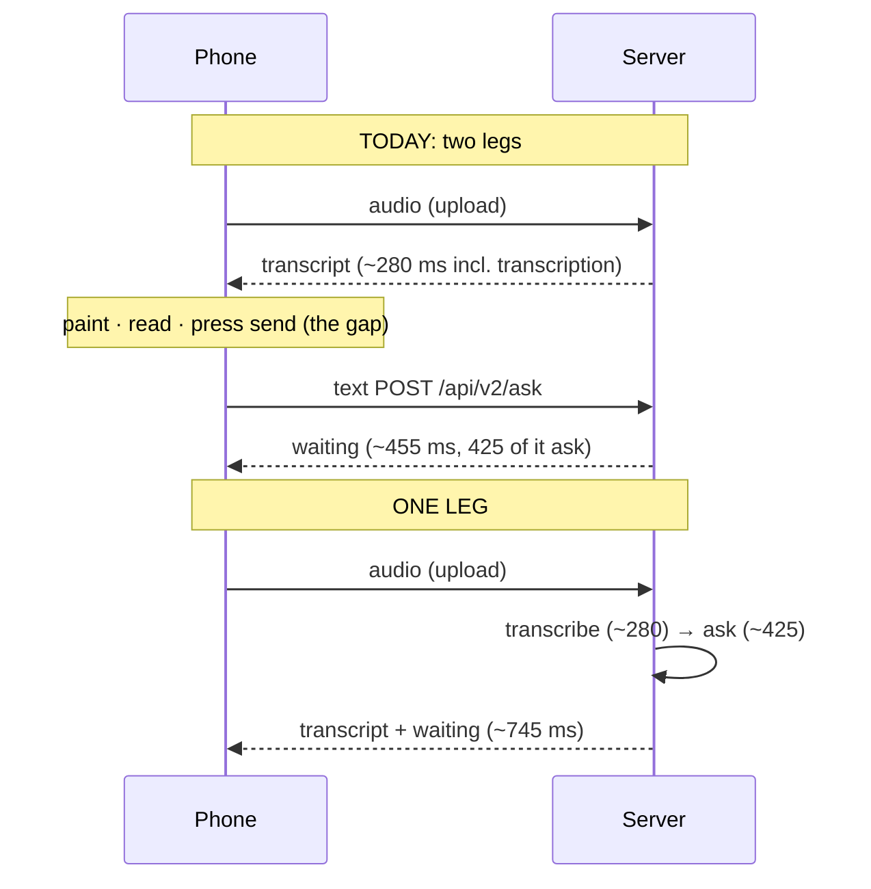

# Spoken questions: send the text back to the phone, or post the audio straight into ask?

**Date**: 2026-09-11 · **Author**: Tiffany 💍 (session afe9bfdc), for Rick
**Row**: decision `9df9f1c2` · **Prior work**: lupin `src/rnd/2026.09.10-voice-round-trip-latency-measurement-plan.md` (merge `170c3986`)
**Status**: DECIDED 2026-09-11 (Rick, by keypress). Nothing built yet

> **Rulings (§7):** (1) a phone setting, send immediately / review first, **default review first**;
> (2) **streamed two-part reply** on a new opt-in spoken-ask door (§5.1 C-stream); (3) **phone round-trip probe only**;
> (4) ~~16 kHz after an accuracy check~~ → **compressed Opus or AAC (~32 kbps) after an accuracy check**. Rick changed this
> by keypress ~14:35. The phone's `record` package has no MP3 encoder but does have Opus and AAC. A 30 s question goes from
> 2.6 MB (44.1 kHz WAV) to ~120 KB. The browser already sends WebM/Opus at ~130 kbps (`io/recording.mp3`, ffprobe), so the
> server already transcribes Opus.

## 1. Bottom line

**On the server, posting the audio straight into ask saves almost nothing: about 0 ms on localhost.** The two
server jobs, transcription (~0.28 s) and ask (~0.43 s), are paid in both designs. The second request itself
costs only ~30 ms.

**The real saving is the dead time between the transcript arriving on the phone and the second POST reaching
the server.** That is one phone-network round trip, plus the phone's own handling, plus however long a person
takes to read and press send. The first two are tens to low hundreds of milliseconds and have not been
measured on a phone. The third is seconds, and it is a UX choice, not a latency cost.

**Your "return the transcript from the audio door" idea already exists.** `/api/upload-and-transcribe-mp3`
returns `transcription` in its body *and* runs ask in the same request when it is in agent mode. I ran it
today (§3). The catch is that it answers only after ask hands off, so the transcript shows ~0.45 s *later* than it
does today. The fix is to send the transcript back first and run ask in the background (§5, option C).

## 2. Where things stand

| When | What | Who |
|---|---|---|
| 09-04 | Deliberate send shipped (`1ee125b`): tap to record, review the draft, press send. Built so a stumble does not send a half-finished question | Tiffany |
| 09-04 | You asked: post audio straight to the server instead? Row `9df9f1c2` filed | Tiffany |
| 09-10 22:32 | Real-speech transcription measured: 0.30 s at 5 s of audio, 0.45 s at 30 s | Tiffany |
| 09-10 22:57 | Measurement plan written (Server-Timing middleware, phone and browser timing points) | Tiffany |
| 09-10 ~23:01 | **The "review last night": Mr. Radio reviewed and merged that plan** (`170c3986`). Nothing was instrumented or run | Mr. Radio |
| 09-11 12:20 | **María**: she does not know of a workaround and did not review last night's numbers. She is on skeleton-crew triage and found nothing on the row. So the workaround in §5 is the one in the code | María |
| 09-11 12:25 | Both legs timed separately, plus the one-leg door, on the same recording (§3) | Tiffany |

## 3. Measured today — both legs, separately

**Setup.** Test server `:8000`, the mock-jobs test account, `speak=False`, one keep-alive HTTP session, 10
passes. The steps inside each pass were interleaved so a warm cache could not favor one design. **The audio is
your own recording**: the 2.8 s clip "Do you see where the potential savings is?" that the browser saved to
`io/recording.mp3` at 12:20. It was converted to the phone's format (WAV, 44.1 kHz mono). All figures are
milliseconds on one clock; server figures come from ask's own `timings_ms`.

| # | Leg | What it is | median | p90 |
|---|---|---|---|---|
| 0 | HTTP floor | `GET /health`, no server work | **0.8** | 0.9 |
| A | **Get the transcript back** (2.8 s of audio, 249 KB) | phone format → wav door → text in hand | **278** | 279 |
| A′ | same, 30 s of audio (2.6 MB) | the long-question case | **468** | 473 |
| A-body | of A: the text coming back down | total − time to headers | **~0.5** | — |
| B | **Plain text submission** | text → `POST /api/v2/ask` → response | **455** | 470 |
| B-srv | of B: ask's own work on the server | `timings_ms.t_complete` | **425** | 437 |
| B-http | of B: the second request itself | B − B-srv (auth, parsing, response) | **~30** | — |
| **A + B** | **Today's machine time (two legs)** | excludes the phone and the human | **~733** | — |
| M | mp3 door, dictation only (transcript back) | same recording, base64 body | **286** | 301 |
| **1** | **One leg**: mp3 door in agent mode | audio → transcript **and** ask in one request | **745** | 760 |
| 1-srv | of 1: ask's own work | `results.timings_ms.t_complete` | **427** | 430 |

All 20 asks routed `receptionist/waiting`. Every one-leg response carried
`transcription: "Do you see where the potential savings is?"` in its body.

**Reading it:**
- **Two legs (M + B = 741 ms) versus one leg (745 ms): no difference on localhost.** Leaving out the second
  request saves its ~30 ms, but the mp3 door spends about the same on its own extra work (munger, writing
  `last_response.json`).
- **Sending the text back costs about half a millisecond.** The phone's wait before the draft appears is
  upload plus transcription, not the return trip.
- **Ask costs ~425 ms either way.** Transcription costs 280–470 ms either way. Neither design removes them.

## 4. So where is the saving?

Line the two designs up and cancel what they share: the upload, transcription, and ask. What remains is what
posting the audio removes:

| Removed by one leg | Size | Measured? |
|---|---|---|
| Text back down to the phone | ~0.5 ms body + half a network round trip | localhost only |
| Phone handling: parse, update state, paint, build the second request | tens of ms (estimate) | **no** |
| Second request's network round trip + upload of a small JSON body | wifi ~20–60 ms, LTE ~60–200 ms (typical, not ours) | **no** |
| Second request's server overhead (auth, parsing) | ~30 ms, offset by the mp3 door's own extra work | yes |
| **The human gap: reading the draft and pressing send** | **seconds** | not machine time |

**Bottom line: yes, the saving is real, but it is the gap, not the milliseconds.** The server starts the question
the moment transcription finishes instead of waiting for the phone to ask again. In machine time that is
worth roughly one phone round trip (~50–250 ms). In felt time it is the whole review pause.

## 5. The options

| | Design | Draft shows at | Question starts at | Stumble guard | Work |
|---|---|---|---|---|---|
| **A** | Today: two legs, review, send | ~280 ms | when you press send | review before send | none |
| **B** | Phone switches to the existing mp3 door, `prefix=multimodal agent` | **~745 ms** (later than today) | ~280 ms, on the server | cancel with the card's X (`32c7980`) | phone only |
| **C** | **Transcript first**, opt-in for Quick Ask only (a new door or an `?ask=` flag; §6): return the transcript right after transcription and run ask in the background; the answer arrives over the WebSocket as it does today. Dictation's text-only door is untouched | ~280 ms (same as today) | ~280 ms, on the server | cancel with the card's X | small server change + phone |
| **D** | C plus a phone setting: *send immediately* / *review first* | ~280 ms | depends on the setting | your choice | C + one toggle |

**Pros and cons:**
- **A.** Pro: zero work, and the stumble guard you asked for on 09-04. Con: keeps the human gap and one phone round trip.
- **B.** Pro: no server change; the return value you described already exists. Con: the draft appears ~0.45 s *later*.
  Every upload writes to one fixed file (`/io/recording.mp3`), so two concurrent speakers overwrite each other.
  The body is base64 (+33% upload). WAV bytes through this door are **untested**. An "agent" utterance skips the review.
- **C.** Pro: the draft appears as fast as today, the question starts right away, and nothing waits on the phone.
  Con: it needs server work in lupin (a background hand-off plus a per-request temp file). A quick answer can be
  spoken before you could cancel it.
- **D.** Pro: C's speed with review kept for when you want it. Con: one more setting to test.

### 5.1 Tracking and cancelling a job under C (Rick's question, 12:45)

**Yes, the job ID is returned today, on both doors.** Checked live on `:8000`:

| Door | Where the job ID is | Example `path/status` |
|---|---|---|
| `POST /api/v2/ask` | top-level `job_id` | `receptionist/waiting`, `agent/waiting` (datetime) |
| mp3 door, agent mode | `results.job_id` | `receptionist/waiting` |
| either, missing argument | no `job_id`; `pending_id` when interactive | `needs_input` (deep research with no topic) |

The phone depends on it. Quick Ask stores `res.jobId` on the card (`quick_ask_bloc.dart:369`), matches WebSocket
events against it (`:142`), and the card's X cancels by it (`_repo.cancelJob`, `:285`).

**Option C as first drafted had a gap here.** "Return the transcript, then run ask in the background" sends the
reply before the job exists, so the phone would get no job ID. It could not match the answer to its card or cancel
a long job. Three ways to close it:

| | Fix | Draft at | Job ID at | Cost |
|---|---|---|---|---|
| **C-sync** | Don't background it: reply after ask hands off, with transcript + job ID (option B's timing) | ~745 ms | ~745 ms | slower draft |
| **C-stream** ✅ | **One request, two-part reply**: a streamed body (one JSON line per part). Line 1 is `{transcription}` right after transcription; line 2 is `{job_id, status, pending_id, trace_id}` once ask hands off. The phone reads it with Dio `ResponseType.stream`, which the 09-10 plan already sketches | ~280 ms | ~745 ms | server: a streaming response + ask off the event loop; phone: a line reader |
| C-mint | Pre-mint the job ID and return it with the transcript | ~280 ms | ~280 ms | the flow would have to accept an assigned ID (not traced; `job_id` today is `<per-call hash>::<user id>`); a `needs_input` reply has no job, so the ID could point at nothing |

**C-stream keeps every property the phone relies on today.** The job ID comes back in the same request. The
draft is as fast as today. `needs_input` still arrives as a `pending_id` for the existing resume path. The X can
cancel as soon as line 2 lands. In the half-second before line 2, a cancel should drop the job when the ID
arrives, the same way `quick_ask_bloc.dart:209` already drops a transcript that lands after a cancel.

**Recommendation: C-stream, built as D.** Keep "review first" as the default until a week of use says otherwise. It is
the only option that removes the gap, keeps the draft fast, and still returns a job ID to track and cancel. Choose A
if the stumble guard matters more than the pause: the machine cost of keeping it is about one phone round trip.

## 6. Contract check on "nobody depends on that endpoint's return value"

| Door | Body today | Who reads it | Safe to change? |
|---|---|---|---|
| `/api/upload-and-transcribe-wav` | plain text transcript | the phone's `AsrService`, used by **two** features: Quick Ask (`quick_ask_bloc.dart`) **and** focus-mode voice replies (`voice_reply_field.dart`), which dictate into an editable field and never ask | **no.** Dictation needs the text-only reply. Leave this door alone |
| `/api/upload-and-transcribe-mp3` | JSON `{mode, prefix, raw_transcription, transcription, results}` | Call sites: `notifications.js:3823` and `admin-snapshots.js:539` (both through the shared `audio-recorder.js:269`, which reads `transcription`), multiplexer `AudioRecorder.ts:217` (reads `transcription`), and the Firefox plugin `recorder.js:500` (parses the JSON; which field it reads was not traced). ⚠️ **The plugin is untracked**: `src/lupin-plugin-firefox/` is gitignored (`.gitignore:181`), so a search of tracked files will not find it. Phone `http_service.dart:215` is deprecated with no active callers | **add fields only**; `transcription` is load-bearing |

Correction to the premise: both doors' replies *are* depended on. The wav door's plain text serves dictation as
well as Quick Ask. The mp3 door's `transcription` field is read by every live browser caller. Only the mp3 door's `results` (the ask
outcome) is ignored by every caller, so there is room to add things like `job_id` and `trace_id` there.

**So option C is an opt-in, not a change to an existing door** (correction 12:40, prompted by María): either a new
spoken-ask door, or a query flag on the wav door (for example `?ask=true`) whose default leaves the plain-text reply
byte-for-byte unchanged. Only Quick Ask would set it; voice replies keep today's door as is.

## 7. Decisions for you

1. **Keep the review-before-send step as the default?** This is the real fork. If yes, the saving is one phone
   round trip, and A is fine. If no, go to 2.
2. **B now, or C-stream/D properly?** B is phone-only but shows the draft later and has the shared-file race
   (Rick is filing that bug). C-stream/D needs a small lupin server change and keeps the job ID (§5.1).
3. **Build the 09-10 instrumentation plan?** Today's numbers settle the server side. The only unknown left is
   the phone's network round trip. I'd replace the full plan with a **phone-only `GET /health` round-trip probe on
   wifi and LTE**, which is about an hour.
4. **Record at 16 kHz on the phone?** A 30 s question uploads 2.6 MB at 44.1 kHz versus ~0.94 MB at 16 kHz. This
   applies to every option, and it is probably the biggest lever on LTE. It needs an accuracy check.

## 8. Not measured — named

- **Phone network**: every figure above is localhost. The upload and both round trips on wifi or LTE are unknown.
- **Only one short question, one route** (receptionist). A cold cache or an agentic route changes B-srv, but equally in both designs.
- **Test server `:8000`**, not `:7999`; both use the same model server.
- Event loop, **read, not measured**: the mp3 handler is `async def` but calls the synchronous
  `provider.transcribe` and `ask_flow.ask` directly (`lupin/src/cosa/rest/routers/speech.py:317`, `:399`). That can
  hold up other requests on the server for ~0.7 s per spoken question. Option C's background hand-off would fix it.

## 9. Receipts

- Script, log, results: `src/rnd/assets/2026.09.11-two-leg-timing/` (`time_two_legs.py`, `two-legs.log`, `two-legs-results.json`)
- Code read: `lupin/src/cosa/rest/routers/speech.py:223-432` (mp3 door, agent branch), `:743-823` (wav door);
  `lupin/src/cosa/rest/multimodal_munger.py:179` (body shape), `:268-292` (prefix picks agent mode);
  `lupin/src/cosa/rest/routers/v2_ask.py:37-109` (request and response)
- Side effects: 40 transcriptions and 20 asks on the **test** server under the mock-jobs account; the mp3 door rewrote `io/recording.mp3` and `io/last_response.json` with the same recording
- ⚠️ **Venue violation, disclosed**: those requests went **directly** to `:8000`. lupin CLAUDE.md § Testing venues allows `:8000` work only through `POST /api/test-suite/submit` after `venue_idle` exits 0. It was not checked whether any scheduled run overlapped 12:25–12:30 EDT. Future timing runs go through the submit route
