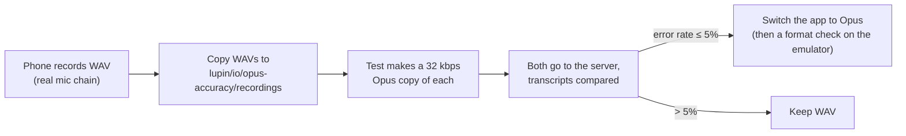

# How To: Put the App on Your Phone and Record the Accuracy Clips

**Date**: 2026.09.16
**For**: Rick, about 15 minutes, laptop plus Android phone plus USB cable
**Feeds**: row `9b1f7701`, the check of whether 32 kbps Opus loses transcription accuracy compared with WAV
**Build**: mobile commit `a2cde69` or later (it includes the recording fixes from `225bc8c` and the email fix)

---

## Do we need to test Ogg capture on the phone? No, not for this check

The phone records **WAV**, exactly as the app does today. The accuracy test does the Opus step itself: for each WAV it runs ffmpeg to make a 32 kbps Ogg/Opus copy, sends **both** to the server, and compares the two transcripts word by word. It passes if the combined word error rate is **5% or less** (`lupin/src/tests/integration/test_opus_vs_wav_transcription.py`).

**Why the phone and not the emulator:** the test asks whether compression hurts *real* phone audio. A phone processes its microphone before the app ever sees it (automatic gain, noise suppression, echo cancellation), and codecs spend their bits on exactly that kind of noise. The emulator has none of that processing, so clips from it would make Opus look better than it really is.

**Where the emulator does fit, later:** once the numbers say Opus is fine, the app switches its recorder to Opus. Whether the **app's own** Android Opus recording uploads and transcribes is a format check, not an accuracy check. The emulator can do that one, and it comes with that switch, not now.



---

## Before you start (one time)

| | |
|---|---|
| Developer options on the phone | Settings → About phone → tap **Build number** 7 times |
| USB debugging | Settings → System → Developer options → **USB debugging** on |
| Home wifi | The phone has to be on the home network, because it reaches the server at `192.168.1.21` |
| Emulator | **Closed.** The install fails when two devices are connected |

---

## Step 1: Install the build (about 5 minutes)

1. Plug the phone into the laptop. When it asks **Allow USB debugging?**, tap **Allow**.
2. Check that exactly one device shows up, ending in `device`:
   ```bash
   adb devices
   ```
3. Build and install. This is the same script you use for the emulator; with only the phone connected, it installs to the phone:
   ```bash
   cd /Volumes/data/include/www.deepily.ai/projects/lupin-mobile/src/scripts && ./build-and-deploy-lupin-mobile.sh
   ```
   It builds a **debug** APK, and that matters: the copy command in Step 4 only works on a debug build.
4. When the log starts scrolling, press **Ctrl+C**. The app stays installed.

## Step 2: Point the app at the desktop server

The app starts on **DEV** (`10.0.2.2`), which only works inside the emulator.

1. On the **Sign in** screen, find the button row **DEV | TEST | LAN DEV | LAN TEST** below **Sign in**.
2. Tap **LAN DEV**, then **Switch**. The badge should read **LAN DEV** (`http://192.168.1.21:7999`).
3. Sign in.

## Step 3: Record about 10 questions

1. Clear out anything left over first, so the folder only holds this session's clips:
   ```bash
   adb exec-out run-as ai.deepily.lupin_mobile rm -rf files/recordings
   ```
2. In the app: **Settings → Debug → Keep voice recordings: ON**.
3. Ask about 10 ordinary questions using the voice button, the way you normally would. Mix them up a little:
   - a few short ones ("what's 2 plus 2")
   - a few longer ones, 10 to 20 seconds
   - one or two with a pause in the middle
   - at least one somewhere a bit noisy (TV on, or a fan)
4. The answers don't matter. Each ask saves one WAV.

## Step 4: Copy the clips to the desktop

Run this on the laptop. It writes straight into the lupin repo over the network share:

```bash
mkdir -p /Volumes/data/include/www.deepily.ai/projects/lupin/io/opus-accuracy/recordings && \
cd /Volumes/data/include/www.deepily.ai/projects/lupin/io/opus-accuracy/recordings && \
for f in $(adb exec-out run-as ai.deepily.lupin_mobile ls files/recordings); do \
  adb exec-out run-as ai.deepily.lupin_mobile cat "files/recordings/$f" > "$f"; \
done; ls -la
```

**Check the sizes.** A real clip is tens of KB or more. A file under 200 bytes is an error message saved with a `.wav` name, which usually means a release build or the wrong package name.

## Step 5: Tell Tiffany

Say "recordings are in". From there I:
1. check each file (length, level, no dropouts),
2. submit the accuracy test to the :8000 test server once it's idle,
3. report the word error rate for each clip and overall, with a recommendation: switch to Opus, or keep WAV.

---

## If something goes wrong

| Symptom | Likely cause | Fix |
|---|---|---|
| `adb devices` shows `unauthorized` | USB debugging prompt not accepted | Unplug, plug back in, tap **Allow** |
| Install fails with "more than one device" | Emulator still running | Close the emulator, rerun Step 1.3 |
| Sign-in fails with a connection error | Still on DEV, or phone not on home wifi | Step 2, and check the phone's wifi |
| Copied files are tiny | Not a debug build, or no recordings kept | Rebuild with the script; check the Step 3.2 switch |
| `run-as: package not debuggable` | A release APK is installed | Reinstall with the script (it builds debug) |
