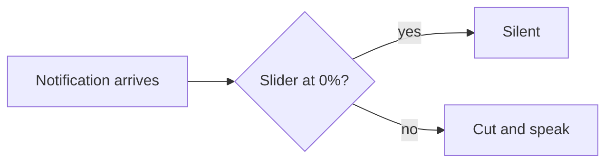

# Markdown render sample

This is the same content Tiffany sent as a notification abstract on 2026-09-18, so you can compare the abstract renderer with the document viewer.

## Text styles

Plain text, **bold**, *italic*, ***bold italic***, ~~strikethrough~~, and `inline code`.

## Lists

1. First numbered item
2. Second, with a nested list:
   - nested bullet A
   - nested bullet B
3. Third

- [ ] An open checkbox
- [x] A ticked checkbox

## Table

| Item | State | Commit |
|---|---|---|
| 0% slider is silent | ✅ fixed | `73b76f0` |
| Focus-screen tests | ✅ added | `67a2c74` |
| Device rebuild | ⏳ owed | — |

## Quote

> A saved file is not a served file.

## Code block

```dart
static bool silences( double fraction ) => fraction <= 0;
```

## Diagram



## Links

- An external link: [Flutter docs](https://docs.flutter.dev)
- A doc link: [Open: emulator check list](/app/docs?path=lupin-mobile/src/rnd/2026.09.18-emulator-ui-check-list.md)

---

End of sample.
